# 1.背景

对于锁大家肯定不会陌生，在Java中synchronized关键字和ReentrantLock可重入锁在我们的代码中是经常见的，一般我们用其在多线程环境中控制对资源的并发访问，但是随着分布式的快速发展，本地的加锁往往不能满足我们的需要，在我们的分布式环境中上面加锁的方法就会失去作用。于是人们为了在分布式环境中也能实现本地锁的效果，也是纷纷各出其招，今天让我们来聊一聊一般分布式锁实现的套路。

# 2.分布式锁

## 2.1为何需要分布式锁

Martin Kleppmann是英国剑桥大学的分布式系统的研究员，之前和Redis之父Antirez进行过关于RedLock(红锁，后续有讲到)是否安全的激烈讨论。Martin认为一般我们使用分布式锁有两个场景:

- 效率:使用分布式锁可以避免不同节点重复相同的工作，这些工作会浪费资源。比如用户付了钱之后有可能不同节点会发出多封短信。
- 正确性:加分布式锁同样可以避免破坏正确性的发生，如果两个节点在同一条数据上面操作，比如多个节点机器对同一个订单操作不同的流程有可能会导致该笔订单最后状态出现错误，造成损失。

## 2.2分布式锁的一些特点

当我们确定了在不同节点上需要分布式锁，那么我们需要了解分布式锁到底应该有哪些特点:

- 互斥性:和我们本地锁一样互斥性是最基本，但是分布式锁需要保证在不同节点的不同线程的互斥。
- 可重入性:同一个节点上的同一个线程如果获取了锁之后那么也可以再次获取这个锁。
- 锁超时:和本地锁一样支持锁超时，防止死锁。
- 高效，高可用:加锁和解锁需要高效，同时也需要保证高可用防止分布式锁失效，可以增加降级。
- 支持阻塞和非阻塞:和ReentrantLock一样支持lock和trylock以及tryLock(long timeOut)。
- 支持公平锁和非公平锁(可选):公平锁的意思是按照请求加锁的顺序获得锁，非公平锁就相反是无序的。这个一般来说实现的比较少。

## 2.3常见的分布式锁

我们了解了一些特点之后，我们一般实现分布式锁有以下几个方式:

- MySql
- Zk
- Redis
- 自研分布式锁:如谷歌的Chubby。

下面分开介绍一下这些分布式锁的实现原理。

# 3.Mysql分布式锁

首先来说一下Mysql分布式锁的实现原理，相对来说这个比较容易理解，毕竟数据库和我们开发人员在平时的开发中息息相关。对于分布式锁我们可以创建一个锁表:

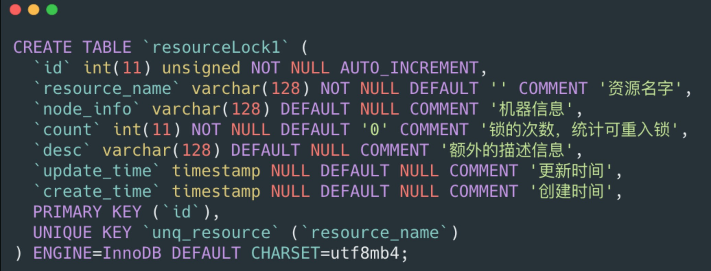

 前面我们所说的lock(),trylock(long timeout)，trylock()这几个方法可以用下面的伪代码实现。


## 3.1 lock()

lock一般是阻塞式的获取锁，意思就是不获取到锁誓不罢休，那么我们可以写一个死循环来执行其操作: 

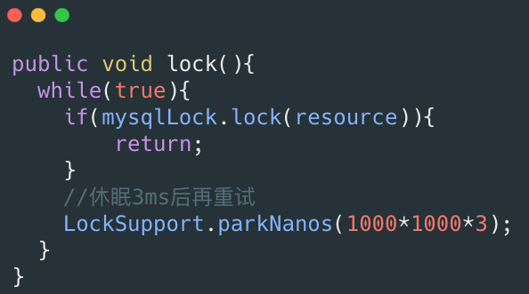


mysqlLock.lcok内部是一个sql,为了达到可重入锁的效果那么我们应该先进行查询，如果有值，那么需要比较node_info是否一致，这里的node_info可以用机器IP和线程名字来表示，如果一致那么就加可重入锁count的值，如果不一致那么就返回false。如果没有值那么直接插入一条数据。伪代码如下: 

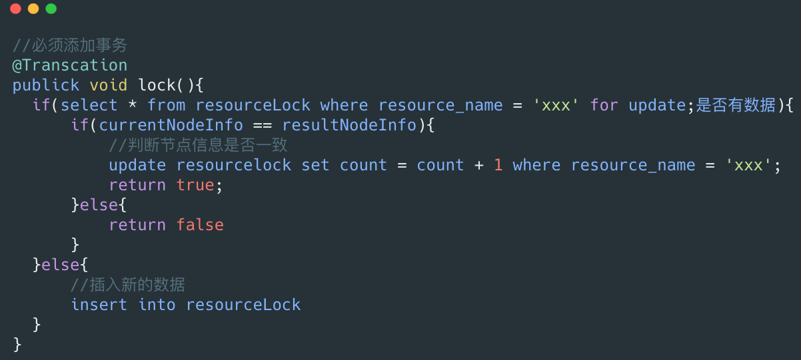


需要注意的是这一段代码需要加事务，必须要保证这一系列操作的原子性。

## 3.2 tryLock()和tryLock(long timeout)

tryLock()是非阻塞获取锁，如果获取不到那么就会马上返回，代码可以如下: 

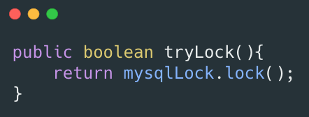

 tryLock(long timeout)实现如下: 

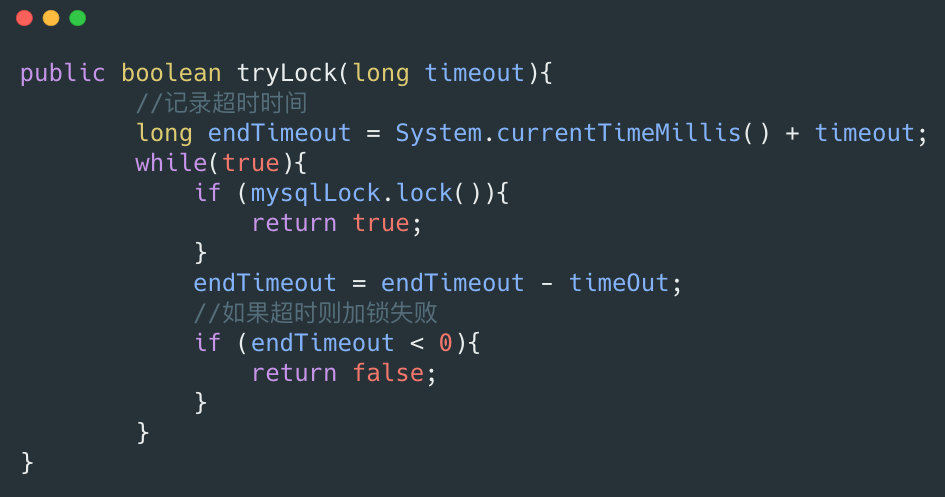

 mysqlLock.lock和上面一样，但是要注意的是select ... for update这个是阻塞的获取行锁，如果同一个资源并发量较大还是有可能会退化成阻塞的获取锁。


## 3.3 unlock()

unlock的话如果这里的count为1那么可以删除，如果大于1那么需要减去1。


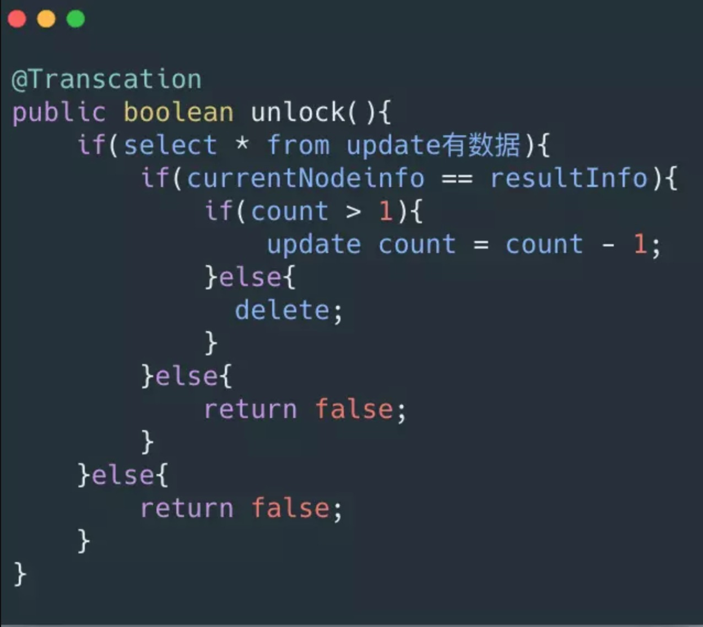


## 3.4 锁超时

我们有可能会遇到我们的机器节点挂了，那么这个锁就不会得到释放，我们可以启动一个定时任务，通过计算一般我们处理任务的一般的时间，比如是5ms，那么我们可以稍微扩大一点，当这个锁超过20ms没有被释放我们就可以认定是节点挂了然后将其直接释放。

## 3.5 Mysql小结

- 适用场景: Mysql分布式锁一般适用于资源不存在数据库，如果数据库存在比如订单，那么可以直接对这条数据加行锁，不需要我们上面多的繁琐的步骤，比如一个订单，那么我们可以用select * from order_table where id = 'xxx' for update进行加行锁，那么其他的事务就不能对其进行修改。
- 优点:理解起来简单，不需要维护额外的第三方中间件(比如Redis,Zk)。
- 缺点:虽然容易理解但是实现起来较为繁琐，需要自己考虑锁超时，加事务等等。性能局限于数据库，一般对比缓存来说性能较低。对于高并发的场景并不是很适合。

## 3.6 乐观锁

前面我们介绍的都是悲观锁，这里想额外提一下乐观锁，在我们实际项目中也是经常实现乐观锁，因为我们加行锁的性能消耗比较大，通常我们会对于一些竞争不是那么激烈，但是其又需要保证我们并发的顺序执行使用乐观锁进行处理，我们可以对我们的表加一个版本号字段，那么我们查询出来一个版本号之后，update或者delete的时候需要依赖我们查询出来的版本号，判断当前数据库和查询出来的版本号是否相等，如果相等那么就可以执行，如果不等那么就不能执行。这样的一个策略很像我们的CAS(Compare And Swap),比较并交换是一个原子操作。这样我们就能避免加select * for update行锁的开销。

# 4. ZooKeeper

ZooKeeper也是我们常见的实现分布式锁方法，相比于数据库如果没了解过ZooKeeper可能上手比较难一些。ZooKeeper是以Paxos算法为基础分布式应用程序协调服务。Zk的数据节点和文件目录类似，所以我们可以用此特性实现分布式锁。我们以某个资源为目录，然后这个目录下面的节点就是我们需要获取锁的客户端，未获取到锁的客户端注册需要注册Watcher到上一个客户端，可以用下图表示。


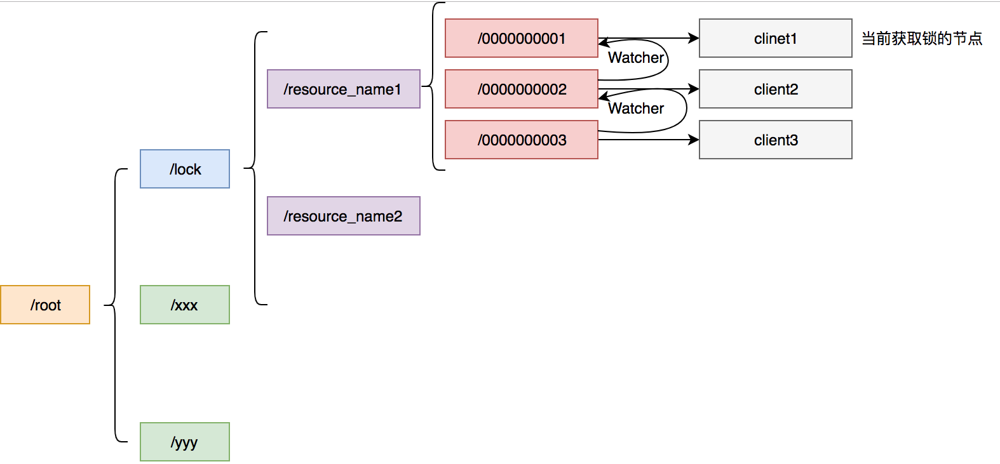

 /lock是我们用于加锁的目录,/resource_name是我们锁定的资源，其下面的节点按照我们加锁的顺序排列。


## 4.1 Curator

Curator封装了Zookeeper底层的Api，使我们更加容易方便的对Zookeeper进行操作，并且它封装了分布式锁的功能，这样我们就不需要再自己实现了。

Curator实现了可重入锁(InterProcessMutex),也实现了不可重入锁(InterProcessSemaphoreMutex)。在可重入锁中还实现了读写锁。

## 4.2 InterProcessMutex

InterProcessMutex是Curator实现的可重入锁，我们可以通过下面的一段代码实现我们的可重入锁:


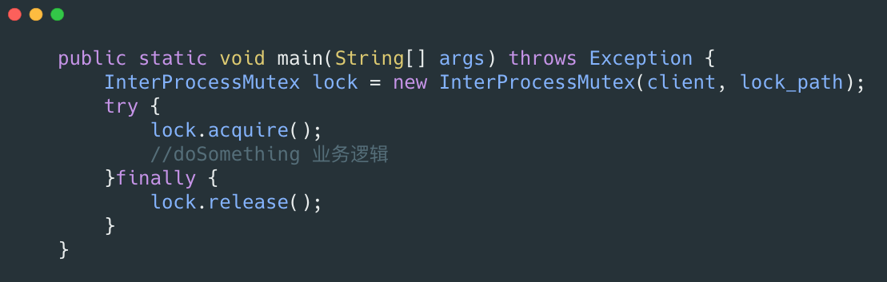


我们利用acuire进行加锁，release进行解锁。

加锁的流程具体如下:

1. 首先进行可重入的判定:这里的可重入锁记录在ConcurrentMap<Thread, LockData> threadData这个Map里面，如果threadData.get(currentThread)是有值的那么就证明是可重入锁，然后记录就会加1。我们之前的Mysql其实也可以通过这种方法去优化，可以不需要count字段的值，将这个维护在本地可以提高性能。
2. 然后在我们的资源目录下创建一个节点:比如这里创建一个/0000000002这个节点，这个节点需要设置为EPHEMERAL_SEQUENTIAL也就是临时节点并且有序。
3. 获取当前目录下所有子节点，判断自己的节点是否位于子节点第一个。
4. 如果是第一个，则获取到锁，那么可以返回。
5. 如果不是第一个，则证明前面已经有人获取到锁了，那么需要获取自己节点的前一个节点。/0000000002的前一个节点是/0000000001，我们获取到这个节点之后，再上面注册Watcher(这里的watcher其实调用的是object.notifyAll(),用来解除阻塞)。
6. object.wait(timeout)或object.wait():进行阻塞等待这里和我们第5步的watcher相对应。

解锁的具体流程:

1. 首先进行可重入锁的判定:如果有可重入锁只需要次数减1即可，减1之后加锁次数为0的话继续下面步骤，不为0直接返回。
2. 删除当前节点。
3. 删除threadDataMap里面的可重入锁的数据。

## 4.3 读写锁

Curator提供了读写锁，其实现类是InterProcessReadWriteLock，这里的每个节点都会加上前缀：

```java
private static final String READ_LOCK_NAME  = "__READ__";
private static final String WRITE_LOCK_NAME = "__WRIT__";
```

根据不同的前缀区分是读锁还是写锁，对于读锁，如果发现前面有写锁，那么需要将watcher注册到和自己最近的写锁。写锁的逻辑和我们之前4.2分析的依然保持不变。

## 4.4 锁超时

Zookeeper不需要配置锁超时，由于我们设置节点是临时节点，我们的每个机器维护着一个ZK的session，通过这个session，ZK可以判断机器是否宕机。如果我们的机器挂掉的话，那么这个临时节点对应的就会被删除，所以我们不需要关心锁超时。

## 4.5 ZK小结

- 优点:ZK可以不需要关心锁超时时间，实现起来有现成的第三方包，比较方便，并且支持读写锁，ZK获取锁会按照加锁的顺序，所以其是公平锁。对于高可用利用ZK集群进行保证。
- 缺点:ZK需要额外维护，增加维护成本，性能和Mysql相差不大，依然比较差。并且需要开发人员了解ZK是什么。

# 5.Redis

大家在网上搜索分布式锁，恐怕最多的实现就是Redis了，Redis因为其性能好，实现起来简单所以让很多人都对其十分青睐。

## 5.1 Redis分布式锁简单实现

熟悉Redis的同学那么肯定对setNx(set if not exist)方法不陌生，如果不存在则更新，其可以很好的用来实现我们的分布式锁。对于某个资源加锁我们只需要

```java
setNx resourceName value
```

这里有个问题，加锁了之后如果机器宕机那么这个锁就不会得到释放所以会加入过期时间，加入过期时间需要和setNx同一个原子操作，在Redis2.8之前我们需要使用Lua脚本达到我们的目的，但是redis2.8之后redis支持nx和ex操作是同一原子操作。

```java
set resourceName value ex 5 nx
```

## 5.2 Redisson

Javaer都知道Jedis，Jedis是Redis的Java实现的客户端，其API提供了比较全面的Redis命令的支持。Redisson也是Redis的客户端，相比于Jedis功能简单。Jedis简单使用阻塞的I/O和redis交互，Redisson通过Netty支持非阻塞I/O。Jedis最新版本2.9.0是2016年的快3年了没有更新，而Redisson最新版本是2018.10月更新。

Redisson封装了锁的实现，其继承了java.util.concurrent.locks.Lock的接口，让我们像操作我们的本地Lock一样去操作Redisson的Lock，下面介绍一下其如何实现分布式锁。


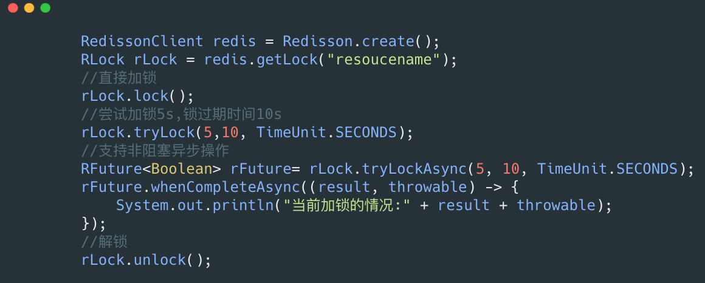


Redisson不仅提供了Java自带的一些方法(lock,tryLock)，还提供了异步加锁，对于异步编程更加方便。 由于内部源码较多，就不贴源码了，这里用文字叙述来分析他是如何加锁的，这里分析一下tryLock方法:

1. 尝试加锁:首先会尝试进行加锁，由于保证操作是原子性，那么就只能使用lua脚本，相关的lua脚本如下： 

   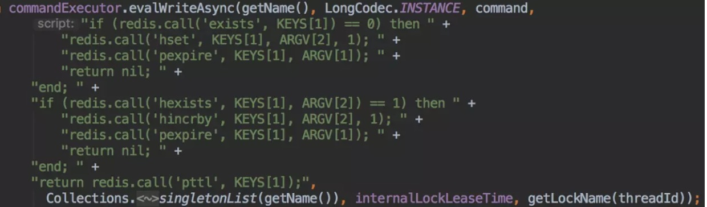

    可以看见他并没有使用我们的sexNx来进行操作，而是使用的hash结构，我们的每一个需要锁定的资源都可以看做是一个HashMap，锁定资源的节点信息是Key,锁定次数是value。通过这种方式可以很好的实现可重入的效果，只需要对value进行加1操作，就能进行可重入锁。当然这里也可以用之前我们说的本地计数进行优化: 

   1. 如果通过 `exists` 命令发现当前 key 不存在，即锁没被占用，则执行 `hset` 写入 Hash 类型数据 **key:全局锁名称**（例如共享资源ID）, **field:锁实例名称**（Redisson客户端ID:线程ID）, **value:1**，并执行 `pexpire` 对该 key 设置失效时间，返回空值 `nil`，至此获取锁成功。
   2. 如果通过 `hexists` 命令发现 Redis 中已经存在当前 key 和 field 的 Hash 数据，说明当前线程之前已经获取到锁，因为这里的锁是**可重入**的，则执行 `hincrby` 对当前 key field 的值**加一**，并重新设置失效时间，返回空值，至此重入获取锁成功。
   3. 最后是锁已被占用的情况，即当前 key 已经存在，但是 Hash 中的 Field 与当前值不同，则执行 `pttl` 获取锁的剩余存活时间并返回，至此获取锁失败。

2. 如果尝试加锁失败，判断是否超时，如果超时则返回false。

3. 如果加锁失败之后，没有超时，那么需要在名字为redisson_lock__channel+lockName的channel上进行订阅，用于订阅解锁消息，然后一直阻塞直到超时，或者有解锁消息。这里的具体实现本文也不深入，只是简单提一下 Redisson 在执行 Redis 命令时提供了**同步**和**异步**的两种实现，但实际上**同步的实现都是基于异步的**，具体做法是使用 Netty 中的异步工具 *Future*和 *FutureListener* 结合 JDK 中的 *CountDownLatch* 一起实现。

4. 重试步骤1，2，3，直到最后获取到锁，或者某一步获取锁超时。

对于我们的unlock方法比较简单也是通过lua脚本进行解锁，如果是可重入锁，只是减1。如果是非加锁线程解锁，那么解锁失败: 

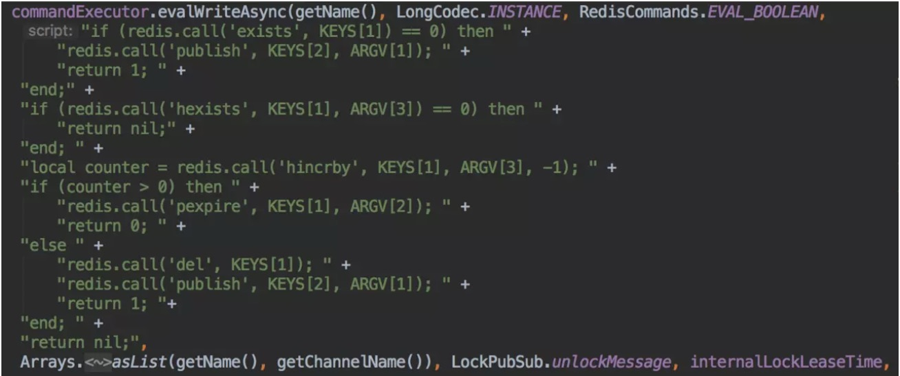

1. key 不存在，说明锁已释放，直接执行 `publish` 命令发布释放锁消息并返回 `1`。
2. key 存在，但是 field 在 Hash 中不存在，说明自己不是锁持有者，无权释放锁，返回 `nil`。
3. 因为锁可重入，所以释放锁时不能把所有已获取的锁全都释放掉，一次只能释放一把锁，因此执行 `hincrby` 对锁的值**减一**。
4. 释放一把锁后，如果还有剩余的锁，则刷新锁的失效时间并返回 `0`；如果刚才释放的已经是最后一把锁，则执行 `del` 命令删除锁的 key，并发布锁释放消息，返回 `1`。

Redisson还有公平锁的实现，对于公平锁其利用了list结构和hashset结构分别用来保存我们排队的节点，和我们节点的过期时间，用这两个数据结构帮助我们实现公平锁，这里就不展开介绍了，有兴趣可以参考源码。

### 上述 Redis 分布式锁的缺点

上面那种方案最大的问题，就是如果你对某个 Redis Master 实例，写入了 myLock 这种锁 Key 的 Value，此时会异步复制给对应的 Master Slave 实例。

但是这个过程中一旦发生 Redis Master 宕机，主备切换，Redis Slave 变为了 Redis Master。

接着就会导致，客户端 2 来尝试加锁的时候，在新的 Redis Master 上完成了加锁，而客户端 1 也以为自己成功加了锁。

此时就会导致多个客户端对一个分布式锁完成了加锁。这时系统在业务语义上一定会出现问题，导致各种脏数据的产生。

所以这个就是 Redis Cluster，或者是 redis master-slave 架构的主从异步复制导致的 Redis 分布式锁的最大缺陷：在 Redis Master 实例宕机的时候，可能导致多个客户端同时完成加锁。

## 5.3 RedLock

我们想象一个这样的场景当机器A申请到一把锁之后，如果Redis主宕机了，这个时候从机并没有同步到这一把锁，那么机器B再次申请的时候就会再次申请到这把锁，为了解决这个问题Redis作者提出了RedLock红锁的算法,在Redisson中也对RedLock进行了实现。


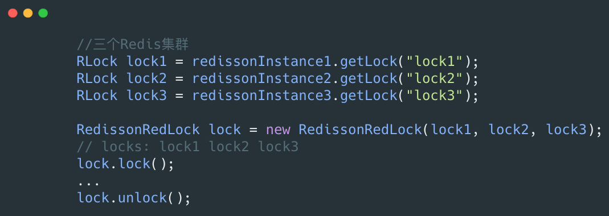


通过上面的代码，我们需要实现多个Redis集群，然后进行红锁的加锁，解锁。具体的步骤如下:

1. 首先生成多个Redis集群的Rlock，并将其构造成RedLock。
2. 依次循环对三个集群进行加锁，加锁的过程和5.2里面一致。
3. 如果循环加锁的过程中加锁失败，那么需要判断加锁失败的次数是否超出了最大值，这里的最大值是根据集群的个数，比如三个那么只允许失败一个，五个的话只允许失败两个，要保证多数成功。
4. 加锁的过程中需要判断是否加锁超时，有可能我们设置加锁只能用3ms，第一个集群加锁已经消耗了3ms了。那么也算加锁失败。
5. 3，4步里面加锁失败的话，那么就会进行解锁操作，解锁会对所有的集群在请求一次解锁。

可以看见RedLock基本原理是利用多个Redis集群，用多数的集群加锁成功，减少Redis某个集群出故障，造成分布式锁出现问题的概率。

## 5.4 Redis小结

- 优点:对于Redis实现简单，性能对比ZK和Mysql较好。如果不需要特别复杂的要求，那么自己就可以利用setNx进行实现，如果自己需要复杂的需求的话那么可以利用或者借鉴Redisson。对于一些要求比较严格的场景来说的话可以使用RedLock。
- 缺点:需要维护Redis集群，如果要实现RedLock那么需要维护更多的集群。

# 6.分布式锁的安全问题

上面我们介绍过红锁，但是Martin Kleppmann认为其依然不安全。有关于Martin反驳的几点，我认为其实不仅仅局限于RedLock,前面说的算法基本都有这个问题，下面我们来讨论一下这些问题:

- 长时间的GC pause:熟悉Java的同学肯定对GC不陌生，在GC的时候会发生STW(stop-the-world),例如CMS垃圾回收器，他会有两个阶段进行STW防止引用继续进行变化。那么有可能会出现下面图(引用至Martin反驳Redlock的文章)中这个情况： 

  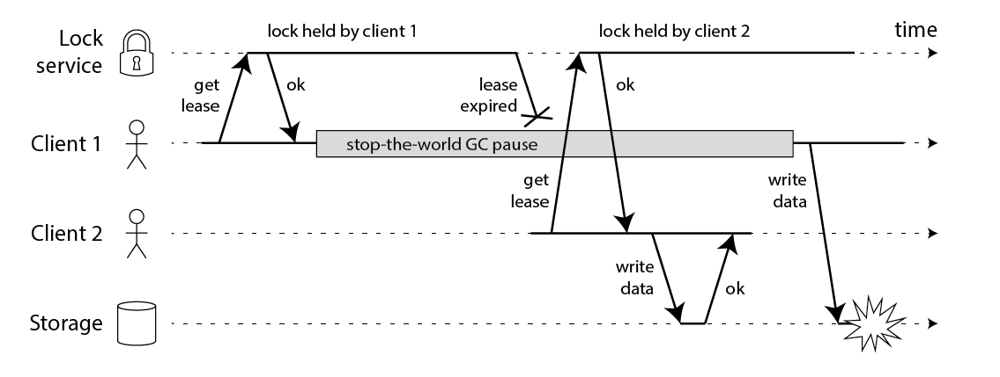

   client1获取了锁并且设置了锁的超时时间，但是client1之后出现了STW，这个STW时间比较长，导致分布式锁进行了释放，client2获取到了锁，这个时候client1恢复了锁，那么就会出现client1，2同时获取到锁，这个时候分布式锁不安全问题就出现了。这个其实不仅仅局限于RedLock,对于我们的ZK,Mysql一样的有同样的问题。

- 时钟发生跳跃:对于Redis服务器如果其时间发生了向跳跃，那么肯定会影响我们锁的过期时间，那么我们的锁过期时间就不是我们预期的了，也会出现client1和client2获取到同一把锁，那么也会出现不安全，这个对于Mysql也会出现。但是ZK由于没有设置过期时间，那么发生跳跃也不会受影响。

- 长时间的网络I/O:这个问题和我们的GC的STW很像，也就是我们这个获取了锁之后我们进行网络调用，其调用时间由可能比我们锁的过期时间都还长，那么也会出现不安全的问题，这个Mysql也会有，ZK也不会出现这个问题。

对于这三个问题，在网上包括Redis作者在内发起了很多讨论。

## 6.1 GC的STW

对于这个问题可以看见基本所有的都会出现问题，Martin给出了一个解法，对于ZK这种他会生成一个自增的序列，那么我们真正进行对资源操作的时候，需要判断当前序列是否是最新，有点类似于我们乐观锁。当然这个解法Redis作者进行了反驳，你既然都能生成一个自增的序列了那么你完全不需要加锁了，也就是可以按照类似于Mysql乐观锁的解法去做。

我自己认为这种解法增加了复杂性，当我们对资源操作的时候需要增加判断序列号是否是最新，无论用什么判断方法都会增加复杂度，后面会介绍谷歌的Chubby提出了一个更好的方案。

## 6.2 时钟发生跳跃

Martin觉得RedLock不安全很大的原因也是因为时钟的跳跃，因为锁过期强依赖于时间，但是ZK不需要依赖时间，依赖每个节点的Session。Redis作者也给出了解答:对于时间跳跃分为人为调整和NTP自动调整。

- 人为调整:人为调整影响的那么完全可以人为不调整，这个是处于可控的。
- NTP自动调整:这个可以通过一定的优化，把跳跃时间控制的可控范围内，虽然会跳跃，但是是完全可以接受的。

## 6.3 长时间的网络I/O

这一块不是他们讨论的重点，我自己觉得，对于这个问题的优化可以控制网络调用的超时时间，把所有网络调用的超时时间相加，那么我们锁过期时间其实应该大于这个时间，当然也可以通过优化网络调用比如串行改成并行，异步化等。可以参考我的两个文章: [并行化-你的高并发大杀器](https://juejin.im/post/5b9861d15188255c581a92a0)，[异步化-你的高并发大杀器](https://juejin.im/post/5b4cd263e51d4519846971e0)

# 7. Chubby的一些优化

大家搜索ZK的时候，会发现他们都写了ZK是Chubby的开源实现，Chubby内部工作原理和ZK类似。但是Chubby的定位是分布式锁和ZK有点不同。Chubby也是使用上面自增序列的方案用来解决分布式不安全的问题，但是他提供了多种校验方法:

- CheckSequencer()：调用Chubby的API检查此时这个序列号是否有效。
- 访问资源服务器检查，判断当前资源服务器最新的序列号和我们的序列号的大小。
- lock-delay:为了防止我们校验的逻辑入侵我们的资源服务器，其提供了一种方法当客户端失联的时候，并不会立即释放锁，而是在一定的时间内(默认1min)阻止其他客户端拿去这个锁，那么也就是给予了一定的buffer等待STW恢复，而我们的GC的STW时间如果比1min还长那么你应该检查你的程序，而不是怀疑你的分布式锁了。

# 8. 每秒上千订单场景下的分布式锁高并发优化实践

接着就给大家聊一个有意思的话题：每秒上千订单场景下，如何对分布式锁的并发能力进行优化?

首先，我们一起来看看这个问题的背景?前段时间有个朋友在外面面试，然后有一天找我聊说：有一个国内不错的电商公司，面试官给他出了一个场景题：

假如下单时，用分布式锁来防止库存超卖，但是是每秒上千订单的高并发场景，如何对分布式锁进行高并发优化来应对这个场景?

他说他当时没答上来，因为没做过没什么思路。其实我当时听到这个面试题心里也觉得有点意思，因为如果是我来面试候选人的话，应该会给的范围更大一些。

比如，让面试的同学聊一聊电商高并发秒杀场景下的库存超卖解决方案，各种方案的优缺点以及实践，进而聊到分布式锁这个话题。

因为库存超卖问题是有很多种技术解决方案的，比如悲观锁，分布式锁，乐观锁，队列串行化，Redis 原子操作，等等吧。

但是既然那个面试官兄弟限定死了用分布式锁来解决库存超卖，我估计就是想问一个点：在高并发场景下如何优化分布式锁的并发性能。

我觉得，面试官提问的角度还是可以接受的，因为在实际落地生产的时候，分布式锁这个东西保证了数据的准确性，但是他天然并发能力有点弱。

刚好我之前在自己项目的其他场景下，确实是做过高并发场景下的分布式锁优化方案，因此正好是借着这个朋友的面试题，把分布式锁的高并发优化思路，给大家来聊一聊。

## 8.1 库存超卖现象是怎么产生的?

先来看看如果不用分布式锁，所谓的电商库存超卖是啥意思?大家看看下面的图：

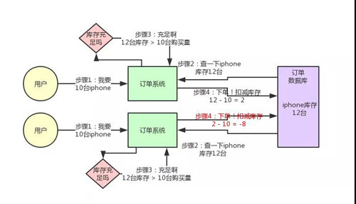

这个图，其实很清晰了，假设订单系统部署在两台机器上，不同的用户都要同时买 10 台 iPhone，分别发了一个请求给订单系统。

接着每个订单系统实例都去数据库里查了一下，当前 iPhone 库存是 12 台。俩大兄弟一看，乐了，12 台库存大于了要买的 10 台数量啊!

于是乎，每个订单系统实例都发送 SQL 到数据库里下单，然后扣减了 10 个库存，其中一个将库存从 12 台扣减为 2 台，另外一个将库存从 2 台扣减为 -8 台。

现在完了，库存出现了负数!泪奔啊，没有 20 台 iPhone 发给两个用户啊!这可如何是好。

## 8.2 用分布式锁如何解决库存超卖问题?

我们用分布式锁如何解决库存超卖问题呢?其实很简单，回忆一下上次我们说的那个分布式锁的实现原理：

同一个锁 Key，同一时间只能有一个客户端拿到锁，其他客户端会陷入无限的等待来尝试获取那个锁，只有获取到锁的客户端才能执行下面的业务逻辑。

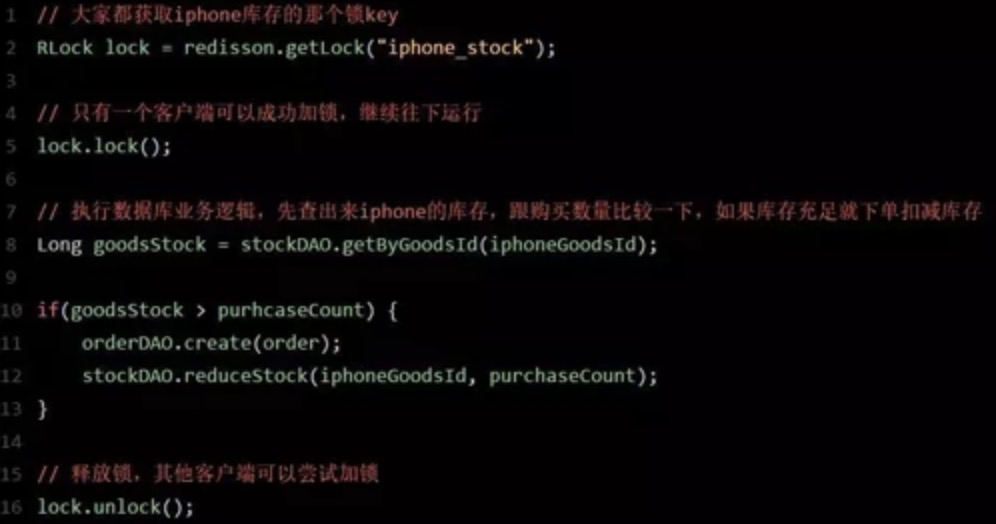

代码大概就是上面那个样子，现在我们来分析一下，为啥这样做可以避免库存超卖?

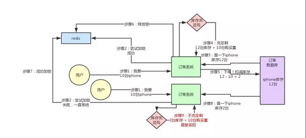

大家可以顺着上面的那个步骤序号看一遍，马上就明白了。

从上图可以看到，只有一个订单系统实例可以成功加分布式锁，然后只有他一个实例可以查库存、判断库存是否充足、下单扣减库存，接着释放锁。

释放锁之后，另外一个订单系统实例才能加锁，接着查库存，一下发现库存只有 2 台了，库存不足，无法购买，下单失败。不会将库存扣减为 -8 的。

## 8.3 有没其他方案解决库存超卖问题?

当然有啊!比如悲观锁，分布式锁，乐观锁，队列串行化，异步队列分散，Redis 原子操作，等等，很多方案，我们对库存超卖有自己的一整套优化机制。

但是前面说过了，这篇文章就聊一个分布式锁的并发优化，不是聊库存超卖的解决方案，所以库存超卖只是一个业务场景而已。

## 8.4 分布式锁的方案在高并发场景下

好，现在我们来看看，分布式锁的方案在高并发场景下有什么问题?

问题很大啊!兄弟，不知道你看出来了没有。分布式锁一旦加了之后，对同一个商品的下单请求，会导致所有客户端都必须对同一个商品的库存锁 Key 进行加锁。

比如，对 iPhone 这个商品的下单，都必对“iphone_stock”这个锁 Key 来加锁。这样会导致对同一个商品的下单请求，就必须串行化，一个接一个的处理。

大家再回去对照上面的图反复看一下，应该能想明白这个问题。

假设加锁之后，释放锁之前，查库存→创建订单→扣减库存，这个过程性能很高吧，算他全过程 20 毫秒，这应该不错了。

那么 1 秒是 1000 毫秒，只能容纳 50 个对这个商品的请求依次串行完成处理。

比如一秒钟来 50 个请求，都是对 iPhone 下单的，那么每个请求处理 20 毫秒，一个一个来，最后 1000 毫秒正好处理完 50 个请求。

大家看一眼下面的图，加深一下感觉。

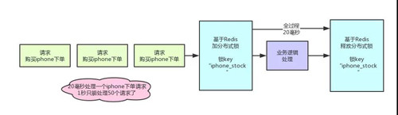

所以看到这里，大家起码也明白了，简单的使用分布式锁来处理库存超卖问题，存在什么缺陷。

缺陷就是同一个商品多用户同时下单的时候，会基于分布式锁串行化处理，导致没法同时处理同一个商品的大量下单的请求。

这种方案，要是应对那种低并发、无秒杀场景的普通小电商系统，可能还可以接受。

因为如果并发量很低，每秒就不到 10 个请求，没有瞬时高并发秒杀单个商品的场景的话，其实也很少会对同一个商品在 1 秒内瞬间下 1000 个订单，因为小电商系统没那场景。

## 8.5 如何对分布式锁进行高并发优化?

好了，终于引入正题了，那么现在怎么办呢?

面试官说，我现在就卡死，库存超卖就是用分布式锁来解决，而且一秒对一个 iPhone 下上千订单，怎么优化?

现在按照刚才的计算，你 1 秒钟只能处理针对 iPhone 的 50 个订单。其实说出来也很简单，相信很多人看过 Java 里的 ConcurrentHashMap 的源码和底层原理，应该知道里面的核心思路，就是分段加锁!

把数据分成很多个段，每个段是一个单独的锁，所以多个线程过来并发修改数据的时候，可以并发的修改不同段的数据。不至于说，同一时间只能有一个线程独占修改 ConcurrentHashMap 中的数据。

另外，Java 8 中新增了一个 LongAdder 类，也是针对 Java 7 以前的 AtomicLong 进行的优化，解决的是 CAS 类操作在高并发场景下，使用乐观锁思路，会导致大量线程长时间重复循环。

LongAdder 中也是采用了类似的分段 CAS 操作，失败则自动迁移到下一个分段进行 CAS 的思路。

其实分布式锁的优化思路也是类似的，之前我们是在另外一个业务场景下落地了这个方案到生产中，不是在库存超卖问题里用的。

但是库存超卖这个业务场景不错，很容易理解，所以我们就用这个场景来说一下。

大家看看下面的图：

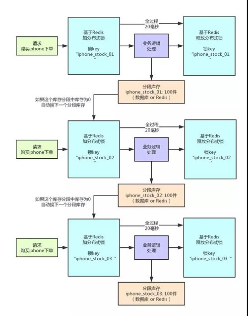

这就是分段加锁。假如你现在 iPhone 有 1000 个库存，那么你完全可以给拆成 20 个库存段。

要是你愿意，可以在数据库的表里建 20 个库存字段，比如 stock_01，stock_02，类似这样的，也可以在 Redis 之类的地方放 20 个库存 Key。

总之，就是把你的 1000 件库存给他拆开，每个库存段是 50 件库存，比如 stock_01 对应 50 件库存，stock_02 对应 50 件库存。

接着，每秒 1000 个请求过来了，好!此时其实可以是自己写一个简单的随机算法，每个请求都是随机在 20 个分段库存里，选择一个进行加锁。

Bingo!这样就好了，同时可以有最多 20 个下单请求一起执行，每个下单请求锁了一个库存分段，然后在业务逻辑里面，就对数据库或者是 Redis 中的那个分段库存进行操作即可，包括查库存→判断库存是否充足→扣减库存。

这相当于什么呢?相当于一个 20 毫秒，可以并发处理掉 20 个下单请求，那么 1 秒，也就可以依次处理掉 20 * 50 = 1000 个对 iPhone 的下单请求了。

一旦对某个数据做了分段处理之后，有一个坑大家一定要注意：就是如果某个下单请求，咔嚓加锁，然后发现这个分段库存里的库存不足了，此时咋办?

这时你得自动释放锁，然后立马换下一个分段库存，再次尝试加锁后尝试处理。这个过程一定要实现。

## 8.6 分布式锁并发优化方案有什么不足?

不足肯定是有的，最大的不足，很不方便，实现太复杂了：

- 首先，你得对一个数据分段存储，一个库存字段本来好好的，现在要分为 20 个库存字段。
- 其次，你在每次处理库存的时候，还得自己写随机算法，随机挑选一个分段来处理。
- 最后，如果某个分段中的数据不足了，你还得自动切换到下一个分段数据去处理。

这个过程都是要手动写代码实现的，还是有点工作量，挺麻烦的。

不过我们确实在一些业务场景里，因为用到了分布式锁，然后又必须要进行锁并发的优化，又进一步用到了分段加锁的技术方案，效果当然是很好的了，一下子并发性能可以增长几十倍。

该优化方案的后续改进：以我们本文所说的库存超卖场景为例，你要是这么玩，会把自己搞的很痛苦!再次强调，我们这里的库存超卖场景，仅仅只是作为演示场景而已。

# 参考资料

- [再有人问你分布式锁，这篇文章扔给他](https://juejin.im/post/5bbb0d8df265da0abd3533a5#heading-5)
- [每秒100W请求，12306秒杀业务，架构如何优化？](https://mp.weixin.qq.com/s?__biz=MjM5ODYxMDA5OQ==&mid=2651962774&idx=1&sn=17e9a5e014651430dea14b460a789207&chksm=bd2d084a8a5a815ced2370f055a8413afdde0988fe0736f85b929d1af229af99be56b2edb933&token=2034999168&lang=zh_CN&scene=25#wechat_redirect)