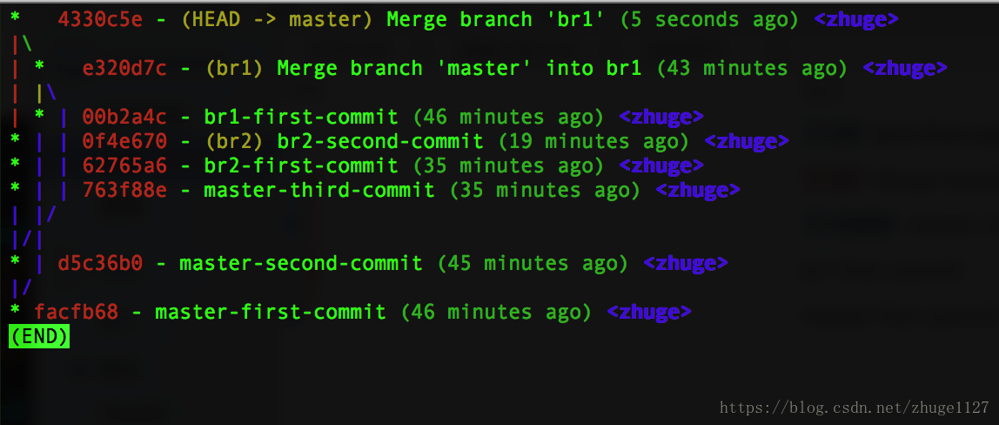

# 基础操作

## 创建 Git 版本库
在本地创建 Git 版本库，需要使用 `git init` 命令。

首先，你需要新建一个存放版本库的目录，然后进入到该目录所在路径，然后执行：

```bash
git init
```


然后查看目录结构中，就可以看到包含有 .git 子目录，这就说明创建版本库成功了。

## 将文件添加到版本库
要将一个文件纳入到版本库管理，首先要将其添加到暂存区(这里不做深入介绍)，然后才能提交到仓库中。

1. 将文件添加到暂存区，使用的是 `git add`：

```bash
git add Readme.md       // 添加单个文件到暂存区
git add .               // 将当前目录下所有修改添加到暂存区，除按照规则忽略的之外
```

> 注意：这边空文件夹是不会被添加到暂存区中的。

2. 将暂存区中的文件，提交到仓库中。需要使用 `git commit`：

```bash
git commit      // 如果暂存区有文件，则将其中的文件提交到仓库
git commit -m 'your comments'       // 带评论提交，用于说明提交内容、变更、作用等
```

>
> 注意：这边直接用 git commit 提交，会先弹出添加评论的页面。


## 查看仓库的状态
不论我们是新建了文件，将文件加入暂存区，或者其他的修改等等，我们都可以通过：

```bash
git status
```


来随时查看仓库中文件的状态。这个应该是使用 Git 做版本控制过程中，我使用最多的一个命令。

## 查看仓库中的具体修改

很经常的，我们对某个文件做了修改，但过不久就忘记了。这时候就可以通过 git diff 来查看具体的修改内容。

```bash
git diff    // 查看版本库中所有的改动
git diff Readme.md      // 查看具体文件的改动
```

## 查看提交历史记录

有的时候，你会需要查看自己做过哪些提交，来回顾自己完成的部分。或者需要寻找某个具体的提交来查看当时的代码。这里需要用到：

```bash
git log     // 显示所有提交的历史记录
git log --graph --abbrev-commit --pretty=format:'%Cred%h%Creset -%C(yellow)%d%Creset %s %Cgreen(%cr) %C(bold blue)<%an>%Creset' --all  // 图形化显示更清晰的提交历史(提交时间、作者)。--all代表显示所有的分支的提交记录
git show 'commit_id'   // 显示某次提交的元数据和内容变化
```

在 `git log` 的输出内容中，可以看到每次提交的 ID，是一个 40 位的字符串。

`git log --graph`显示说明: 

- 每个`*` 代表一次提交
- |表示分支前进。两条平行竖线代表两个不同的分支在并行开发。
- /表示分叉   \表示合入

## 版本回退
### 使用reset
有了 git log 来查看提交的历史记录，我们就可以通过 git reset --hard 来回退到我们需要的特定版本，然后使用当时的代码进行各种操作。

```bash
git reset --hard HEAD^      // 回退到上一个提交版本
git reset --hard HEAD^^     // 回退到上上一个提交版本
git reset --hard 'commit_id'    // 会退到 commit_id 指定的提交版本
```

接下来要把本地的修改强制推送到远程分支上:
```bash
git push origin master -f // 将本地 master 分支强制推送到 origin 远程分支
```

### 使用revert
```bash
git revert HEAD         // 回退到上一个提交版本
git push origin master  // 将本地 master 分支推送到 origin 远程分支
```
**区别:**

reset是指将HEAD指针指到指定提交，历史记录中不会出现放弃的提交记录；

revert是放弃指定提交的修改，但是会生成一次新的提交，需要填写提交注释，以前的历史记录都在。

## 回到未来的某个提交

当退回到某个提交的版本以后，再通过 git log 是无法显示在这之后的提交信息的。但是，通过 git reflog 可以获取到操作命令的历史。

因此，想要回到未来的某个提交，先通过 git reflog 从历史命令中找到想要回到的提交版本的 ID，然后通过 git reset --hard 来切换。

```bash
git reflog
git reset --hard 'commit_id'
```


## 撤销修改

撤销修改同样包括两方面的内容，由于仓库中的文件在提交之前，可能在工作区中，尚未在版本控制范围内，也可能在暂存区中。

1. 丢弃工作区中文件的修改

```bash
git checkout -- Readme.md   // 如果 Readme.md 文件在工作区，则丢弃其修改
git checkout -- .           // 丢弃当前目录下所有工作区中文件的修改
```

>
> 注意： git checkout -- 中的 -- 是必须的。


2. 丢弃已经进入暂存区的修改

```bash
git reset HEAD Readme.md    // 将 Readme.md 恢复到 HEAD 提交版本的状态
```

## 删除文件

在文件未添加到暂存区之前，对想删除文件可以直接物理删除。或者通过 git checkout -- file 来丢弃。如果文件已经被提交，则需要 git rm 来删除：

```bash
git rm Readme.md    // 删除已经被提交过的 Readme.md

```

> 注意： git rm 只能删除已经提交到版本库中的文件。其他状态的文件直接用这个命令操作是出错的。

# 分支管理

分支是版本控制系统中很重要的一个概念，在 Git 中新建、合并等分支的操作非常轻量便捷，因此我们会很经常的用到。

## 查看分支

查看分支使用 `git branch`：

```bash
git branch      // 查看本地分支信息
git branch -v   // 查看相对详细的本地分支信息
git branch -av  // 查看包括远程仓库在内的分支信息
```

>
> 注意：在 git branch 的输出内容中，有一个分支，前面带有 * 号，这标识我们当前所在的分支。

## 创建分支

当我们要修复一个 Bug，或者开发一个新特性，甚至是在初学的时候怕打乱原来的代码，都可以新建一个分支来避免对原来代码的影响。

```bash
git branch dev  // 新建一个名称为 dev 的分支
```


## 切换分支

当我们创建完分支以后，我们需要切换到新建的分支，否则，所有的修改，还是在原来的分支上。事实上，所有的改动，只能影响到当前所在的分支。

```bash
git checkout dev    // 新建完 dev 分支以后，通过该命令切换到 dev 分支
```


## 创建并切换分支

```bash
git checkout -b dev     // 新建 dev 分支，并切换到该分支上
```


这个命令合并了前两个独立的命令，平常使用中一般这样使用。

## 合并分支

当我们修复完成一个 Bug，或者开发完成一个新特性，我们就会把相关的 Bug 或者 特性的上修改合并回原来的主分支上，这时候就需要 `git merge` 来做分支的合并。

首先需要切换回最终要合并到的分支，如 `master`：

```bash
git checkout master     // 切换回 master 分支
git merge dev           // 将 dev 分钟中的修改合并回 master 分支
```


合并回主分支的时候，后面可能会面临到冲突的问题。冲突的解决暂不在这里说明。

## 删除分支

当之前创建的分支，完成了它的使命，如 Bug 修复完，分支合并以后，这个分支就不在需要了，就可以删除它。

```bash
git branch -d dev       // 删除 dev 分支
```

# 远程仓库

上面的所有命令都是针对本地仓库的操作。当我们希望多个人来协作时，会将代码发布到一个统一的远程仓库，然后多个人在本地操作以后，在推送到远程仓库。其他人协作时，需要先同步远程仓库的内容，再推送自己的修改。

## 从远程仓库克隆

如果你本地没有仓库，希望从已有的远程仓库上复制一份代码，那么你需要 git clone。

```bash
git clone https://github.com/git/git.git    // 通过 https 协议，克隆 Github 上 git 仓库的源码
git clone linfuyan@github.com/git/git.git   // 通过 ssh 协议，克隆 Github 上 git 仓库的源码
```

>
> 注意： git clone 后面的仓库地址，可以支持多种协议，如 https， ssh 等。

## 添加远程仓库

如果你已经有了一个本地仓库，如之前创建的 git-guide，然后你打算将它发布到远程，供其他人协作。那么使用：

```bash
git remote add origin your_remote_git_repo      // 为本地仓库添加远程仓库
```


## 推送本地的内容到远程仓库

当本地仓库中，代码完成提交，就需要将代码等推送到远程仓库，这样其他协作人员可以从远程仓库同步内容。

```bash
git push -u origin master // 第一次推送时使用，可以简化后面的推送或者拉取命令使用
git push origin master  // 将本地 master 分支推送到 origin 远程分支
```

> 注意： `git push -u origin master`，第一次使用时，带上 -u 参数，在将本地的 master 分支推送到远程新的 master 分支的同时，还会把本地的 master 分支和远程的 master 分支关联起来。

## 从远程仓库获取最新内容

在多人协作过程中，当自己完成了本地仓库中的提交，想要向远程仓库推送前，需要先获取到远程仓库的最新内容。

可以通过 `git fetch` 和 `git pull` 来获取远程仓库的内容。

```bash
git fetch origin master 
git pull origin master
```

`git fetch` 和 `git pull` 之间的区别:

- `git fetch` 是仅仅获取远程仓库的更新内容，并不会自动做合并。

- `git pull` 在获取远程仓库的内容后，会自动做合并，可以看成 git fetch 之后 git merge。

> 注意：建议多使用 git fetch。
>

## 查看远程仓库信息

```bash
git remote [-v]     // 显示远程仓库信息
```


## 建立本地分支和远程分支的关联

在本地仓库中的分支和远程仓库中的分支是对应的。一般情况下，远程仓库中的分支名称和本地仓库中的分支名称是一致的。

有的时候，我们会需要指定本地分支与远程分支的关联。

```bash
git branch --set-upstream 'local_branch' origin/remote_branch
```


## 修改本地仓库对应的远程仓库地址

当远程的仓库地址发生变化时，需要修改本地仓库对应的远程仓库的地址。主要应用在工程迁移过程中。

```bash
git remote set-url origin url
```

# 标签管理

在项目开发过程中，当一个版本发布完成时，是需要对代码打上标签，便于后续检索。获取处于其他的原因，需要对某个提交打上特定的标签。

## 创建标签

```bash
git tag -a 'tagname' -m 'comment' 'commit_id'
```

`-a` 参数指定标签名， `-m` 添加备注信息， 'commit_id' 指定打标签的提交。

## 查看所有标签

```bash
git tag     // 查看本地仓库中的所有标签
```


## 查看具体标签信息

```bash
git show tagname
```


## 删除本地标签

如果打的标签出错，或者不在需要某个标签，则可以删除它。

```bash
git tag -d tagname
```


## 删除远程标签

```bash
git push origin :refs/tags/tagname

git push origin --delete tagname

git push origin :tagname
```


## 推送标签到远程仓库

打完标签以后，有需要推送到远程仓库。

1. 推送单个标签到远程仓库

```bash
git push origin tagname
```

2. 一次性推送所有标签到远程仓库。

```bash
git push origin --tags
```

# 进阶操作

## 临时保存修改

在执行很多的 Git 操作的时候，是需要保持当前操作的仓库/分支处于 clean 状态，及没有未提交的修改。如 `git pull`， `git merge` 等等，如果有未提交的修改，这些将无法操作，报错如下:
> error: Your local changes to the following files would be overwritten by merge:
	pom.xml
Please commit your changes or stash them before you merge.
Aborting

但是做这些事情的时候，你可能修改了比较多的代码，却又不想丢弃它。那么，你需要把这些修改临时保存起来，这就需要用到 `git stash`。处理方法如下:
```bash
git stash
git pull
git stash pop
```

反过来，如果希望用代码库中的文件完全覆盖本地工作版本。方法如下:
```bash
git reset --hard
git pull
```

### git stash命令

1. **临时保存修改**，这样仓库就可以回到 clean 状态。

```bash
git  stash      // 保存本地仓库中的临时修改
```

>
> 注意：可以多次的 git stash 来保存不同的临时修改。

2. **查看临时保存**。当你临时保存以后，后面还是要取回来的，那它们在哪里呢？

```bash
git stash list  // 显示所有临时修改
```

3. 当我们处理完其他操作时，想要恢复临时保存的修改。

```bash
git stash apply     // 恢复所有保存的临时修改
git stash pop       // 恢复最近一次保存的临时修改
```

4. 或者，我们后面觉得临时保存不想要了，那可以丢弃它。

```bash
git stash clear     // 丢弃所有保存的临时修改
```

