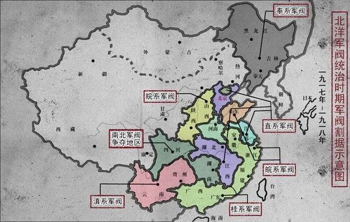
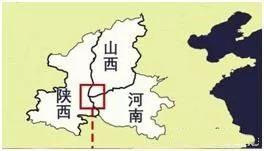
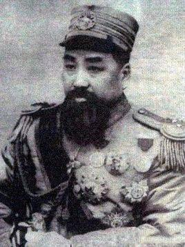
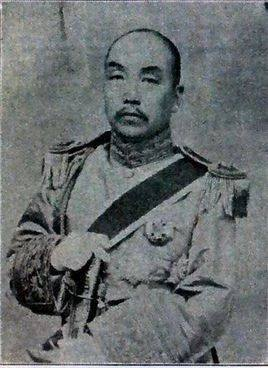

北洋军阀时期是中国近代史上纷乱的割据时代，各地军阀依仗自身的军事、经济实力以及各自身后的美日等国支持，划地为政，中央政府名存实亡。但是放眼河南周边地区，山东有吴佩孚、孙传芳，安徽有段祺瑞，湖北有黎元洪，陕西有杨虎城，山西有阎锡山，河北有冯国璋、冯玉祥等等，独独河南一省没有被类似等级的大军阀长期占领，甚至在北洋割据初期，还一度服从于中央政府直接管理，这在北洋军阀史上是一个非常奇特的现象。

有人可能会提到比前几位都要厉害的河南人袁世凯，但他毕竟没有将河南作为自己的割据地，创建个豫系军阀之类的，所以不太能算。

那么，河南为什么没有被大军阀长期割据？

其实，并非是河南没有军阀，而是大军阀们在河南没法长期待下去。

## 上古遗风，只尊正统

在古代中国，传统的“正统”评判标准有三，其中就包括是否据中原，宋代叶适的《兵部尚书蔡公墓志铭》记载：“若夫不别夷夏，不分正闰，恬其仇我，俛焉并立，甚至以为戎狄之德，黎民怀之，若天眷命而然，则尤公师友之所讳也。”

简言之，就是只有中原之人才是天下正统之所在。由此可见，正统观在中国人的心目中占有极重的地位。

而千百年来，“尊主”一直是位居中原腹地的河南民众的共识。民国时期，在河南省安阳市侯家庄内，有近89%的人对中央有强烈的归属感，“尊尊”“亲亲”的思想以及对正统的归属感依然在民众和政治上层中有很大的影响，且对正统的认同程度有增无减。

在军阀割据的初期，正统显而易见就是与各派割据势力名称相异的中央政府。因而，深厚的封建中原文化遗存，是使河南在军阀割据之初不为各派军阀所占的原因之一。

当然，随着军阀混战规模的不断扩大，河南在之后曾陆续归附不同的大军阀势力之下，只是时间都不长久。

## 黄河泛滥，环境不稳

黄河重灾区是军阀们不得不放弃河南的另一个重要原因

在历史上，河南一度是中国的政治经济文化中心。所谓“得中原者得天下”，这是各路志在天下的豪杰枭雄们的共识。由于土壤肥沃，气候温和，河南成为中国冬小麦的主要产地，其中河南北部的冬小产量居全国第一。得到了中原大地上的出产的粮食，得到了中原男儿做兵源，就有了夺取天下的本钱。于是“群雄逐鹿”时都要“逐鹿中原”，河南就成为兵家必争之地。

但是国历君之前曾讲过，河南地区一直面临着黄河带来的水患。自周定王（公元前602年）至1938年国民党花园口扒开河水淹没日军，这2540年中，黄河决溢次数多达1590多次，黄河26次大的变道中就有20余次发生在河南地界上，真的是“中国之水非一，而黄河为大，其源远而高，其流大而疾，其质浑而浊，其为患于中国也，视诸水为甚焉”。

在兵荒马乱、缺乏对黄河进行有效管理的民国时代，黄河水患带来的影响更为严重。1921年、1931年、1935年、1938年，河南共计发生四次大规模的水灾发生，其沿河各县，河水纷纷漫灌，河水退却之后，村落尽数被毁，土地大量荒芜，有的地方被水浸泡长达3个月之久，每一次水灾带来的都是大量的田地被淹没、房屋被摧毁以及大量人口的锐减，几乎整个河南的地块都曾遭受过黄河的肆虐，给河南人民带来了深重的灾难。

因此，饱受黄河肆虐的河南已经不适合作为长期驻兵屯粮的首选根据地，自然没有大军阀长期占领。

## 四通八达，四战之地

河南位居中原腹地，地理位置四通八达，这在和平年代是优势，但在战争年代，就是严重的“缺陷”。

翻看地图，河南正是处在中原的中心位置，属于交通要道。战争时期，地处中心的河南，常会陷入四面受敌、无回旋余地的境界。

河南自古以来就被称为“四战之地”，因其特殊的军事价值一直是兵家必争之地，只要中原有战争，河南必定是主战场之一。春秋战国有围魏救赵，秦末有陈胜吴广起义。隋末农民军荥阳大海寺一役，使隋朝残兵败将“尽夜号哭，数日不止，河南郡县为之丧气。”（《旧唐书》卷五三《李密传》）。唐末王仙芝又在河南长垣发动起义。到了近代，义和团运动在山东、河南等地兴起。我们从成语“逐鹿中原”和“问鼎中原”，就能体会到古代河南地理位置的独特性。

而由于四通八达的平坦地形，使得河南一旦被占领，就有可能面临腹背受敌的困境。北宋最终将都城定在开封，也不得不解决其地理上的防御弱点，必须在都城驻屯重兵加以弥补。而军阀混战的年代，还没有哪一个军阀能势力强大到用重兵占领河南。

围棋术语中，有句话叫“金角银边草肚皮”，所谓四个角部，因为有两边支撑，易守难攻，容易活棋，所以称“金”；四条边线，虽有一定风险，但至少左右相通，所以称“银”；唯有中央，无所依凭，一马平川，就如茫茫大野，难攻难守，所以它是“草”。而河南，就处于“草肚皮”的位置。

北伐战争前夕，河南被吴佩孚控制，属直系军阀势力范围。到了北伐战争中，随着吴佩孚、孙传芳的溃败，奉系张作霖就进军河南省，企图阻止国民革命军北伐。最后，从武汉北上的北伐军与冯玉祥部队会师河南郑州，奉军也因腹背受敌，被迫撤退。

## 饱经蹂躏，经济承载力弱

军阀混战使得河南饱经蹂躏，已是千疮百孔。据不完全统计，1919-1922年，中国大约每两个月要发生3次较大规模的内战，战火几乎遍及全国。而这期间，河南本地小军阀的胡作非为无疑是雪上加霜。

河南曾有一个军阀叫赵倜，曾奉袁世凯之命率部进入河南，后又追剿白朗起义军，因功授河南护军使，1914年督理河南军务。但是，赵倜的主要精力都用在巩固自己的地盘，对发展经济毫无兴趣。赵倜在河南统治8年，对地方无所建树，还以种种手段谋取私利，加之他的军队纪律非常败坏，河南百姓因此特别恨他。

据记载，赵倜在河南谋私有三个主要方法：一是欠饷自肥，军队经常欠饷数月，年终则马虎了事；二是把持河南省铜元局，买铜自造，从中取利；三是不通过省长公署和财政机关，直接向豫西产鸦片县份摊派鸦片捐款，尽入私囊。

1916年袁世凯死后，北洋军阀分裂为皖、直、奉三大派系，各派军阀纷纷划分势力范围，从东北到两广几乎已被各系军阀分瓜殆尽。

这时，任河南督军兼省长的赵倜，先依附段祺瑞，后因为与段产生矛盾，在1920年直皖战争时期，拥直反皖。战争结束后，本以为能享受功劳的赵倜却被吴佩孚排挤，地位降低。1922年，第一次直奉战争爆发，赵倜又响应奉系在河南反对吴佩孚，结果被冯玉祥击败，并被免除河南督军。他不得不出关投靠张作霖，任高等顾问。1933年，赵倜在北京病逝。

除了赵倜，河南还有一支军阀部队——镇嵩军。但这支军队势力明显要小很多，如果不是《白鹿原》的热播，估计很少有人知道历史上还有过这么一支部队。镇嵩军的长官刘镇华除了围困西安外，好像也没折腾起什么大事来。

民国最大的一场军阀混战，就是以河南为主战场的中原大战。1930年，蒋介石大战冯玉祥、阎锡山、桂系李宗仁、白崇禧等联军。这时，河南小军阀们只能选其中一方投靠。河南最大的军阀势力镇嵩军就是在这场战争中，从冯玉祥麾下转投了蒋介石，从此四分五裂，几乎消失。从赵倜、刘镇华的经历不难看出，河南当地的小军阀并不打算以河南为根据地，长期经营自己的势力，而是努力将河南一地依附在周边的大军阀势力下，牟取私利。

另外，庞大的军费开支，几乎榨干了整个河南。1926年，北伐前夕，北方军阀（包括所属地方军阀）在河南省驻军三十万，每月支付军费164万1千元，而河南省全年收入不过2千万元。可见河南省已被军阀蹂躏得面目全非、鲜血淋漓。

总的来讲，河南虽说是四通八达的中心，人口也众多，土地也平整可耕，可是由于黄河水患的影响、无险可守的特殊地理环境以及军阀混战导致的社会经济衰退，使得军阀们对河南都只是暂时性的占据，无力维持长久的统治，就更别说长期的割据了。