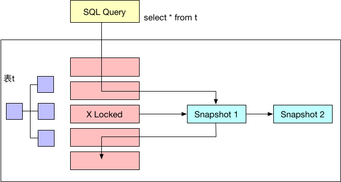
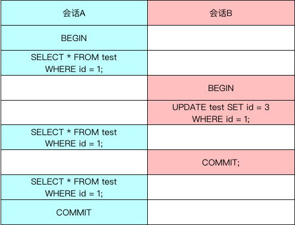
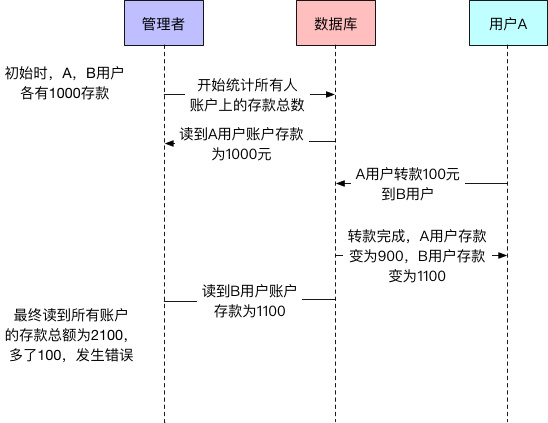
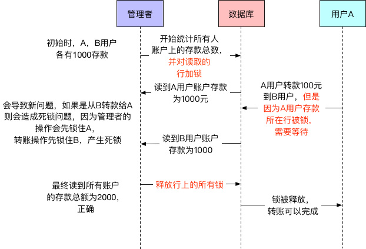
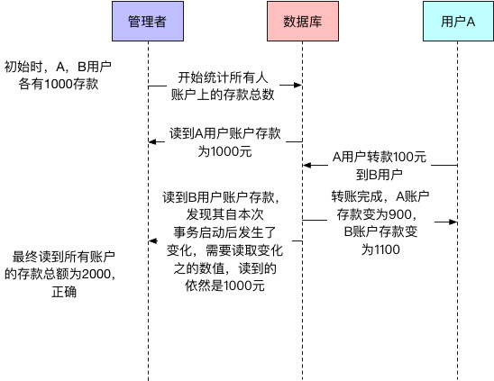
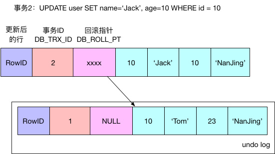
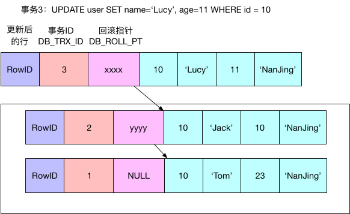

# 一致性非锁定读

一致性非锁定读(consistent nonlocking read)是指InnoDB存储引擎通过多版本控制(MVVC)读取当前数据库中行数据的方式。如果读取的行正在执行DELETE或UPDATE操作，这时读取操作不会因此去等待行上锁的释放。相反地，InnoDB会去读取行的一个快照。



上图直观地展现了InnoDB一致性非锁定读的机制。之所以称其为非锁定读，是因为不需要等待行上排他锁的释放。快照数据是指该行的之前版本的数据，每行记录可能有多个版本，一般称这种技术为行多版本技术。由此带来的并发控制，称之为多版本并发控制(Multi Version Concurrency Control, MVVC)。InnoDB是通过undo log来实现MVVC。undo log本身用来在事务中回滚数据，因此快照数据本身是没有额外开销。此外，读取快照数据是不需要上锁的，因为没有事务需要对历史的数据进行修改操作。

## 事务隔离级别


一致性非锁定读是InnoDB默认的读取方式，即读取不会占用和等待行上的锁。但是并不是在每个事务隔离级别下都是采用此种方式。此外，即使都是使用一致性非锁定读，但是对于快照数据的定义也各不相同。

在事务隔离级别READ COMMITTED和REPEATABLE READ下，InnoDB使用一致性非锁定读。然而，对于快照数据的定义却不同。在READ COMMITTED事务隔离级别下，一致性非锁定读总是读取被锁定行的最新一份快照数据(可能会发生在一个事务内两次读到的数据是不一样的，因此称为是不可重复读)。而在REPEATABLE READ事务隔离级别下，则读取事务开始时的行数据版本。

我们下面举个例子来详细说明一下上述的情况。

```
# session A
mysql> BEGIN;
mysql> SELECT * FROM test WHERE id = 1;
```

我们首先在会话A中显示地开启一个事务，然后读取test表中的id为1的数据，但是事务并没有结束。于此同时，用户在开启另一个会话B，这样可以模拟并发的操作，然后对会话B做出如下的操作：

```
# session B
mysql> BEGIN;
mysql> UPDATE test SET id = 3 WHERE id = 1;
```

在会话B的事务中，将test表中id为1的记录修改为id=3，但是事务同样也没有提交，这样id=1的行其实加了一个排他锁。由于InnoDB在READ COMMITTED和REPEATABLE READ事务隔离级别下使用一致性非锁定读，这时如果会话A再次读取id为1的记录，仍然能够读取到相同的数据。此时，READ COMMITTED和REPEATABLE READ事务隔离级别没有任何区别。



如上图所示，当会话B提交事务后，会话A再次运行`SELECT * FROM test WHERE id = 1`的SQL语句时，两个事务隔离级别下得到的结果就不一样了。
对于READ COMMITTED的事务隔离级别，它总是读取行的最新版本，如果行被锁定了，则读取该行版本的最新一个快照。因为会话B的事务已经提交，所以在该隔离级别下上述SQL语句的结果是最新的。
对于REPEATABLE READ的事务隔离级别，总是读取事务开始时的行数据，因此，在该隔离级别下，上述SQL语句仍然会获得相同的数据。

### 不可重复读和幻读的区别

很多人容易搞混不可重复读和幻读，确实这两者有些相似。但不可重复读重点在于update和delete，而幻读的重点在于insert。

如果使用锁机制来实现这两种隔离级别，在可重复读中，该sql第一次读取到数据后，就将这些数据加锁，其它事务无法修改这些数据，就可以实现可重复读了。但这种方法却无法锁住insert的数据，所以当事务A先前读取了数据，或者修改了全部数据，事务B还是可以insert数据提交，这时事务A就会发现莫名其妙多了一条之前没有的数据，这就是幻读，不能通过行锁来避免。需要Serializable隔离级别 ，读用读锁，写用写锁，读锁和写锁互斥，这么做可以有效的避免幻读、不可重复读、脏读等问题，但会极大的降低数据库的并发能力。

MySQL采用了gap lock，所以实际上MySQL的REPEATABLE READ隔离级别也解决了幻读的问题，也就是Mysql InnoDB在Read repeatable级别上使用next-key locking 策略来避免幻读现象的产生。详见: [Innodb锁机制：Next-Key Lock 浅谈](https://www.cnblogs.com/zhoujinyi/p/3435982.html)

上文说的，是使用悲观锁机制来处理这两种问题，但是MySQL、ORACLE、PostgreSQL等成熟的数据库，出于性能考虑，都是使用了以乐观锁为理论基础的MVCC（多版本并发控制）来避免这两种问题。

# MVVC

我们首先来看一下wiki上对MVVC的定义：

> Multiversion concurrency control (MCC or MVCC), is a concurrency control
> method commonly used by database management systems to provide
> concurrent access to the database and in programming languages to
> implement transactional memory.

由定义可知，MVVC是用于数据库提供并发访问控制的并发控制技术。
数据库的并发控制机制有很多，最为常见的就是锁机制。锁机制一般会给竞争资源加锁，阻塞读或者写操作来解决事务之间的竞争条件，最终保证事务的可串行化。而MVVC则引入了另外一种并发控制，它让读写操作互不阻塞，每一个写操作都会创建一个新版本的数据，读操作会从有限多个版本的数据中挑选一个最合适的结果直接返回，由此解决了事务的竞争条件。
考虑一个现实场景。管理者要查询所有用户的存款总额，假设除了用户A和用户B之外，其他用户的存款总额都为0，A、B用户各有存款1000，所以所有用户的存款总额为2000。但是在查询过程中，用户A会向用户B进行转账操作。转账操作和查询总额操作的时序图如下图所示。



如果没有任何的并发控制机制，查询总额事务先读取了用户A的账户存款，然后转账事务改变了用户A和用户B的账户存款，最后查询总额事务继续读取了转账后的用户B的账号存款，导致最终统计的存款总额多了100元，发生错误。

使用锁机制可以解决上述的问题。查询总额事务会对读取的行加锁，等到操作结束后再释放所有行上的锁。因为用户A的存款被锁，导致转账操作被阻塞，直到查询总额事务提交并将所有锁都释放。



但是这时可能会引入新的问题，当转账操作是从用户B向用户A进行转账时会导致死锁。转账事务会先锁住用户B的数据，等待用户A数据上的锁，但是查询总额的事务却先锁住了用户A数据，等待用户B的数据上的锁。

使用MVVC机制也可以解决这个问题。查询总额事务先读取了用户A的账户存款，然后转账事务会修改用户A和用户B账户存款，查询总额事务读取用户B存款时不会读取转账事务修改后的数据，而是读取本事务开始时的数据副本(在REPEATABLE READ隔离等级下)。



MVCC使得数据库读不会对数据加锁，普通的SELECT请求不会加锁，提高了数据库的并发处理能力。借助MVCC，数据库可以实现READ COMMITTED，REPEATABLE READ等隔离级别，用户可以查看当前数据的前一个或者前几个历史版本，保证了ACID中的I特性（隔离性)。

通过MVCC机制，虽然让数据变得可重复读，但我们读到的数据可能是历史数据，是不及时的数据，不是数据库当前的数据！这在一些对于数据的时效特别敏感的业务中，就很可能出问题。对于这种读取历史数据的方式，我们叫它快照读 (snapshot read)，而读取数据库当前版本数据的方式，叫当前读 (current read)。很显然，在MVCC中：

- 快照读：就是select
  - select * from table ….;
- 当前读：特殊的读操作，插入/更新/删除操作，属于当前读，处理的都是当前的数据，需要加锁。
  - select * from table where ? lock in share mode;
  - select * from table where ? for update;
  - insert;
  - update ;
  - delete;

# InnoDB的MVVC实现

多版本并发控制仅仅是一种技术概念，并没有统一的实现标准， 其的核心理念就是数据快照，不同的事务访问不同版本的数据快照，从而实现不同的事务隔离级别。虽然字面上是说具有多个版本的数据快照，但这并不意味着数据库必须拷贝数据，保存多份数据文件，这样会浪费大量的存储空间。InnoDB通过事务的undo日志巧妙地实现了多版本的数据快照。

数据库的事务有时需要进行回滚操作，这时就需要对之前的操作进行undo。因此，在对数据进行修改时，InnoDB会产生undo log。当事务需要进行回滚时，InnoDB可以利用这些undo log将数据回滚到修改之前的样子。

根据行为的不同 undo log 分为两种 insert undo log和update undo log。
insert undo log 是在 insert 操作中产生的 undo log。因为 insert 操作的记录只对事务本身可见，对于其它事务此记录是不可见的，所以 insert undo log 可以在事务提交后直接删除而不需要进行 purge 操作。

update undo log 是 update 或 delete 操作中产生的 undo log，因为会对已经存在的记录产生影响，为了提供 MVCC机制，因此 update undo log 不能在事务提交时就进行删除，而是将事务提交时放到入 history list 上，等待 purge 线程进行最后的删除操作。

为了保证事务并发操作时，在写各自的undo log时不产生冲突，InnoDB采用回滚段的方式来维护undo log的并发写入和持久化。回滚段实际上是一种 Undo 文件组织方式。

InnoDB行记录有三个隐藏字段：分别对应该行的rowid、事务号db_trx_id和回滚指针db_roll_ptr，其中db_trx_id表示最近修改的事务的id，db_roll_ptr指向回滚段中的undo log。如下图所示。


当事务2使用UPDATE语句修改该行数据时，会首先使用排他锁锁定改行，将该行当前的值复制到undo log中，然后再真正地修改当前行的值，最后填写事务ID，使用回滚指针指向undo log中修改前的行。如下图所示。



当事务3进行修改与事务2的处理过程类似，如下图所示。



REPEATABLE READ隔离级别下事务开始后使用MVVC机制进行读取时，会将当时活动的事务id记录下来，记录到Read View中。READ COMMITTED隔离级别下则是每次读取时都创建一个新的Read View。
Read View是InnoDB中用于判断记录可见性的数据结构，记录了一些用于判断可见性的属性。

- low_limit_id：某行记录的db_trx_id < 该值，则该行对于当前Read View是一定可见的
- up_limit_id：某行记录的db_trx_id >= 该值，则该行对于当前read view是一定不可见的
- low_limit_no：用于purge操作的判断
- rw_trx_ids：读写事务数组

Read View创建后，事务再次进行读操作时比较记录的db_trx_id和Read View中的low_limit_id，up_limit_id和读写事务数组来判断可见性。

如果该行中的db_trx_id等于当前事务id，说明是事务内部发生的更改，直接返回该行数据。否则的话，如果db_trx_id小于up_limit_id，说明是事务开始前的修改，则该记录对当前Read View是可见的，直接返回该行数据。

如果db_trx_id大于或者等于low_limit_id，则该记录对于该Read View一定是不可见的。如果db_trx_id位于[up_limit_id, low_limit_id)范围内，需要在活跃读写事务数组(rw_trx_ids)中查找db_trx_id是否存在，如果存在，记录对于当前Read View是不可见的。
如果记录对于Read View不可见，需要通过记录的DB_ROLL_PTR指针遍历undo log，构造对当前Read View可见版本数据。
简单来说，Read View记录读开始时及其之后，所有的活动事务，这些事务所做的修改对于Read View是不可见的。除此之外，所有其他的小于创建Read View的事务号的所有记录均可见。

# 参考资料

- MySQL探秘(六):InnoDB一致性非锁定读: https://segmentfault.com/a/1190000017055118
- Innodb锁机制：Next-Key Lock 浅谈: https://www.cnblogs.com/zhoujinyi/p/3435982.html