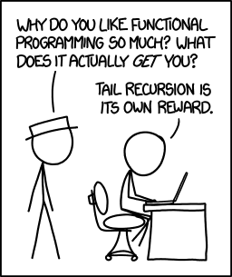

Java 是一流的面向对象语言，除了部分简单数据类型，Java 中的一切都是对象，即使数组也是一种对象，每个类创建的实例也是对象。在 Java 中定义的函数或方法不可能完全独立，也不能将方法作为参数或返回一个方法给实例。

从 Swing 开始，我们总是通过匿名类给方法传递函数功能，以下是旧版的事件监听代码：

```java
someObject.addMouseListener(new MouseAdapter() {
        public void mouseClicked(MouseEvent e) {

            //Event listener implementation goes here...

        }
    });
```

在上面的例子里，为了给 Mouse 监听器添加自定义代码，我们定义了一个匿名内部类 MouseAdapter 并创建了它的对象，通过这种方式，我们将一些函数功能传给 addMouseListener 方法。

简而言之，在 Java 里将普通的方法或函数像参数一样传值并不简单，为此，Java 8 增加了一个语言级的新特性，名为 **Lambda 表达式**。

## 为什么 Java 需要 Lambda 表达式？

如果忽视注解(Annotations)、泛型(Generics)等特性，自 Java 语言诞生时起，它的变化并不大。Java 一直都致力维护其对象至上的特征，在使用过 JavaScript 之类的函数式语言之后，Java 如何强调其面向对象的本质，以及源码层的数据类型如何严格变得更加清晰可感。其实，函数对 Java 而言并不重要，在 Java 的世界里，函数无法独立存在。



在函数式编程语言中，函数是一等公民，它们可以独立存在，你可以将其赋值给一个变量，或将他们当做参数传给其他函数。JavaScript 是最典型的函数式编程语言。点击[此处](http://eloquentjavascript.net/chapter6.html)以及[此处](http://www.ibm.com/developerworks/library/wa-javascript/index.html)可以清楚了解 JavaScript 这种函数式语言的好处。函数式语言提供了一种强大的功能——闭包，相比于传统的编程方法有很多优势，闭包是一个可调用的对象，它记录了一些信息，这些信息来自于创建它的作用域。Java 现在提供的最接近闭包的概念便是 Lambda 表达式，虽然闭包与 Lambda 表达式之间存在显著差别，但至少 Lambda 表达式是闭包很好的替代者。

在 Steve Yegge 辛辣又幽默的[博客文章](http://steve-yegge.blogspot.com/2006/03/execution-in-kingdom-of-nouns.html)里，描绘了 Java 世界是如何严格地以名词为中心的，如果你还没看过，赶紧去读吧，写得非常风趣幽默，而且恰如其分地解释了为什么 Java 要引进 Lambda 表达式。

Lambda 表达式为 Java 添加了缺失的函数式编程特点，使我们能将函数当做一等公民看待。尽管不完全正确，我们很快就会见识到 Lambda 与闭包的不同之处，但是又无限地接近闭包。在支持一类函数的语言中，Lambda 表达式的类型将是函数。但是，在 Java 中，Lambda 表达式是对象，他们必须依附于一类特别的对象类型——函数式接口(functional interface)。我们会在后文详细介绍函数式接口。

Mario Fusco 的这篇思路清晰的[文章](http://java.dzone.com/articles/why-we-need-Lambda-expressions)介绍了为什么 Java 需要 Lambda 表达式。他解释了为什么现代编程语言必须包含闭包这类特性。

## Lambda 表达式简介

Lambda 表达式是一种匿名函数(对 Java 而言这并不完全正确，但现在姑且这么认为)，简单地说，它是没有声明的方法，也即没有访问修饰符、返回值声明和名字。

你可以将其想做一种速记，在你需要使用某个方法的地方写上它。当某个方法只使用一次，而且定义很简短，使用这种速记替代之尤其有效，这样，你就不必在类中费力写声明与方法了。

Java 中的 Lambda 表达式通常使用 `(argument) -> (body)` 语法书写，例如：

```java
(arg1, arg2...) -> { body }

(type1 arg1, type2 arg2...) -> { body }
```

以下是一些 Lambda 表达式的例子：

```java
(int a, int b) -> {  return a + b; }

() -> System.out.println("Hello World");

(String s) -> { System.out.println(s); }

() -> 42

() -> { return 3.1415 };
```

## Lambda 表达式的结构

让我们了解一下 Lambda 表达式的结构。

- 一个 Lambda 表达式可以有零个或多个参数
- 参数的类型既可以明确声明，也可以根据上下文来推断。例如：`(int a)`与`(a)`效果相同
- 所有参数需包含在圆括号内，参数之间用逗号相隔。例如：`(a, b)` 或 `(int a, int b)` 或 `(String a, int b, float c)`
- 空圆括号代表参数集为空。例如：`() -> 42`
- 当只有一个参数，且其类型可推导时，圆括号（）可省略。例如：`a -> return a*a`
- Lambda 表达式的主体可包含零条或多条语句
- 如果 Lambda 表达式的主体只有一条语句，花括号{}可省略。匿名函数的返回类型与该主体表达式一致
- 如果 Lambda 表达式的主体包含一条以上语句，则表达式必须包含在花括号{}中（形成代码块）。匿名函数的返回类型与代码块的返回类型一致，若没有返回则为空

## 方法引用

### 从 Lambda 表达式到双冒号操作符

使用 Lambda 表达式，我们已经看到代码可以变得非常简洁。

例如，要创建一个比较器，以下语法就足够了

```java
Comparator c = (Person p1, Person p2) -> p1.getAge().compareTo(p2.getAge());
```

然后，使用类型推断：

```java
Comparator c = (p1, p2) -> p1.getAge().compareTo(p2.getAge());
```

但是，我们可以使上面的代码更具表现力和可读性吗？我们来看一下：

```java
Comparator c = Comparator.comparing(Person::getAge);
```

使用 `::` 运算符作为 Lambda 调用特定方法的缩写，并且拥有更好的可读性。

### 使用方式

双冒号（`::`）操作符是 Java 中的**方法引用**。 当们使用一个方法的引用时，目标引用放在 `::` 之前，目标引用提供的方法名称放在 `::` 之后，即 `目标引用::方法`。比如：

```java
Person::getAge;
```

在 `Person` 类中定义的方法 `getAge` 的方法引用。

然后我们可以使用 `Function` 对象进行操作：

```java
// 获取 getAge 方法的 Function 对象
Function<Person, Integer> getAge = Person::getAge;
// 传参数调用 getAge 方法
Integer age = getAge.apply(p);
```

我们引用 `getAge`，然后将其应用于正确的参数。

目标引用的参数类型是 `Function<T,R>`，`T` 表示传入类型，`R` 表示返回类型。比如，表达式 `person -> person.getAge();`，传入参数是 `person`，返回值是 `person.getAge()`，那么方法引用 `Person::getAge` 就对应着 `Function<Person,Integer>` 类型。

## 函数式接口

### 简介

在 Java 中，Marker（标记）类型的接口是一种没有方法或属性声明的接口，简单地说，marker 接口是空接口。相似地，**函数式接口是只包含一个抽象方法声明的接口**。因此经常使用的Runnable，Callable接口就是典型的函数式接口。

`java.lang.Runnable` 就是一种函数式接口，在 Runnable 接口中只声明了一个方法 `void run()`，相似地，ActionListener 接口也是一种函数式接口，我们使用匿名内部类来实例化函数式接口的对象，有了 Lambda 表达式，这一方式可以得到简化。

每个 Lambda 表达式都能隐式地赋值给函数式接口，例如，我们可以通过 Lambda 表达式创建 Runnable 接口的引用。

```java
Runnable r = () -> System.out.println("hello world");
```

当不指明函数式接口时，编译器会自动解释这种转化：

```java
new Thread(
   () -> System.out.println("hello world")
).start();
```

因此，在上面的代码中，编译器会自动推断：根据线程类的构造函数签名 `public Thread(Runnable r) { }`，将该 Lambda 表达式赋给 Runnable 接口。

以下是一些 Lambda 表达式及其函数式接口：

```java
Consumer<Integer>  c = (int x) -> { System.out.println(x) };

BiConsumer<Integer, String> b = (Integer x, String y) -> System.out.println(x + " : " + y);

Predicate<String> p = (String s) -> { s == null };
```

[@FunctionalInterface](http://download.java.net/jdk8/docs/api/java/lang/FunctionalInterface.html) 是 Java 8 新加入的一种接口，用于指明该接口类型声明是根据 Java 语言规范定义的函数式接口。Java 8 还声明了一些 Lambda 表达式可以使用的函数式接口，当你注释的接口不是有效的函数式接口时，可以使用 @FunctionalInterface 解决编译层面的错误。

以下是一种自定义的函数式接口： 

```java
@FunctionalInterface 
public interface WorkerInterface {   
	public void doSomeWork();
}
```

根据定义，函数式接口只能有一个抽象方法，如果你尝试添加第二个抽象方法，将抛出编译时错误。但是，函数式接口要求只有一个抽象方法却可以拥有若干个默认方法的（实例方法），比如下例：

```java
@java.lang.FunctionalInterface
public interface FunctionalInterface {
    void handle();

    default void run() {
        System.out.println("run");
    }
}
```

该接口中，除了有抽象方法handle外，还有默认方法（实例方法）run。

函数式接口定义好后，我们可以在 API 中使用它，同时利用 Lambda 表达式。例如：

```java
@FunctionalInterface
interface Converter<F, T> {
    T convert(F from);
}
Converter<String, Integer> converter = (from) -> Integer.valueOf(from);
Integer converted = converter.convert("123");
System.out.println(converted);    // 123
```

上面的代码可以通过静态方法应用可以更加简洁:

```java
Converter<String, Integer> converter = Integer::valueOf;
Integer converted = converter.convert("123");
System.out.println(converted);   // 123
```

### Built-in Functional Interfaces(内置函数)

JDK 1.8 API包含了许多内置函数. 它们中很多在老版本中是大家很熟悉的,像 `Comparator` 和`Runnable`. 这些接口通过 添加`@FunctionalInterface注解来支持`Lambda表达式.

但是Java 8 API 也添加了很多新接口使编程变的更加容易 . 这些新的函数很多是借鉴被大家所熟知的 [Google Guava](https://code.google.com/p/guava-libraries/) 函数库.即使你很熟悉这些函数库,你也需要关注这些方法是怎么在接口中扩展的以及它们怎么使用.

#### Predicates( 判断)

判断是传递一个参数返回一个布尔值. 这个接口包含各种默认的方法组成复杂的逻辑判断单元 (and, or, negate)

```java
Predicate<String> predicate = (s) -> s.length() > 0;

predicate.test("foo");              // true
predicate.negate().test("foo");     // false

Predicate<Boolean> nonNull = Objects::nonNull;
Predicate<Boolean> isNull = Objects::isNull;

Predicate<String> isEmpty = String::isEmpty;
Predicate<String> isNotEmpty = isEmpty.negate();
```

#### Functions(函数)

函数接收一个参数返回一个结果. 默认方法能够链式调用 (compose, andThen).

```java
Function<String, Integer> toInteger = Integer::valueOf;
Function<String, String> backToString = toInteger.andThen(String::valueOf);

backToString.apply("123");     // "123"
```

#### Suppliers(生产者)

Suppliers返回一个给定的泛型类型的结果. 不像函数, Suppliers不需要传递参数.

```java
Supplier<Person> personSupplier = Person::new;
personSupplier.get();   // new Person
```

#### Consumers(消费者)

Consumers代表在一个输入参数上执行一项操作.

```java
Consumer<Person> greeter = (p) -> System.out.println("Hello, " + p.firstName);
greeter.accept(new Person("Luke", "Skywalker"));
```

#### Comparators(比较)

Comparators在老版本中大家都比较熟悉. Java 8 为这个接口增加了几种默认的方法.

```java
Comparator<Person> comparator = (p1, p2) -> p1.firstName.compareTo(p2.firstName);

Person p1 = new Person("John", "Doe");
Person p2 = new Person("Alice", "Wonderland");

comparator.compare(p1, p2);             // > 0
comparator.reversed().compare(p1, p2);  // < 0
```

#### Optionals(选项)

Optionals 并不是一个函数接口, 相反的它的作用就是避免出现空指针异常.它是一个很重要的概念对以一部分,然我们来快速了解它.

Optional是一个简单的容器里面包含有空或者非空的值.想象一下如果有一个方法能够返回一个空或者一个非空的值 . 在Java8中你可以通过返回一个`Optional来替代空`.

```java
Optional<String> optional = Optional.of("bam");

optional.isPresent();           // true
optional.get();                 // "bam"
optional.orElse("fallback");    // "bam"

optional.ifPresent((s) -> System.out.println(s.charAt(0)));     // "b"
```

## Lambda 表达式举例

### 线程初始化

线程可以通过以下方法初始化：

```java
// Old way
new Thread(new Runnable() {
    @Override
    public void run() {
        System.out.println("Hello world");
    }
}).start();

// New way
new Thread(
    () -> System.out.println("Hello world")
).start();
```

### 事件处理

事件处理可以使用 Java 8 的 Lambda 表达式解决。下面的代码中，我们将使用新旧两种方式向一个 UI 组件添加 ActionListener：

```java
  //Old way:
button.addActionListener(new ActionListener() {
@Override
public void actionPerformed(ActionEvent e) {
    System.out.println("The button was clicked using old fashion code!");
}
});

//New way:
button.addActionListener( (e) -> {
    System.out.println("The button was clicked. From Lambda expressions !");
});
```

### 遍例输出（方法引用）

以下代码的作用是打印出给定数组中的所有元素。注意，使用 Lambda 表达式的方法不止一种。在下面的例子中，我们先是用常用的箭头语法创建 Lambda 表达式，之后，使用 Java 8 全新的双冒号(::)操作符将一个常规方法转化为 Lambda 表达式：

```java
//Old way:
List<Integer> list = Arrays.asList(1, 2, 3, 4, 5, 6, 7);
for(Integer n: list) {
   System.out.println(n);
}

//1.8 非lambda
integers.forEach(new Consumer<Integer>() {
  @Override
  public void accept(Integer x) {
    System.out.print(x);
  }
});

//可以将 Lambda 表达式赋值给函数接口的局部变量
Consumer<Integer> consumer=x -> System.out.println(x);
integers.forEach(consumer);

//使用 -> 的 Lambda 表达式
List<Integer> list = Arrays.asList(1, 2, 3, 4, 5, 6, 7);
list.forEach(n -> System.out.println(n));


//使用 :: 的 Lambda 表达式
list.forEach(System.out::println);
```

### 逻辑操作

在下面的例子中，我们使用断言(Predicate)函数式接口创建一个测试，并打印所有通过测试的元素，这样，你就可以使用 Lambda 表达式规定一些逻辑，并以此为基础有所作为：

```java
package com.wuxianjiezh.demo.lambda;

import java.util.Arrays;
import java.util.List;
import java.util.function.Predicate;

public class Main {

    public static void main(String[] args) {
        List<Integer> list = Arrays.asList(1, 2, 3, 4, 5, 6, 7);

        System.out.print("输出所有数字：");
        evaluate(list, (n) -> true);

        System.out.print("不输出：");
        evaluate(list, (n) -> false);

        System.out.print("输出偶数：");
        evaluate(list, (n) -> n % 2 == 0);

        System.out.print("输出奇数：");
        evaluate(list, (n) -> n % 2 == 1);

        System.out.print("输出大于 5 的数字：");
        evaluate(list, (n) -> n > 5);
    }

    public static void evaluate(List<Integer> list, Predicate<Integer> predicate) {
        for (Integer n : list) {
            if (predicate.test(n)) {
                System.out.print(n + " ");
            }
        }
        System.out.println();
    }
}
```

输出：

```java
输出所有数字：1 2 3 4 5 6 7 
不输出：
输出偶数：2 4 6 
输出奇数：1 3 5 7 
输出大于 5 的数字：6 7 
```

### Stream API 示例

下面的例子使用 Lambda 表达式打印数值中每个元素的平方，注意我们使用了 .stream() 方法将常规数组转化为流。Java 8 增加了一些超棒的流 APIs。[java.util.stream.Stream](http://download.java.net/jdk8/docs/api/java/util/stream/Stream.html) 接口包含许多有用的方法，能结合 Lambda 表达式产生神奇的效果。我们将 Lambda 表达式 `x -> x*x` 传给 map() 方法，该方法会作用于流中的所有元素。之后，我们使用 forEach 方法打印数据中的所有元素：

```java
//Old way:
List<Integer> list = Arrays.asList(1,2,3,4,5,6,7);
for(Integer n : list) {
    int x = n * n;
    System.out.println(x);
}

//New way:
List<Integer> list = Arrays.asList(1,2,3,4,5,6,7);
list.stream().map((x) -> x*x).forEach(System.out::println);
```

下面的例子会计算给定数值中每个元素平方后的总和。请注意，Lambda 表达式只用一条语句就能达到此功能，这也是 MapReduce 的一个初级例子。我们使用 map() 给每个元素求平方，再使用 reduce() 将所有元素计入一个数值：

```java
//Old way:
List<Integer> list = Arrays.asList(1,2,3,4,5,6,7);
int sum = 0;
for(Integer n : list) {
    int x = n * n;
    sum = sum + x;
}
System.out.println(sum);

//New way:
List<Integer> list = Arrays.asList(1,2,3,4,5,6,7);
int sum = list.stream().map(x -> x*x).reduce((x,y) -> x + y).get();
System.out.println(sum);
```

## Lambda 表达式与匿名类的区别

- `this` 关键字。对于匿名类 `this` 关键字解析为匿名类，而对于 Lambda 表达式，`this` 关键字解析为包含写入 Lambda 的类。
- 编译方式。Java 编译器编译 Lambda 表达式时，会将其转换为类的私有方法，再进行动态绑定。