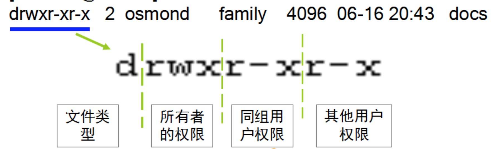

# 用户管理

## 用户及用户组

### 用户账户

- 管理员：UID：0，GID：0
- 系统用户：UID：1-499  GID：1-499 作用：对守护进程获取资源进行权限分配
- 普通用户: UID:500-60000  GID:500-6000

### 组账户(组是用户的集合) 

- 管理员组：root, 0
- 系统组：1-499, 1-999(centos7)
- 普通组：500-6000

#### Linux组的分类

当一个用户同**属于多个组**时，将这些组分为

- 用户的基本组(**主组**)：组名同用户名，且仅包含一个用户：私有组
- **附加组**：登录后可切换的其他组

按照用户组中是否只有自己，可以分为

- 标准组：标准组可以容纳多个用户
- 私有组：私有组中只有用户自己

## 对应文档的格式说明

账户的实质上就是用户在系统上的标识，这些标识是用**文件保存**起来的：

- 用户名和 UID 被保存在`/etc/passwd`文件中，文件权限 `(-rw-r--r--)`

- 组和GID 被保存在 `/etc/group`文件中，文件权限`(-r--------)`

- 用户口令(密码)被保存在 `/etc/shadow`文件中  ，文件权限`(-rw-r--r-- )`

- 组口令被保存在 `/etc/gshadow`文件中 ，文件权限 `(-r--------)`

  

#### /etc/passwd

```bash
root:x:0:0:root:/root:/bin/bash
```

**用户名:密码:UID:GID:用户注释信息:用户家目录:Shell定义**

1. 用户名: 用户的名称
2. 密码: X表示占位符,也可以是密码
3. UID: 用户识别代码
4. GID: 用户所属组的GID(基本组)
5. 用户注释信息:Comment,可以完善用户的基本信息
6. 用户家目录: 系统登录用户后的工作目录
7. shell: 定义用户登录系统所使用的shell,指定的shell需要在/etc/shells中出现

#### /etc/shadow

```bash
root:$6$YqkEsOcfKPptyhnS$YD0ym4BZ52pzcCnU....:16781:0:99999:7:::
```

**用户名:密码:上一次修改密码的时间:密码最小使用期限:最长使用期限:警告时间:帐户过期时间:保留字段**

1. 用户名: 用户的名称，对应/etc/passwd文件中
2. 密码: Centos6中使用MD5加密算法，Centos7中使用sha1的算法，第一个$后面加密算法类型，第二个$后面表示salt,第三个$后面表示密码的提取码（参照加密类型）
3. 上一次修改密码的时间: 指用户上次修改密码的时间，计算方法:从Linux元年1970年01月01日0点0分到目录所经过的秒数
4. 密码最小使用期限: 指用户修改密码后，需要到多少天后方可更改密码,0表示禁用
5. 密码最长使用期限: 指用户的密码到多少天后需要修改密码
6. 警告时间: 指用户密码到期前多少天提示用户修改密码，0和空字段表示禁用此功能
7. 帐户过期时间: 批帐户在密码过期后多少天还未修改密码，将被停用

#### /etc/group

```bash
root:x:0:
```

**组名：密码：GID：User_list**

1. 组名：组的名称，默认同名用户名
2. 密码: 组的密码占位符，用于用户临时切换至需要的组以获取相应权限，可以使用`newgrp - GROUP_NAME`切换
3. GID：组的全局识别号
4. User_list：隶属此组的用户，多个用户使用","隔开

#### /etc/gshadow

```bash
root:$6$PLRAi/Z/svr$PRelPtvLuGJqvFG3D8fbjYHDho2RQUe93glO.::
```

**组名：密码：组管理者：User_list**

1. 组名：组的名称，同步/etc/group文件中
2. 密码：第一个$后面表示加密算法，第二个$后面表示加密的密码
3. 组管理者：可以对此组成员有操作权限，如果有多个，可以用逗号隔开
4. User_list： 用户的列表，如果有多个，可以使用逗号隔开


有了上面的知识点，下面我来简述一下创建用户的时候会发生什么：

- 用户名和 UID 被保存在 `/etc/passwd` 这个文件中，用户的口令通常用`shadow passwords`保护
- 当用户登录时，他们**被分配了一个主目录和一个运行的程序**（通常是 shell）
- 若没有指定他所属于的组，RHEL/CentOS就建立一个和**该用户同名的私有组**，且用户被分配到这个私有组中


## 用户及用户组管理命令

### 用户创建：useradd

> useradd [options] LOGIN

- -c "COMMENT"：用户的注释信息；
- -d /PATH/TO/HOME_DIR: 以指定的路径为家目录；
- -m 强制建立用户主文件夹，并将/etc/skel/当中的文件复制到用户的根目录下
- -p 密码。输入该帐号的密码
- -s SHELL: 指明用户的默认shell程序，可用列表在/etc/shells文件中；
- -r: 创建系统用户

```bash
useradd -m -s /bin/bash user1
```

### 为普通用户增加管理员权限

修改 /etc/sudoers 文件，找到下面一行，在root下面添加一行，如下所示：

```bash
## Allow root to run any commands anywhere
root    ALL=(ALL)     ALL
user1   ALL=(ALL)     ALL
```

修改完毕，现在可以用user1帐号登录，然后用命令 su - ，即可获得root权限进行操作。

### 组创建：groupadd

> groupadd [OPTION]... group_name

- g GID: 指明GID号；[GID_MIN, GID_MAX]
- r: 创建系统组

### 用户属性修改：usermod

> usermod [OPTION] login

- -u UID: 新UID
- -g GID: 新基本组
- -G GROUP1[,GROUP2,...[,GROUPN]]]：新附加组，原来的附加组将会被覆盖；若保留原有，则要同时使用-a选项，表示append；
- -s SHELL：新的默认SHELL；
- -c 'COMMENT'：新的注释信息；
- -d HOME: 新的家目录；原有家目录中的文件不会同时移动至新的家目录；若要移动，则同时使用-m选项；
- -l login_name: 新的名字；
- -L: lock指定用户
- -U: unlock指定用户

### 给用户添加密码：passwd

> passwd [OPTIONS] UserName: 修改指定用户的密码，仅root用户权限
>  passwd: 修改自己的密码；

- -l: 锁定指定用户
- -u: 解锁指定用户
- -n mindays: 指定最短使用期限
- -x maxdays：最大使用期限

```bash
sudo passwd user1       <--root修改普通用户的密码
passwd		 <--普通用户修改自己的密码
```

### 删除用户：userdel

> userdel [OPTION]... login

- -r: 删除用户家目录；

### 组属性修改：groupmod

> groupmod [OPTION]... group

- -n group_name: 新名字
- -g GID: 新的GID；

### 组删除：groupdel

> groupdel GROUP

### 组密码：gpasswd

> gpasswd [OPTION] GROUP

- -a user: 将user添加至指定组中；
- -d user: 删除用户user的以当前组为组名的附加组
- -A user1,user2,...: 设置有管理权限的用户列表

### 修改用户属性：chage

> chage [OPTION]... LOGIN

- -d LAST_DAY
- -E, --expiredate EXPIRE_DATE
- -I, --inactive INACTIVE
- -m, --mindays MIN_DAYS
- -M, --maxdays MAX_DAYS
- -W, --warndays WARN_DAYS

### 用户切换命令: su/sudo

```bash
su
```

直接切换为超级用户，但是需要**root账号的密码**，但是我们的目的只是让普通用户来借用root的权限，而不是把普通账号变为root，因为一旦root密码被别人知道这可是很危险的行为。

```bash
sudo
sudo su <user>      <--与su <user>用法类似，都是用来切换用户的，不过只要输入自己的账号
```

而sudo 只要输入自己的账号就可以拥有root权限来执行系统管理命令，而无需知道超级用户的口令。当用户执行sudo时，会自动查找**/etc/sudoers**文件判断用户是否有执行sudo命令的权限。


### 用户相关的命令: id、groups、whoami、w/who

- `id`：显示用户当前的uid、gid和用户所属的组列表
- `groups`：显示指定用户所属的组列表
- `whoami`：显示当前用户的名称
- `w/who`：显示登录用户及相关信息

# 权限管理

下图是文件权限管理展示信息:



## 权限类别: u/g/o

- owner: 属主, u
- group: 属组, g
- other: 其他, o
- a: 代表以上三项

## 权限标识: r/w/x

- r: Readable
- w: Writable
- x: eXcutable(对于文件指可启动为一个进程；对于目录指可以使用ls -l查看此目录中文件列表，可以cd进入此目录)

权限用数字表示，读(r) = 4  写(w) = 2  执行(x) = 1

## 修改文件权限：chmod

```bash
sysnopsis: 
chmod [OPTION]... MODE[,MODE]... FILE...
chmod [OPTION]... OCTAL-MODE FILE...
chmod [OPTION]... --reference=RFILE FILE...

options:
        -r --recursive : 递归修改
        --reference : 参照某文件来修改  
        
Usage: 
        1、赋权等值法
            chmod u=rwx,g=rwx,o=rwx FILE
            chmod a=rwx FILE
        2、赋权加减法
            chmod u-rwx,g-rwx,o-rwx FILE
            chmod ugo-x FILE
            chmod u+rwx,go+r FILE
            chmod a+r FILE
        3、十进制赋权法
            chmod 777 FILE
        4、参照赋值法
            chmod --reference/var/log/file FILE        
```

## 修改文件的属主：chown

```bash
synopsis: 
		chown [OPTION]... [OWNER][:[GROUP]] FILE...
              chown [OPTION]... --reference=RFILE FILE... 
    options:
        -R :  --recursive 递归修改
        --reference : 参照某文件来修改
    Usage:
        chown mariadb FILE : 只修改文件的属主为mariadb
        chown mariadb:mariadb FILE :修改文件的属主、属组为mariadb
        chown mariadb:mariadb FILE : 同上
        chown --reference=/var/log/file FILE : 参照/var/log/file来修改FILE的属主、属组
```

## 修改文件的属组：chgrp

```bash
synopsis: 
		chgrp [OPTION]... GROUP FILE...
    chgrp [OPTION]... --reference=RFILE FILE...
注：由于chgrp只能修改属组，故一般情况都使用chown代替
```