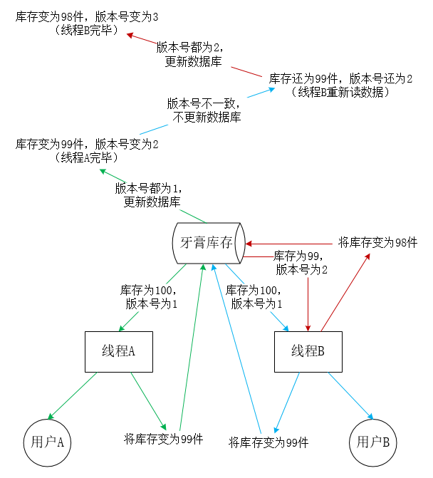

# 简介

乐观锁通俗的理解就是，数据有一个版本号，第一次读的时候将获取数据的版本号；当需要对数据进行更新时，需要检查数据库中的版本号与第一次获取的版本号是否一致。如果一致则更新数据，否则不更新。也就是说，要保证数据在中间没被修改过。乐观锁一般来说有以下2种方式：

1. 使用数据版本（Version）记录机制实现，这是乐观锁最常用的一种实现方式。何谓数据版本？即为数据增加一个版本标识，一般是通过为数据库表增加一个数字类型的 “version” 字段来实现。当读取数据时，将version字段的值一同读出，数据每更新一次，对此version值加一。当我们提交更新的时候，判断数据库表对应记录的当前版本信息与第一次取出来的version值进行比对，如果数据库表当前版本号与第一次取出来的version值相等，则予以更新，否则认为是过期数据。
2. 使用时间戳（timestamp）。乐观锁定的第二种实现方式和第一种差不多，同样是在需要乐观锁控制的table中增加一个字段，名称无所谓，字段类型使用时间戳（timestamp）, 和上面的version类似，也是在更新提交的时候检查当前数据库中数据的时间戳和自己更新前取到的时间戳进行对比，如果一致则OK，否则就是版本冲突。

Java JUC中的atomic包就是乐观锁的一种实现，AtomicInteger 通过CAS（Compare And Set）操作实现线程安全的自增。

# 实例

## 牙膏库存

牙膏库存为 100 件，用户 A （线程 A ）和用户 B （线程 B ）同时购买一件牙膏。

1. 线程 A 读取牙膏库存（ 100 件，版本号为 1 ，不加锁），线程 B 读取牙膏库存（ 100 件，版本号为 1 ，不加锁）；
2. 线程 A 将库存减 1 ， 100-1=99 件；线程 B 将库存减 1 ， 100-1=99 件（注意还没更新到牙膏库存）；
3. 因为线程 A 、线程 B 总有一个线程必先执行，假设是线程 A 。线程 A 将库存减 1 后（库存为 100-1=99 件），通过本地版本号与数据库版本号比对（都为 1 ），因为版本号一致，所以更新牙膏库存（牙膏库存变为 99 件，版本号变为 2 ），线程 A 执行完毕；
4. 线程 B 将库存减 1 后（库存为 100-1=99 件），通过本地版本号（为 1 ）与数据库版本号（为 2 ）比对，因为版本号不一致，所以不更新牙膏库存，线程 B 重新读取牙膏库存（库存为 99 ，版本号为 2 ），重复执行。
5. 线程 B 将库存减 1 后（库存为 99-1=98 件），通过本地版本号（为 2 ）与数据库版本号（为 2 ）对比，因为版本号一致，所以更新牙膏库存（牙膏库存变为 98 件，版本号变为 3 ），线程 B 执行完毕。



## 电商下单

考虑电商系统中的下单流程，商品的库存量是固定的，如何保证商品数量不超卖？ 其实需要保证数据一致性：某个人点击秒杀后系统中查出来的库存量和实际扣减库存时库存量的一致性就可以。

假设，MySQL数据库中商品库存表tb_product_stock 结构定义如下：

```java
CREATE TABLE `tb_product_stock` (
  `id` bigint(20) NOT NULL AUTO_INCREMENT COMMENT '自增ID',
  `product_id` bigint(32) NOT NULL COMMENT '商品ID',
  `number` INT(8) NOT NULL DEFAULT 0 COMMENT '库存数量',
  `create_time` DATETIME NOT NULL COMMENT '创建时间',
  `modify_time` DATETIME NOT NULL COMMENT '更新时间',
  PRIMARY KEY (`id`),
  UNIQUE KEY `index_pid` (`product_id`)
) ENGINE=InnoDB DEFAULT CHARSET=utf8 COMMENT='商品库存表';
```

对应的POJO类：

```java
class ProductStock {
    private Long productId; //商品id
    private Integer number; //库存量

    public Long getProductId() {
        return productId;
    }

    public void setProductId(Long productId) {
        this.productId = productId;
    }

    public Integer getNumber() {
        return number;
    }

    public void setNumber(Integer number) {
        this.number = number;
    }
}
```

### 悲观锁

```java
/**
     * 更新库存(使用悲观锁)
     * @param productId
     * @return
     */
    public boolean updateStock(Long productId){
        //先锁定商品库存记录
        ProductStock product = query("SELECT * FROM tb_product_stock WHERE product_id=#{productId} FOR UPDATE", productId);
        if (product.getNumber() > 0) {
            int updateCnt = update("UPDATE tb_product_stock SET number=number-1 WHERE product_id=#{productId}", productId);
            if(updateCnt > 0){    //更新库存成功
                return true;
            }
        }
        return false;
    }
```

### 乐观锁

```java
    /**
     * 下单减库存
     * @param productId
     * @return
     */
    public boolean updateStock(Long productId){
        int updateCnt = 0;
        while (updateCnt == 0) {
            ProductStock product = query("SELECT * FROM tb_product_stock WHERE product_id=#{productId}", productId);
            if (product.getNumber() > 0) {
                updateCnt = update("UPDATE tb_product_stock SET number=number-1 WHERE product_id=#{productId} AND number=#{number}", productId, product.getNumber());
                if(updateCnt > 0){    //更新库存成功
                    return true;
                }
            } else {    //卖完啦
                return false;
            }
        }
        return false;
    }
```

使用乐观锁更新库存的时候不加锁，当提交更新时需要判断数据是否已经被修改（AND number=#{number}），只有在 number等于上一次查询到的number时 才提交更新。

**注意**：UPDATE 语句的WHERE 条件字句上需要建索引

### 乐观锁与悲观锁的区别

乐观锁的思路一般是表中增加版本字段，更新时where语句中增加版本的判断，算是一种CAS（Compare And Swep）操作，商品库存场景中number起到了版本控制（相当于version）的作用（ AND number=#{number}）。

悲观锁之所以是悲观，在于他认为本次操作会发生并发冲突，所以一开始就对商品加上锁（SELECT ... FOR UPDATE），然后就可以安心的做判断和更新，因为这时候不会有别人更新这条商品库存。

# CAS：compare and swap

 CAS的含义是，我认为V的值应该为A，如果是，那么将V的值更新为B，否则不修改并告诉V的值实际为多少。
 附上java.util.concurrent.atomic.AtomicLong中的源码

```java
    public final long getAndAccumulate(long x,
                                       LongBinaryOperator accumulatorFunction) {
        long prev, next;
        do {
            prev = get();
            next = accumulatorFunction.applyAsLong(prev, x);
        } while (!compareAndSet(prev, next));
        return prev;
    }
    public final boolean compareAndSet(long expect, long update) {
        return unsafe.compareAndSwapLong(this, valueOffset, expect, update);
    }
```

# 参考资料

- MySQL 乐观锁与悲观锁: https://www.jianshu.com/p/f5ff017db62a
- 并发扣款一致性，幂等性问题，这个话题还没聊完: https://mp.weixin.qq.com/s/xXju0y64KKUiD06QE0LoeA