> 祁连山是一个对中国举足轻重的山。许多人知道东西方文明交流的大通道——丝绸之路，知道大名鼎鼎的河西走廊，但是人们却不知道祁连山对河西走廊和丝绸之路的贡献，不知道祁连山是幕后的英雄。本文作者深入祁连山中，并且环绕着祁连山走了一圈，他将给我们讲述祁连山的故事，以及祁连山对青海、甘肃乃至中国的意义。

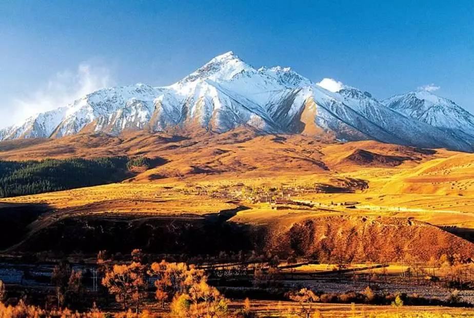

这是青海省祁连县县城北边的牛心山，这里已是祁连山的深处。秋天的牛心山上已是白雪皑皑，阳光照射在收割后的田野上，一片金色的秋景。山前的河流，就是最终流到了内蒙古巴丹吉林沙漠的黑河的支流——八宝河。黑河发源于走廊南山的南坡，在托来山和走廊南山之间一直向东流淌，在祁连县与八宝河汇合后，突然折向北流，在走廊南山和冷龙岭之间切开一道险峻的峡谷——黑河大峡谷，流向河西走廊，然后流向内蒙古的沙漠深处。从图中还可以看出，尽管这里已是祁连山的中段，但还有森林分布，田野里收获着麦子，这与它南面的青海湖周边显然不同，那里是游牧者的天下。摄影/马福江

## 我们被地图洗了脑

中国人一般都知道祁连山，不过不是从地理书中知道的，而是从历史书中知道的。中国的历史书讲到汉代、汉王朝与匈奴的战争，都会提到祁连山。匈奴有一首歌唱道：“失我祁连山，使我六畜不蕃息；失我焉支山，使我嫁妇无颜色。”祁连山是与匈奴联系在一起的。这是许多人对祁连山的印象。

在祁连山的东端,由于季风的影响,其南面和北面,差异并不是很大,尤其是顺着大通河与湟水河谷,东南季风能吹送到祁连山的深处,因此大通河畔的门源县降水足以让油菜花开得一片灿烂,门源县的油菜花不仅是这里的主要经济作物,而且成了一种美景资源,给人们以美的享受。摄影/郑云峰

除了历史书中对祁连山的描绘，我们许多人对祁连山的印象还来自于地图。我们平时所见的全国地图，大多是行政区划图，很少是地势图；再就是比例尺都很小，比如是1比400万或比这比例尺还小的地图。比如我面前的一本大16开的中国地图册，一张跨页全国地图的比例尺是1比1600万的，图中的一厘米代表的是160公里，在这样的图上，祁连山只能是一条线。在这种没有地势只有地名、小比例尺的全国地图上，不仅是祁连山，许多雄伟壮丽的庞大的山脉或山系都成了一条线，譬如秦岭等。由于总是看这种小比例尺没地势地形的地图（大比例尺有地势地形的地图在中国属保密范围，至今仍未解禁），许多人就像那些地图一样把一些庞大的山脉或山系，想象成长长的一条线。可以说长期以来，我们已经被这种小比例尺没地势的地图洗了脑，我们已经对祖国的许多山川形成了错误的认识，这种错误的认识只有当你亲自走到那些山川面前，才能得到纠正。我的一位朋友是摄影师，他告诉过我他第一次到祁连山时给他带来的震撼。他说他一直以为祁连山就是一道长长的山岭，翻过山岭，那边就应是平地，祁连山就没了。可是那年他从河西走廊的张掖出发，经山丹军马场北面的著名古隘口——扁都口翻越了祁连山的山脊线，当他一登上隘口，站在制高点上向南望去，眼前的景象让他惊呆了，祁连山根本就不是他原来想象的那样是一条孤立的单薄山岭，而是山连山、岭连岭，展现在他面前的是千山万岭山的海洋。

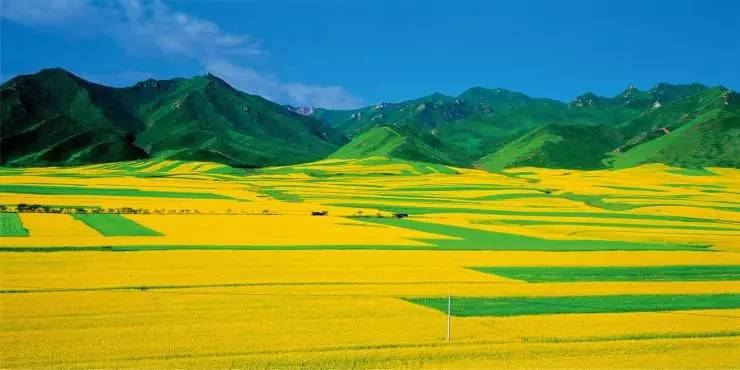

好像是为了与山南边门源县的油菜花比美，在甘肃省肃南县，也种植了大面积的油菜花，这里的油菜花海把大地装扮得好像一幅色彩斑斓的大地毯。从上面两幅照片中，我们还可以了解到，祁连山的东段，山南和山北景观的差异不大，也可以说，祁连山的主山脊虽然高大，但是并没有起到分界作用，没有在山的两边造成很大的差异。摄影/王金

其实这千山万岭正是祁连山的真实形象。因为祁连山根本不是一条单独的山岭，而是一组大致平行的呈西北—东南走向的山脉群。这组山脉群长达1000多公里，宽达300多公里，当我那位摄影师的朋友登上扁都口向南张望时，展现在他面前的是300多公里宽的山脉群，怎能不让他惊讶，怎能不彻底颠覆他头脑中关于祁连山的概念。

## 青海湖原来属于祁连山

虽然我知道祁连山是一个庞大的山系，但我对祁连山的认识也有一个不断深入的过程。

2005年底，我来到了青海湖东边的海晏县。在那里，我才知道原来青海湖也在祁连山的范围内，甚至青海湖南边的青海南山也是祁连山系的一条山脉。在一张卫星三维地图上这一点看得很清楚。青海湖是一个近似椭圆形的湖，它的长轴方向与祁连山诸山脉的走向完全相同，它南边的青海南山不仅走向相同，而且与祁连山中的党河南山、哈尔科山相连，逶迤绵延，青海湖是祁连山的一颗耀眼的明珠。当我们想到祁连山时，如果能想到美丽浩瀚的中国第一大湖青海湖时，我们对祁连山才算有了基本的认识。

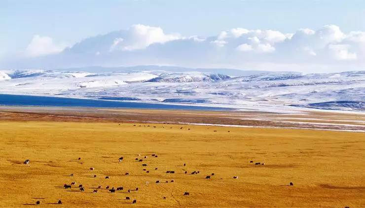

青海湖是属于祁连山的。她是祁连山群山拱卫的一颗明珠。青海湖是中国水面最大的湖泊，也是中国最美的湖泊，她浩瀚如海，水碧如天，环绕她的是繁花似锦的草原。摄影/马培华

青海湖是祁连山的精华和亮点。我曾经沿着布哈河谷地向青海湖走去，那时正值隆冬。原以为此时此地定是大地蒙雪、百草凋零，但我眼前宽阔的布哈河谷却是一片耀眼的金黄草地。有一家牧人骑着马儿在草地上牧羊，还有几头黑色的牦牛在河里饮水。许多人都认为看草原一定要在春夏之交，那时候草原上繁花似锦、灿若云霞。然而冬天的青海湖边的草原自有一种风致，其实湖边的草原就是留做冬季牧场的，夏季，牧民们把牛羊赶到了山上的牧场。湖边草原上的牧草经过一个夏天的疯长，又经过秋天风霜的洗礼，此时灿若黄金，在阳光下熠熠生辉。大地仿佛铺上了金色的地毯，一直伸向远方的地平线。我曾经坐在金黄的草地上，看着远方的羊群，久久不愿离去。

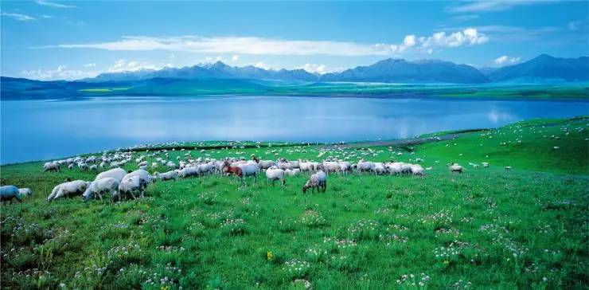

山丹军马场，这里的草原不仅以美丽闻名，而且这里在历史上是为朝廷饲养军马的地方，中原汉王朝一向离不开这里提供的战马，北宋王朝失败后，有人竟把原因归结为北宋王朝很早就失去了对这里的控制，因此缺乏这里提供的优良的战马。可见这里的草原价值不凡。摄影/王金

青海湖东边海晏县的北面有一片草原，叫做金银滩草原，从它的名字就可知它的美丽和富饶。在这金银滩草原，西部歌王王洛宾创作了歌曲《在那遥远的地方》，是一位美丽的藏族牧羊姑娘轻轻地抽了他一鞭子，这一鞭触发了王洛宾的灵感，使他写出这首世界闻名的歌曲。

祁连山的美丽草原不仅仅在青海湖的周边，在祁连山还有许许多多美丽的草原。当我从海晏出发，奔向祁连县时，我发现公路两旁处处是美丽的草原，虽然已是12月，远处的山脊上已是白雪皑皑，但是山坡上、河谷里，扑入视野的还是草原的景象。以至我兴奋地将我们走的这条从海晏县到祁连县的公路称之为：草原大道。

据说更美的草原还在山的那边，在甘肃省山丹县的大马营和山丹军马场那一带，那里的草原草深花艳，每当6、7月份，那里是一片无边无际的花海。这片草原历史上一直被用来牧养军马，最多时这里有军马40多万匹。

## 祁连山的景观不以山脊来划分

我说了许多草原，因为草原是祁连山很重要的景观。祁连山的奇特在于它的自然区划，不是以山的主脊线来划分，因为祁连山的山脊并没有给山两边带来不同的景观。祁连山景色的不同，取决于从太平洋吹来的东南季风向西吹到的位置和极限。因此可以将祁连山从东向西分为三段。

东祁连山在祁连山的东部西宁那一带，由于东部季风能吹到这里，所以这里降雨丰富，因此祁连山的东部生长着茂密的森林，分布有许多国家森林公园，如仙米国家森林公园、互助北山国家森林公园、群加国家森林公园、坎布拉国家森林公园等。从这些森林公园就能看出祁连山的东部森林之蓊郁。

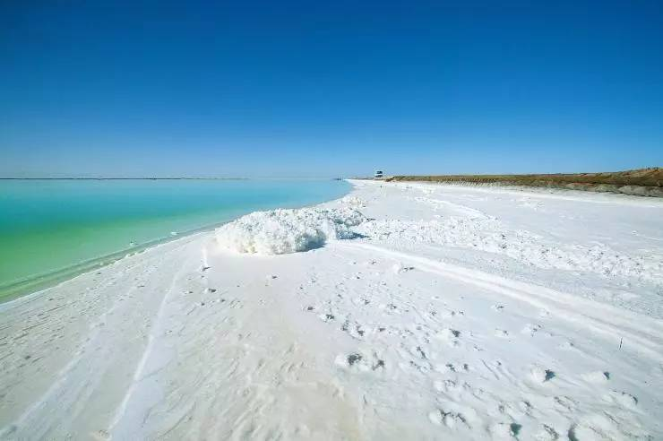

祁连山南盐湖多 祁连山南面是柴达木盆地，这里降水稀少，呈现出典型的荒漠景观，但是这里却多湖泊，不过这里的湖泊多是盐湖。盐湖不仅有可观的经济价值，能产食盐、化肥和各种稀有金属，盐湖更是一种可供观赏的景观。谁能说图中的盐湖不是一种罕见的美景呢？摄影/单之蔷

季风继续向西吹送，力量却是越来越弱，所带的水汽越来越少，因此祁连山的中段（哈拉湖以东，青海湖以西）降雨减弱，森林稀少，草原发育，到处可见。

哈拉湖以西为西祁连山，包含有几列大山，从北向南有党河南山、赛什鄂博图岭、土尔根达坂山、柴达木山等。由于东部季风吹到这里已成强弩之末，这一带降雨稀少，呈现一片荒漠景象。但由于祁连山属于高山和极高山的世界，有许多高大的山峰截住了高空中的气流和云团，在高山发育了众多的雪山和冰川，冰川融水形成了一些河流，因此即使在祁连山干旱的西部，也有河流从雪峰流下，河谷中也会出现草地和植被，也有野牦牛、野驴、藏羚羊等。

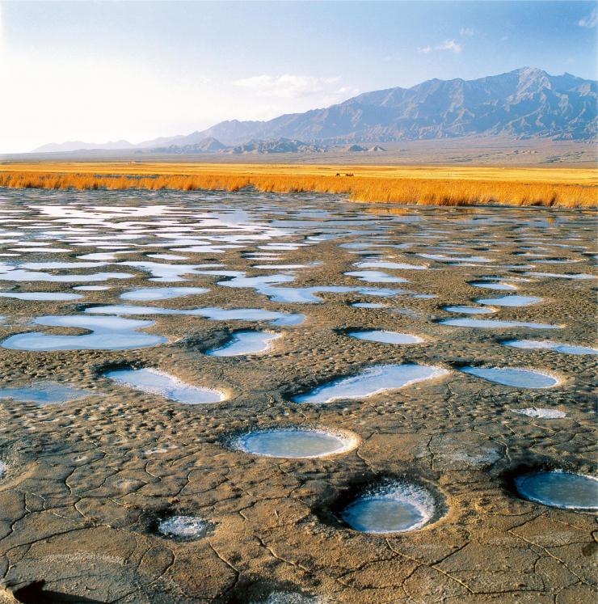

从祁连山上流下来的河流携带了各种盐和矿物质,这些河流都是内流河,流到柴达木盆地后,或者受阻成湖,或者蒸发下渗消失在荒漠中,由于水没有循环,水被蒸发了,盐却流下了,因此在祁连山南面的山麓下,流下了许多盐湖。上图是大柴旦湖,图中的一处处圆或其他形状的坑洼,是一种奇特的盐湖地貌,它形成的原理是,此处原来是干盐滩,地下有结晶的各种盐类,当地下水或其他补充水出现,融解了干盐滩中结晶的盐类,晶体消失,就会出现这种水溶洞地貌。摄影/李洋

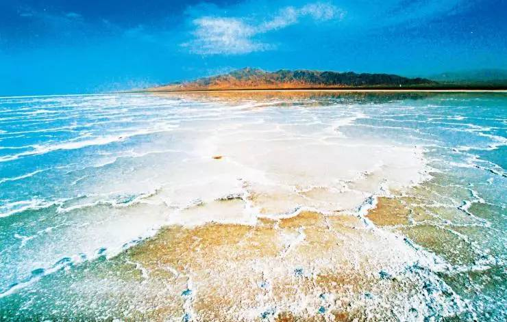

小柴达木湖（也叫巴戛柴达木湖），小柴达木湖的景观非常美丽，湖边是一片片如银似玉、晶莹洁白的盐滩。这种白白的食盐，在这里只是作为一种景观而存在，人们并不看重食盐的经济价值。这小柴达木湖最早受到人们的关注是因为它的湖水里含有稀有而价昂的硼砂。摄影/陈生贵

祁连山的三段各有不同的景观，即森林、草原、荒漠。这三种景观基本上是由气候（主要是由降雨）决定的。然而这仅仅是指祁连山地区的水平地带性分布，也就是说这基本上说的是祁连山麓基带的情况，即最下面第一自然带的景观特点。实际上祁连山的景观分布复杂得很，因为祁连山是雪峰林立的高山带，海拔4000米以上的山地面积占整个山区的三分之一，因此祁连山的景观分布还强烈地受到垂直地带性的控制。在水平地带性和垂直地带性的双重控制下，祁连山的景观呈现出千姿百态的变化。譬如即使是在季风吹不到的西祁连山，由于山高，也会在某一海拔高度形成一个降雨带，在这一降雨带内则形成了森林。在西祁连山的南面或北面你都会看到这种奇异的景观：在一片光秃秃的大山的半山腰上好像玉带缠腰一样分布着一条森林带，那森林带中的树木主要是四季常青的祁连圆柏。尤其是在冬季，当山坡上铺满了白雪，那半山腰上的林带却墨玉般地深绿，在一片白色中跃入你的眼帘，让你觉得神奇。你不禁会好奇地发问：为什么在那个高度上出现了一条森林带？

## 祁连山对中国的意义

在这里我必须说明，尽管祁连山分布在青海和甘肃两省之内，但我所谈到的祁连山，是冲破行政区划的，是在谈自然意义上完整的祁连山。因为如果我们按照行政区划来谈论祁连山，只能谈论半个祁连山，这样我们将无法理解祁连山。只有将祁连山作为一个整体来谈论，我们才能真正认识祁连山。

在一张全国地图上，如果你仔细观察，你会发现祁连山的一个重要的特点。它的三面被沙漠包围，它的北面是巴丹吉林沙漠、西面是库姆塔格沙漠和塔克拉玛干大沙漠、南面是柴达木荒漠。它是伸向沙漠中的一座湿岛，这是祁连山最重要的一个特征。全国只有一座山与他相似，那就是新疆的天山，天山也是伸向沙漠中的一座湿岛。

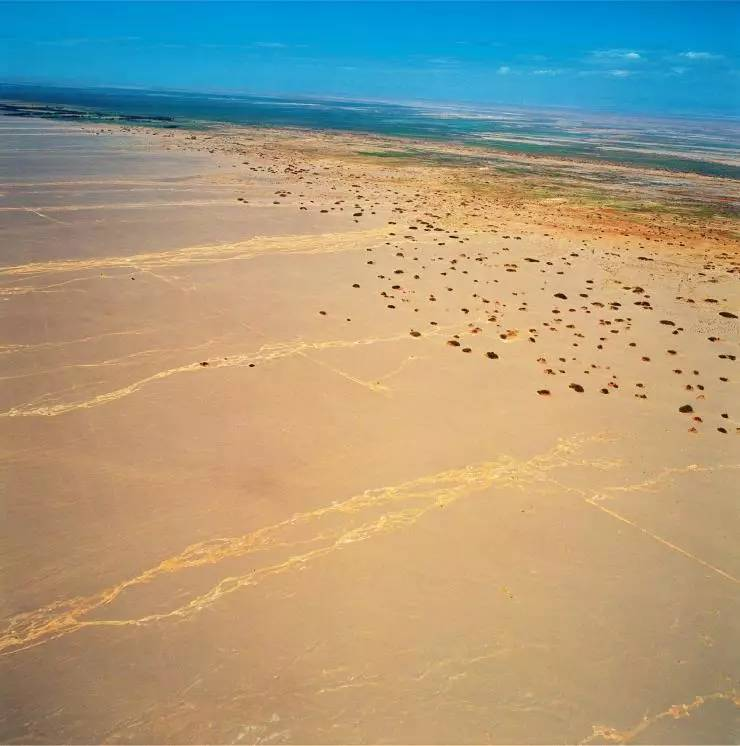

一条条河流从祁连山上流下来，它们是季节性的河流,夏季才是属于它们的季节。在柴达木的荒漠中,它们留下了一条条痕迹，就消失了。

天山与祁连山好像一对兄弟，他们在浩瀚的沙漠中遥相呼应，像两只伸出去要握住的手，就差那么一点点，他们就握在一起了。

我在想，祁连山和天山在沙海中的这种遥相呼应，他们伸进沙漠的半岛姿态有何意义？

由天山和祁连山，我想到了沙漠，想到了绿洲，想到了丝绸之路。

当想到丝绸之路时，我的思路豁然开朗了，好像重新认识了祁连山。

说到丝绸之路，人们首先想到的是河西走廊。我们知道黄河流到了兰州后，忽然掉头北上，钻进茫茫沙漠之中。北上的黄河，成了一个地理的界限，人们将这里黄河以西的大片区域称之为河西。河西一带本应该是浩瀚的沙海，只是因为有了祁连山，才沿着祁连山的北麓，形成了由一个个绿洲连缀而成的一个条形的狭长地带，这个地带被称之为河西走廊。现今这一地带属于甘肃省。

如果没有祁连山,这里将是一片沙漠。祁连山的高大山体截留了水汽,形成了降水。是祁连山中的冰川融水和祁连山中发育的河流在河西走廊中造就了一个个绿洲,虽然已是冬天,但在图中,我们还是能看到远处的祁连山像卧龙一样绵延在远方,祁连山的奇特之处在于,虽然它沿着西北—东南方向延伸达1000多公里,但是它的山体高度变化并不剧烈,平均高度从东到西都在4500米以上,好像一列长长的火车,这就决定了祁连山的冰川发育从东到西很均衡,河流发育也很均衡,即每隔一段距离,大约是100公里左右,就有一条河流出现,这种均衡出现的河流,十分有利于古代的交通,这也是为什么祁连山北麓,形成了古代著名的丝绸之路的原因。

我甚至认为甘肃省是专为河西走廊设置的，这从甘肃的名称能看出来。因为甘肃两个字就取之于河西走廊两个重镇古地名的第一个字，古时的张掖称甘州，酒泉称肃州，两者的首字合起来为甘肃，由此看来甘肃省的省名来自于河西走廊。

为什么人们称这一带为“河西走廊”？尽管这一带良田万顷，稻谷飘香，但是人们看重的并不是这些，而是看重这一带的沟通和交流作用，看重的是这一带的通过能力。因此它才被称之为“走廊”。

河西走廊对古代中国的意义非同寻常。在航海技术不发达的古代，东西方的交流和贸易主要通过陆路来进行。丝绸之路就是欧亚大陆东西方之间最重要的贸易和文化交流通道，而河西走廊是丝绸之路最重要的一段。

东部的祁连山，在来自太平洋季风的吹拂下，是伸进西北干旱区的一座湿岛，没有祁连山，内蒙古的沙漠就会和柴达木盆地的荒漠连成一片，沙漠也许会大大向兰州方向推进。正是有了祁连山，有了极高山上的冰川和山区降雨才发育了一条条河流，才养育了河西走廊，才有了丝绸之路。然而祁连山的意义还不仅于此。作为青海和甘肃的界山，就面积而言，祁连山在青海境内要多一些，但就知名度而言，似乎甘肃的祁连山要高。摄影/马培华

丝绸之路对于中国人之所以重要，是因为丝绸之路不仅仅是贸易之路，更重要的是文化之路，其中最重要的是佛教和伊斯兰教的传播就是沿着丝绸之路进行的，因此丝绸之路完全可以称之为宗教之路。

今年1、2月，我从兰州出发沿着河西走廊一直走到新疆的和田，这一路正是古代丝绸之路。沿途我看到了一个有意思的现象：这里处处可见伊斯兰教的影响，但是古迹和文物却是佛教的多。

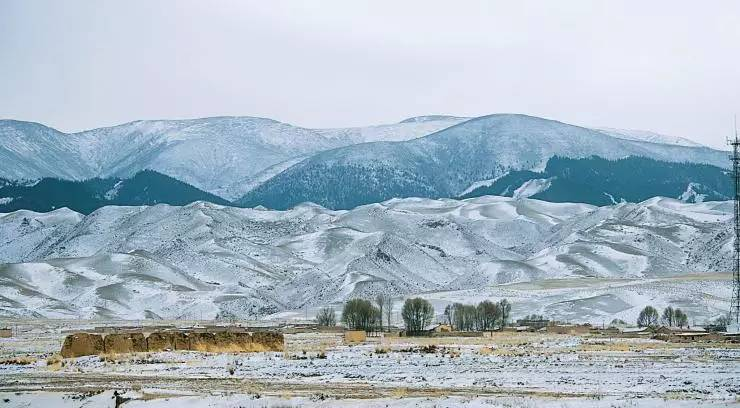

是在祁连山中部拍摄的图片，在图中可以看到一种奇特的现象，就是在山的中部出现了一个横向的林带，这是在干旱区的大山上才有的一种植被分布现象。因为这里气候干旱，降水稀少，但是随着海拔的升高，降水量会逐渐增加，但到达某一高度后，又会逐渐减少，在山中那个降水量最大的海拔高度带，就会有植被或森林出现。在雪后，这种半山腰中的森林带，在白茫茫的大山上横空出世，非常具有美感。摄影/单之蔷

在于田县克里雅河的大河沿乡，这里已经深入到了塔克拉玛干沙漠的深处。夜晚我们住在一户维吾尔族的老乡家中。他们家紧邻克里雅河，周围是浩瀚的沙漠，没有第二户人家。即使在这沙漠的深处，宗教也是这里人们生活的重要内容。他们对伊斯兰教的虔诚给我留下了深刻的印象。傍晚我们围着火炉正在聊天，一会儿主人就终止了谈话，在炕上铺上一个毯子，主人和陪同我们的向导一起跪在上面，面对西方（麦加的方向）开始了祷告。晚上我们已经钻入了睡袋，但对面的屋中又传来了连续不断的声音，原来那是又一次祷告开始了。第二天早晨，我一醒来，就听到了主人祷告的声音。

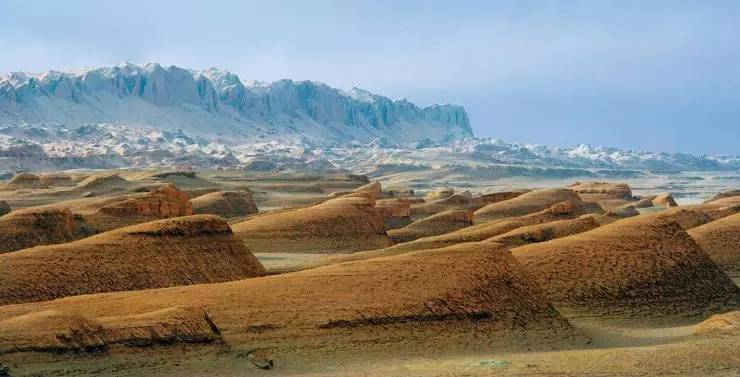

在西祁连山山麓下的冷湖一带，有着荒漠地区独有的一种地貌：雅丹。雅丹地貌是一种被风吹出的地貌，在刮大风的荒漠地区，地表没有植被，并且是软硬适度的河湖相的松散沉积物。大风开始不断地吹走地面物质，由于地面有的地方硬一些，有的地方软一些，风把软处的物质吹走，留下沟槽；把硬的地方留下，形成高垄。长此以往，就在大地上留下了这种顺着风向一个个垄槽相间的地貌形态，如果风向复杂多变，又会使高垄的形态随之变化多端。柴达木盆地是一个雅丹的分布区，冷湖一带的雅丹极具观赏价值。摄影/单之蔷

然而古代这里的人们信奉的却是佛教。从这里向西大约90公里的沙漠中，就埋藏着英国人斯坦因挖掘的古代遗址——丹丹乌里克古城废墟，那里出土了大量珍贵的佛教文物。

在和田，我去了还没有正式开放的博物馆，我看到博物馆的造型是典型的伊斯兰式风格，但博物馆中的文物，却多是佛教的。在这里我还看到一个出土的唐代彩棺，制作极其考究，绘画非常精美，但棺木四面绘画的图案却是汉文化的题材：青龙、白虎、朱雀、玄武。可见这一带文化交流多么的频繁和充分。

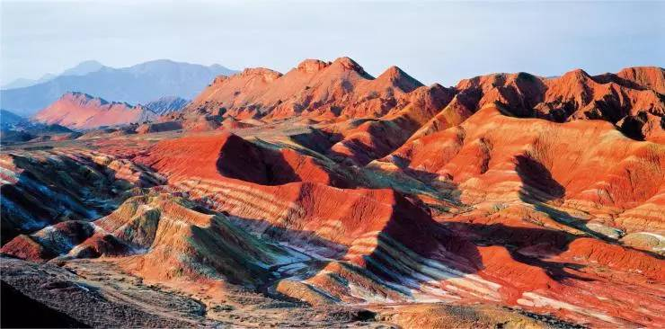

在河西走廊的肃南裕固族自治县南面，祁连山中发育了大面积的丹霞地貌。丹霞地貌是我国科学家最先发现并命名的一种地貌类型，这种地貌极具美感和观赏价值。但是肃南的丹霞地貌与其他地方的丹霞地貌有很大的不同，而且不符合丹霞地貌的定义和基本特征。如丹霞地貌被定义为：以赤壁丹崖为特征的红色陆相碎屑岩地貌，或者说丹霞地貌的景观具有顶平（或顶斜）、身陡、麓缓的形态特征。我们看到肃南的丹霞地貌，既不顶平、身陡，也不麓缓，但它色彩美丽，不仅有红色的砂岩，还有黄色、绿色等色彩，五彩缤纷，灿若云霞，也许就是因为它的色彩，它才被归为丹霞地貌吧。摄影/王金

佛教正是沿着丝绸之路向东向中原传播的，只是到了10世纪，在现今喀什地区的喀喇汗王朝全面信奉伊斯兰教，并且灭掉了信奉佛教的古于阗国，使得这一地区开始了伊斯兰化的过程，伊斯兰教沿着丝绸之路代替佛教开始了东进历程。

无论是佛教还是伊斯兰教，都是沿着丝绸之路传播的，尤其是佛教，沿着丝绸之路我们能清楚地看到佛教传播的轨迹和演变，譬如从佛教的石窟分布，就可以寻出佛教传播的轨迹，从河西走廊开始，我们可以看到佛教的石窟沿着丝绸之路一直分布到中原。我们从河西走廊的西端开始列举，最西边的就是举世闻名的敦煌莫高窟，接下来是榆林石窟、昌马石窟、张掖市的文殊山石窟、马蹄寺石窟，再往东是武威市的天梯山石窟，越过黄河佛教的石窟继续延伸一直到天水的麦积山石窟。甚至可以说，山西大同的云冈石窟、河南洛阳的龙门石窟都是沿丝绸之路传播的佛教石窟的继续和延伸。

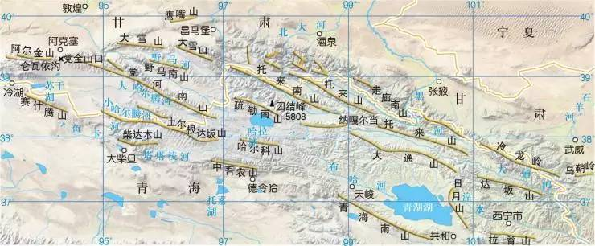

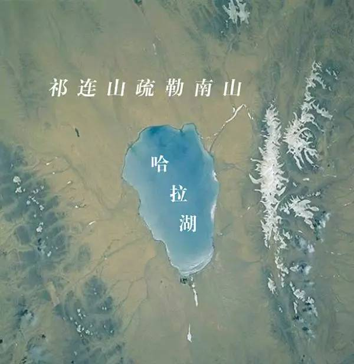

祁连山中部的哈拉湖，是祁连山区除了青海湖外，第二大的湖泊。哈拉湖的水源来自于周围的雪山。在图中可以看出冰川的融水形成了美丽的高山湖泊——哈拉湖。

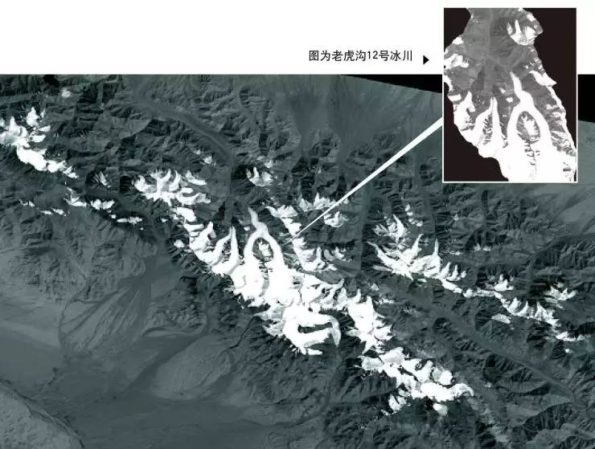

这是祁连山大雪山的冰川分布图，大雪山位于祁连山西部，极端干旱，但大雪山上却发育了很好的冰川，在一片赤裸裸的黄褐色的大山中，冰川像圣洁的雪莲花开放在山顶。其中老虎沟12号冰川是祁连山中最大的山谷冰川。

丝绸之路不仅仅是运送丝绸的，也不仅仅是传播宗教的。丝绸之路还有一个很重要的作用以前很少有人提及，那就是丝绸之路还是运送玉石的。著名的和田玉就是通过丝绸之路运往中原的。在我沿着丝绸之路考察时，我的同伴是中国社会科学院考古所新疆考古队的队长巫新华博士，他通过对古代玉矿的考古工作，证明先于丝绸，这条路运送的是玉石。在河南安阳商代殷墟遗址出土的玉器，经分析证明就是来自新疆的和田。

丝绸之路是如此的重要，然而人们看到的只是像河西走廊这样的路，至于这条路是怎样维系的，这条路为什么能存在？很少有人去深究。其实河西走廊之所以能存在，全赖祁连山，没有祁连山上的雪山和冰川融水，就没有流向河西走廊的河流，也就没有了河西走廊的绿洲，没有了绿洲，没有了河流，就没有了河西走廊，所以祁连山是丝绸之路的幕后英雄。

## 失衡的祁连山

当我从兰州出发，准备环祁连山绕行一周前，特意到兰州大学，拜访了兰州大学古籍研究所的所长吴景山教授。他在兰大历史系读书时，曾有过惊人的壮举，就是骑自行车走完了中国境内的丝绸之路。他对河西走廊既十分了解，又有着深厚的情感。我邀请吴教授同行，他爽快地答应了。

如果不是亲自到河西走廊来，你很难想象河西走廊的富庶和繁荣。路上吴先生随口说出许多古时描述河西走廊富庶的诗词来：

“弱水西流接汉边，绿杨荫里系渔船”，这是写弱水河畔的；

“不望祁连山顶雪，错把甘州当江南”，这是写张掖的，张掖古称甘州；

“两行高柳沙淀暗，一派平湖水稻香。紫燕衔泥穿曲巷，白鸥冲雨过横塘。”这是说高台的；

而诗句：“稻花风里稻花香，妾去采花郎插秧”则透露了这里曾种植过双季稻的信息。

听了这些诗句，感到这里好像是江南水乡一样，可是这里向北不出几十公里，就是茫茫的腾格里沙漠。

车到了武威市，很远我就看到了“马踏飞燕”那个著名的雕塑耸立在一个巨大的拱形门上。这个得到郭沫若激赏，后来成为国家旅游局标志的汉代铜奔马，原件就是在武威出土的。吴教授告诉我，这种“马踏飞燕”的雕塑在武威已经出土了几十件，这说明武威是“天马”的故乡。

确实武威与马有着密切的关系，当我们离开武威向西行进，很快就到了山丹军马场，这一带历史上就是为朝廷养战马的地方。吴教授为我这个季节来，不能看到山丹马场那堪称中国最美的草原而遗憾，但我却为看到的汉代古长城遗迹而兴奋不已。我曾经在宁夏看到过汉代的古长城，但山丹的古长城不知比宁夏保留的好多少倍，这里的古长城高大、完整，长达几公里。天刚刚下过一场雪，大地洁白，黄色的夯土而成的长城在祁连山下绵延起伏。

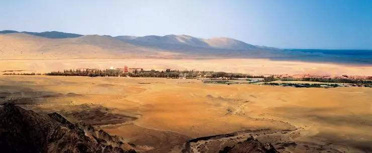

敦煌是一颗世界级的文化明珠，人们为敦煌雕塑和壁画的精美所震撼，每天都有来自世界各地的人来敦煌朝圣。为研究敦煌藏经洞出土的文物，诞生了一门世界性的学问：敦煌学。但是来到敦煌的人们，首先会问的一个问题是，为什么在一片沙漠之中会出现敦煌莫高窟这样一块宗教和艺术的高峰地带？从上图中可以俯瞰敦煌莫高窟，我们看到敦煌的莫高窟显然是沙漠中的一块绿洲，是莫高窟前的一条河流——党河，养育了莫高窟的文化和艺术。

山丹的长城之美，吸引了我们的一位摄影师朋友，他竟在这里买了一处房子，接待摄影界的朋友来此拍长城及其周围的古迹和自然景观。我们找到了他的房子，想让他给我们带路，去看长城，但门锁着，人不在，我们只好自己前往。

离开山丹向西就是河西走廊中最大的城市张掖。在张掖，吴教授带我们去看了他曾经考察过的黑水国古城。遗憾的是张掖还有一些非常值得拜访的古迹由于时间关系不能前往，譬如大佛寺的大佛。这大佛据说是全国最大的卧佛，由于供奉在大佛寺的大殿里，大殿空间有限，没有摄影师能拍到这大佛完整的图片，因此这大佛除了到过大佛寺的人，很少有人知道张掖这里还有如此大的卧佛。

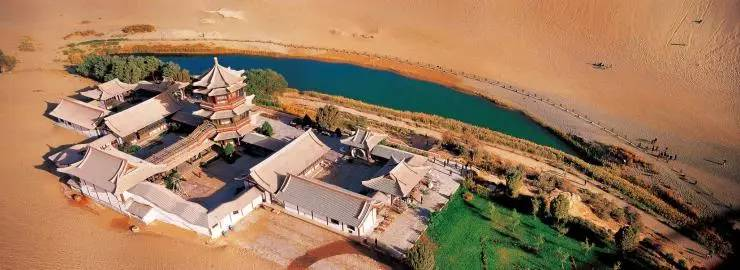

敦煌的月牙泉，月牙泉的一汪碧水，也与从祁连山上流下来的党河密切相关，如果没有党河流入沙漠，沙漠中的地下水就不会这样浅。

第二天，天还没亮，我们就离开了张掖，出城不远，我们遇到了一条河。太阳就要升起了，在蒙蒙的晨光中，可以看到河水并没有封冻，水面上弥漫着雾气，我意识到这就是大名鼎鼎的黑水河。这条从祁连山深处流出的，由冰川融水汇流而成的黑水河古时候一直流到了现今的内蒙古的额济纳旗，在那里曾经形成了一个浩大的湖泊——居延海，并养育了一个古城——黑城子。那里曾经出土几万枚汉代的木简，轰动了考古界。如今由于冰川的退缩，水量的减少，居延海已经消失了。但那里由黑河水养育的额济纳沙漠中的胡杨林，还在沙漠中顽强地生存着，那里的胡杨林，被称为“最美的胡杨林”。

由黑河我想到了河西走廊的河流，是祁连山北坡流下来的一条条河流，养育了河西走廊的一个个绿洲和城市，而且是一条河流对应一座城市。从河西走廊的东面算起，石羊河对应着武威，金昌市对应着大西河，张掖市对应着黑河，酒泉市和嘉峪关市对应着北大河，玉门市对应着昌马河，敦煌市对应着党河。甚至是河流水量的大小而不是所辖的土地面积，决定了城市的规模。譬如因为黑河在这些河中水量最大，因此张掖也就成了河西走廊最大的城市。

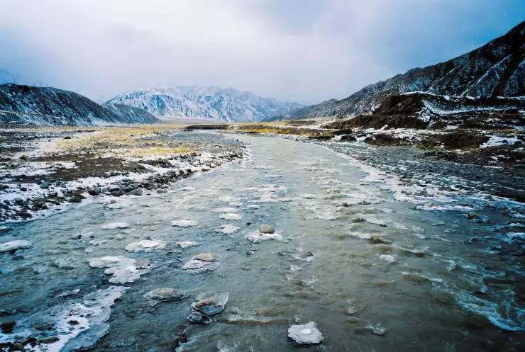

在嘉峪关市，甘肃著名的摄影师王金先生带我们去看长城博物馆，这里是明代长城的最西端，嘉峪关之所以建在这里，因为这里有从祁连山上流下来的北大河。明代是一个在国土和疆域上最萎缩的朝代，汉唐时的长城远远地修到了敦煌的西边，其中玉门关和阳关向西伸进了沙漠之中，然而这两个名关，也没有离开从祁连山上流下来的河流，玉门关紧邻着疏勒河（由于上游截水，今天疏勒河已经流不到玉门关了），阳关像敦煌一样靠的是党河。

当我们在敦煌看完了莫高窟，奔向鸣沙山和月牙泉时，已经是下午5点多钟了。虽然这里比北京太阳落下得晚，但是月牙泉风景区的工作人员已经下班了，是我们的朋友敦煌研究院摄影部的主任吴健先生找到景区的负责人，我们才如愿以偿看到了月牙泉和鸣沙山。许多人对月牙泉的泉水出现在高大的沙丘之间，并且永不枯竭感到神奇。其实很好解释，是祁连山的雪山冰川的融水渗入到了地下，抬高了地下水位，使这一带的沙丘下面就是水。在阳关我们看到了一个名为南湖的湖泊，这个湖泊的出现同月牙泉是一个道理。而且在阳关附近，有一个叫葡萄沟的小村庄，村庄里有一道道水渠，用来灌溉葡萄，这个村庄在一个沙丘围成的凹处，地下水自动涌出来，这和月牙泉一样。

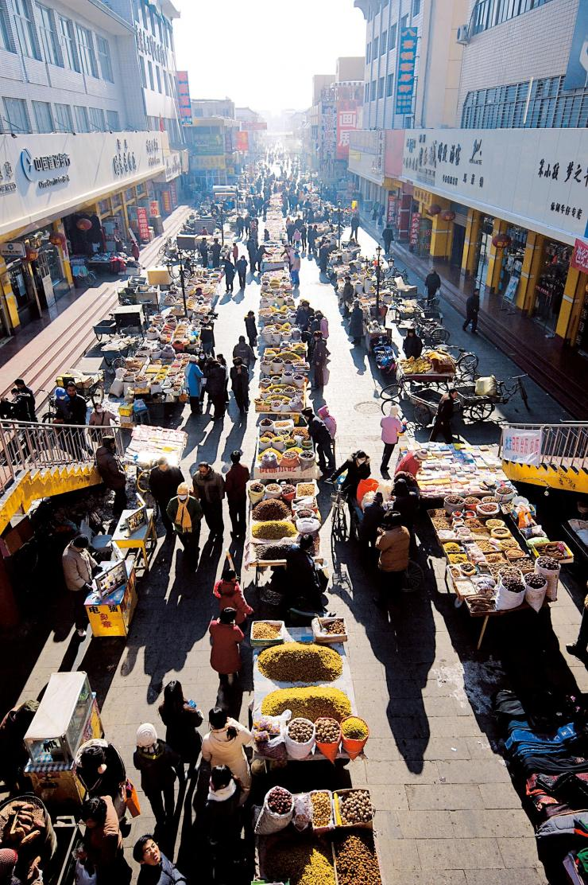

敦煌以莫高窟中的宗教艺术举世闻名，但莫高窟中的那些色彩艳丽、造型生动准确的雕塑，还有那些画在墙上的场面宏大、想象丰富、人物逼真的举世无双的壁画，并不是艺术家的个人创作，那都是一些世俗之人为了佛教信仰或某种心愿，请工匠在洞中雕塑或绘画的，那些雕塑和壁画都有在俗世的供养人，没有古代敦煌（西汉设敦煌县属酒泉郡、隋唐时称瓜州、沙州、敦煌郡）市井社会的繁荣，就不会有辉煌的敦煌艺术。要想象一下当年的敦煌居民，就看一下这张今天拍摄的敦煌的集市。摄影/孙志军

敦煌紧靠中国最干旱的地方——罗布泊，敦煌周围都是沙漠，敦煌之所以能存在全赖党河，党河能存在是因为祁连山西端的极高山上有冰川。

站在阳关的古遗址边，耳边响起王维那著名的诗句：劝君更尽一杯酒，西出阳关无故人。

这时我才意识到沿着河西走廊这一路走来，我们遇到了多少朋友，得到了多少朋友的帮助。

但是想想下面的行程，竟然想不到还会碰到什么朋友，真的是“西出阳关无故人”了，虽然我不是向西，而是掉头向东回返兰州，但是我要走的是祁连山的南面，要从甘肃进入青海了。其实这和西出阳关差不多，虽然是向东，但是要进入柴达木盆地了，进入少数民族的区域了。

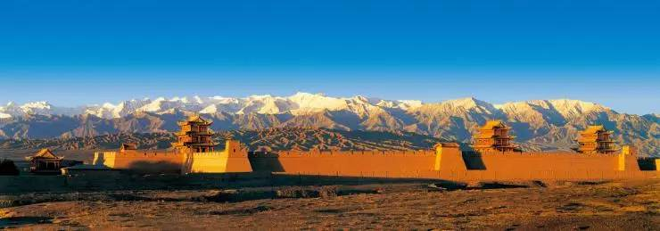

在夕阳和皑皑白雪的映照下，祁连山下的嘉峪关更显得雄浑和苍凉。如今的嘉峪关城楼是明代修建的，高大雄伟的城楼恰恰反映了明王朝对远方的威慑力不够，不得不靠长城的坚固来弥补。在明代，中央王朝的势力和疆域范围大大地萎缩，已经完全不能和汉唐时代相比。汉代的长城早已修到了敦煌以西的玉门关和阳关，那里才是万里长城的最西端。到了清代，清王朝的极盛期，气吞万里如虎，根本就不屑于建长城，而是把王朝的统治推到了中亚地区，当时的新疆首府建在了今日边境地区的伊犁。清王朝的伊犁将军坐镇那里管理那一带现今已经不属于中国的地区。摄影/王金

党金山口是祁连山与阿尔金山的连接处，这里应该算作祁连山的最西端了。车开始爬坡，党金山口在我的心目中一直很神圣，因为它是两座雄伟大山祁连山和阿尔金山相遇的地方。2004年冬天我在柴达木的东台吉乃尔盐湖，曾经想翻越它去敦煌，但正逢大雪，人们说路难走，没有成行，今天却是从甘肃方向来翻越它，进入青海，不知会有什么样的感受。车的左面就是祁连山的西端，这里极端的干旱，降水稀少，一年只有几十毫米。扑入眼帘的是寸草不生的裸山，山峦起伏，基岩裸露，一片赭黄色，有些山麓下堆满了沙丘。右面的阿尔金山完全一样，看不出它们二者有何区别。

车终于爬上了垭口，我们停车下来活动，在野外，我们开车翻越大的山脉，一般爬上垭口，都会停车下来，这仿佛有点仪式的味道，就像藏民翻越垭口时，抛洒龙达（一种画有宗教图案的硬卡片），口中呼喊“雅拉索……”一样。

河西走廊是丝绸之路最重要的部分，当年商旅络绎不绝，如今已经很难看到丝绸之路的遗迹。河西走廊的城市与其他地方的城市已经看不出有何区别，在嘉峪关市的大街上，我们看到路边的骆驼雕塑，似乎唤起了我们关于这个城市历史的记忆。摄影/单之蔷

看到路牌上写着党金山口的海拔高度是3648米，这比我估计的要低，而且翻越党金山口也比我想象的要轻松些。翻过山口，我以为接着就是陡峭的下山路，然而不是，展现在我面前的是一片辽阔的冲积平原，只不过有些倾斜。其实这就是柴达木盆地，我们已经进入了柴达木盆地。柴达木盆地是一个高原盆地，平均海拔2700米—3500米。如果说祁连山的北面是河西走廊的话，那么它的南面就是柴达木盆地。

眼前是一望无际的戈壁滩,没有一个人影,也看不见任何动物。我们想去寻找风蚀地貌——雅丹，听说冷湖一带有亚洲面积最大的雅丹群，这是很有诱惑力的。我们把车开向冷湖，这个当年石油开发的重镇，如今人员已经转移，房屋拆除，只剩下一片残垣断壁在中午的阳光下沉默。我们在冷湖加满了油，然后离开冷湖向西开去，沿途看到了一些雅丹，但都不如我们想象的那样壮观。当我们决定返回时，面临着两种选择：一是顺原路返回，重新回到党金山口，然后沿215国道，向鱼卡方向前进，目标是大柴旦镇。这除了走回头路外，还要多走近百公里的路，但这条路，全是柏油路，好走、安全；还有一种走法是沿着一条石油勘探时开辟的土路向南一直开去，在最新出版的青海省地图上可以清楚地看到这条路会与青海到新疆的315国道会合，这样走从地图上看，会少走路，但是这条路，没人走过，不安全。但是走这条路，很可能看到我们想看到的雅丹群。

在河西走廊，长城与祁连山好像是形影相伴、结伴而行。祁连山在南，长城在北，河西走廊与丝绸之路在中。在河西走廊的张掖山丹一带，长城遗迹保存得还好，还有长长的汉长城蜿蜒在茫茫荒原上。摄影/单之蔷

正是这一点吸引着我，最后我们决定走那条土路。当我们沿着那条土路一直向南开去，真的看到了壮观的雅丹群，雅丹高大、年轻、千姿百态，有时像千万条鲸鱼跃出沙海；有时像一个消失了的古老帝国，留下了一座座王陵；有时则像是一座废弃的城池，城墙、宫殿、屋宇鳞次栉比……，我们的车在雅丹群中迂回前进。

当我们走出雅丹群，天已经黑了，这时我才发现一个问题，就是我们没有碰到一辆车从对面开来，但是我们想这条路毕竟是石油勘探修的路，没有车正常，只要能与315国道会合就行了。我们终于把车开到了315国道上，但是我们还是碰不到车，这就不正常了，315国道，怎么能没有车呢？道路的状况也不对，在车灯的照射下，我们看到道路不仅坑坑洼洼，还经常被沙子掩埋，时常能看到流沙在道路上流窜。有时由于看不清道路，不得不下车查看。

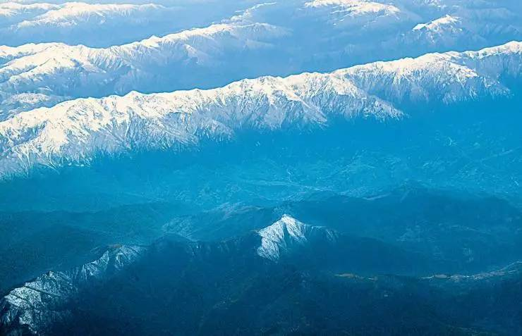

祁连山属于高山和极高山的世界，海拔4000米以上的山地面积占整个山区面积的三分之一以上，因此气温较低，海拔2000-3000米以上的山上年均气温低于0℃，祁连山区平均雪线高度是4700米，在4700米以上的山峰上，普遍发育着冰川。这些冰川在夏季的融水是河西走廊和柴达木盆地各个河流的主要补充水源，因此祁连山的冰川关系到河西走廊和柴达木盆地各个绿洲的命运。随着全球变暖趋势的加剧，祁连山的冰川已经出现了普遍退缩的现象，如果这一趋势继续下去，祁连山中的一些小型冰川将消失。而祁连山冰川分布的特征之一就是小型冰川多，分布状态分散，这种小型冰川在全球变暖的趋势下，比较容易融化消失，这将对河西走廊和柴达木盆地的生态发生影响，这种现象科学家们正在密切关注。图为祁连山中部山脉山脊上的冰川，可以看到这里是一片白皑皑的冰雪世界。

更糟糕的是，油箱里的油越来越少了，路两旁一片黑暗，不见一丝光亮，显然没有任何加油的地方，手机也没有任何信号。

在忐忑不安的心情中,我们顺着时隐时现的路一直向东开去,好在我们的车是四轮驱动的越野车,再坏的路都能应付,只是油没有了怎么办？

当我们的油只够跑40多公里时，前面终于看到了灯光，原来我们到了一个叫南八仙的地方。后来才知道这个地方之所以叫南八仙，是因为当年有8个来自南方的女地质队员在这里勘探石油，遭遇沙尘暴迷路在雅丹群里，最后全部死在这个地方。为了纪念这八位女地质队员，人们把这个地方命名为“南八仙”。

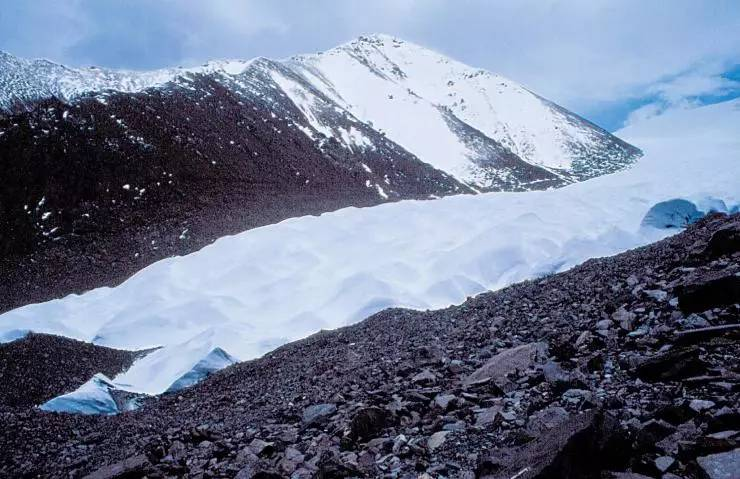

祁连山中段北大河流域内的“七一”冰川，它是祁连山区的冰川中被考察研究最早的一条冰川。

我们看到了许多车聚集在这里，车全部是那种车轮有一人多高的奔驰公司产的沙漠越野车——尤尼莫克。他们显然是石油部门的，但我们不知他们在这里做什么，我们问他们：这条315国道为什么没有车？他们告诉我们，这条道早已经废弃了，315国道已经改走另一条路了。看来地图不仅给我们洗了脑，这种不能及时更新的地图还可能让人迷失在公路已经废弃、没有人烟的地方。

这就是我们在祁连山南面，在柴达木盆地遭遇的一段小插曲。总之，在祁连山南面的道路上行进，不仅“故人”很难遇到，就是城市也很难碰到了。整个祁连山的南缘，只有两座大一点的城市，一是德令哈市，还有一座大城市就是青海的省会西宁了。这与祁连山北面的河西走廊的情况完全不同。祁连山北面一个城市接着一个城市，而且北面的城市随便哪一个都比德令哈市大、人口多。德令哈市人口6万，但河西走廊最小的市敦煌，人口也是13万多。不仅是城市、人口，就是绿洲的面积和农业规模，北面河西走廊也比南面大得多。

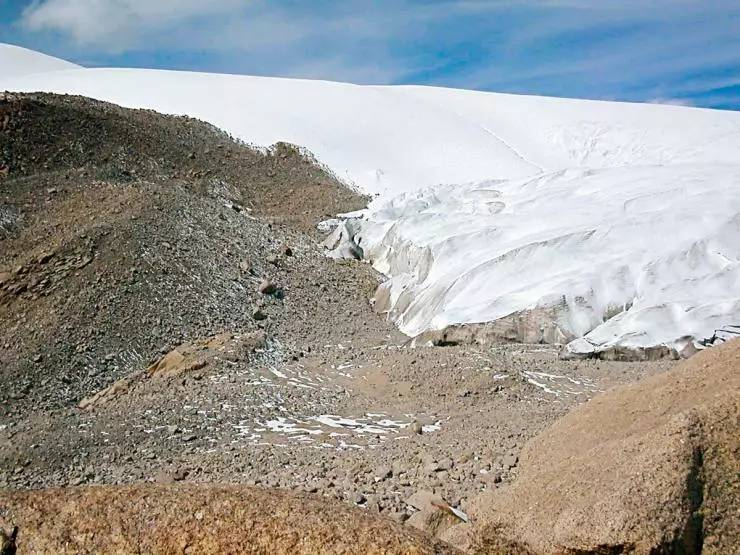

由此我发现祁连山是一个两边人文现象极不平衡的山。山北是河西走廊，山南是柴达木盆地，从历史上看，祁连山北，也就是河西走廊早在汉代就在现今的武威、张掖、酒泉、敦煌设立了河西四郡，而且玉门关和阳关已经向西超过了祁连山的最西端，但是在祁连山南，情况就大不一样了。汉代王莽在青海湖边设置了西海郡，西海郡后来很快就废弃了，后来即使中原汉王朝恢复了对青海湖地区的统治，也总是时断时续。可以说，就文化而言，在祁连山北面的河西走廊，汉文化一直延伸到了祁连山的最西边，但在祁连山的南边，汉文化则徘徊在祁连山的东部西宁一带。

虽然祁连山北的河西走廊人文胜于祁连山南，但是上帝似乎是公平的，他把更多的自然美景给予了祁连山南面，其实仅仅给一个青海湖就足矣，但这还不够，祁连山南面有更多的湖泊发育。在祁连山主脊线的一部分——南疏勒南山的南面有一个高山咸水湖——哈拉湖，周围雪峰巍峨，冰川磅礴，她的北面有整个祁连山系的最高峰5808米的团结峰（岗则吾结），她的西南有祁连山中面积最大的冰川敦德大冰帽，这里应是祁连山系中除了青海湖地区外，又一个美景集中的地带。

除了哈拉湖，就在德令哈市的西南有一对神奇的姊妹般的湖泊，一个叫可鲁克湖，一个叫托素湖，两湖紧邻，中间有河相连，从西宁到格尔木去的铁路正好从中间穿过，这两个湖的神奇在于：可鲁克湖是淡水湖，而托素湖却是咸水湖。这两个湖完全可以作为我国东部外流区的淡水湖与西部内流区的咸水湖的代表，它们可以形象地说明为什么一个湖是淡水湖而相距咫尺的另一个湖却是咸水湖，这其中的奥秘都在于连接这两个湖的那段短短的小河上，这段小河决定了流进可鲁克湖的水有进有出，带进湖中的盐又流走了，但是流走的带有盐的水却流进了托素湖，托素湖没有出口，是靠湖面的蒸发来维持湖水量的平衡，但是蒸发的是水，盐却留下了，所以托素湖是咸的。有趣的是，我们到这里时，虽是冬季12月，但是在可鲁克湖中，却有来自江苏的人在这里养大闸蟹。我问他们，托素湖能养大闸蟹吗？他们直摇头说：“不能。”冬天了，他们把螃蟹从湖中捞出来，养在湖边的池子里，我们买了一些螃蟹，在德令哈市的一个餐馆里，我们把这些螃蟹吃了，味道很不错。

祁连山南，还有一些湖，但都是咸水湖了，从西向东有大苏干湖、宗马海湖、依克柴达木湖、巴戛柴达木湖、尕海、希里沟湖、茶卡盐湖等，如果把柴达木盆地中心地带的盐湖都算上的话，那祁连山南的湖泊就更多了。可以说祁连山南面湖泊众多，是祁连山南北差异中的重要一点。

祁连山南面，自然景观给人的美感要优于山北河西走廊，这是我的观点。且不说那些湖泊，仅是冷湖一带的雅丹地貌也足以让人震撼了。

祁连山南面，不仅富有风景，更富有资源，柴达木盆地的石油和天然气、盐湖中的盐和稀有金属正在使这片人烟稀少的地方，日益繁盛起来。

人文不足，自然补之；地上不足，地下补之。这就是上帝之道。

## 为何祁连山中叫某某南山的多？

我还发现一个有趣的现象，祁连山两边的失衡，从祁连山系的一个个山名中也表现出来，譬如，祁连山系中的诸多山，以南山命名的很多，却没有一个以北山命名的大山。如从东面有青海南山、走廊南山、托来南山、疏勒南山、野马南山、党河南山等。这些山为什么都叫某某南山，而不叫某某北山，原因何在？

其实原因就在于人们看祁连山系中的一列列近似平行的大山，基本上都是站在山的北边向南看，因此看到的山都是南山，同样一座山，如果是站在南边向北看，就成了北山。祁连山中的只有南山无北山，说明早期人类进入祁连山中，最先是从北面进入的。因此他们看到的山总是在南面，因此他们把这些山一一命名为某某南山。

实际上也是如此，因为祁连山系中的一列列大山，总的趋势是北低南高。从北面进入要比从南面进入容易，如以中部为例，覆雪山峰的平均高度，从北向南，最北面的走廊南山为4937米，向南托来南山为5046米，疏勒南山5373米，最南的柴达木山则高达5483米。很明显最早进入祁连山中的人，一定是北面的人，更重要的是北面是河西走廊，海拔低，绿洲一个接着一个，很适合人类生存，但是祁连山的南面，则是海拔高达2700—3500米的高原盆地柴达木，干燥、寒冷，河流稀少，绿洲匮乏。因此人文不如河西走廊繁盛发达。正是这自然和人文的双重原因决定了人们是站在河西走廊的立场和角度来看祁连山，给祁连山命名的，而不是站在柴达木的立场和角度。有一个例外，就是在祁连山南面的西宁，它的北面有一条祁连山的分支山脉，叫做互助北山，这是祁连山诸多山中少有的叫某某北山的山，看来好像是一个例外，其实道理并不例外，就是山哪一面的人文鼎盛，就会被人从这种角度去命名。即山南人文盛，山被叫北山；山北人文盛，山被叫南山；东西走向的山是如此，南北走向的山，也不例外，只不过由把南山北山改为东山西山而已。

## 为何祁连山人文景观如此失衡？因为玫瑰花向北开放

前面我们已经说过了祁连山的南北人文景象的失衡。有一组数字：祁连山北面的河西走廊，有440多万人口、生畜750多万、耕地70多万顷、可耕荒地120万顷、上千个工矿企业；而祁连山南面的柴达木盆地和青海湖地区，人烟稀少，大部分地方人口密度仅是每平方公里1－10人左右，只有极少的耕地。

为什么祁连山会出现这种两边极不平衡的现象?

我们如果面对一张祁连山的地图，就可以看出一些门道。你会发现从祁连山北坡流向河西走廊的河流比从祁连山南坡流向柴达木的河流数量要多得多，河西走廊号称有5大水系：从东向西为石羊河水系、黑河水系、北大河水系、疏勒河水系、党河水系。而祁连山南坡的柴达木盆地的几条河哈尔腾河、鱼卡河、塔塔棱河、巴音郭勒河都是流量小、长度短的小河，无法与河西走廊的河流相比。

我们知道无论是河西走廊还是柴达木盆地，都是绿洲型的经济，是河流养育了绿洲。据一位专家对祁连山地区降水的研究，结论是：山区的降水比平原多得多。比如黑河地区，平原地区年降水仅80—200毫米，这样的降水量，在平原几乎不能形成径流，可是黑河流域在山区的降水量却达到200—600毫米，降水随海拔高程的增加，每100米大约增加10—25毫米。其他河流也与黑河类似。是祁连山拦截了云团水汽，迫使它们冷凝降水，又是祁连山汇集了径流，形成了河流，养育了绿洲。

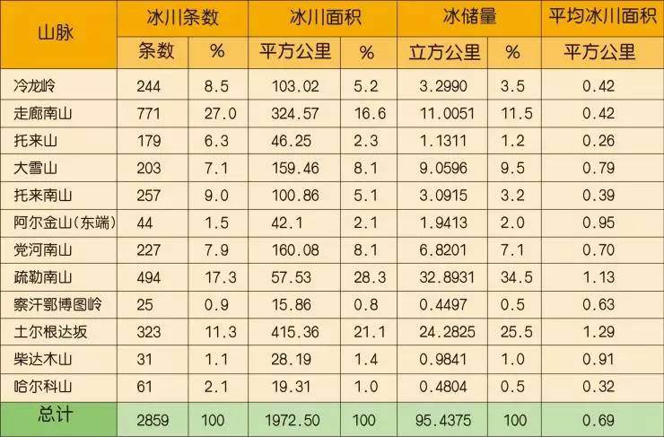

如果你仔细地看地图，你还会注意到一个有意思的现象，就是河西走廊的河流分布得很均衡，彼此的距离大致相等，这一点在古代社会是很重要，因为在以人或畜为运输工具的古代，如果河流或绿洲相距很远，人畜很难到达，那么绿洲间的交通路线将不可能维系。如果那样河西走廊的走廊作用将丧失。

河西走廊河流分布的均衡，其实是冰川分布的均衡，因为河西走廊中五大河流的源头都是冰川，而且冰川对这些河流水量的补给占到1/4—3/5，越向西，冰川对河流的补给作用越大，西边的党河，几乎一半的水量来自冰川，党河是敦煌的母亲河，可以说是冰川养育了敦煌。

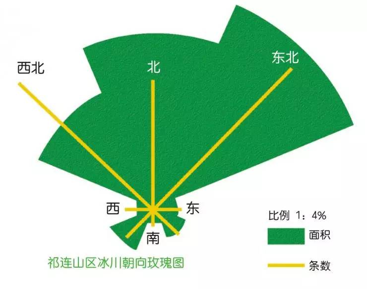

从下面这个玫瑰图，可以看出玫瑰花向北方开放，就是说祁连山中的冰川无论是条数还是面积都是北多南少。看了它，我们也应该明白了为什么河西走廊城市相连，人文鼎盛，而柴达木盆地却人烟稀少，一片荒漠。这个图的画法是，把祁连山总的冰川条数和总面积分成100份，把其中的4份作为一个长度和面积单位按东、西、南、北、东北、西北、东南、西南共8个方向来画图。

祁连山北坡的冰川东西方向均衡分布，造就了大致均衡的河西走廊的五大河流，这五大河流造就了五大绿洲，五大绿洲连缀成了河西走廊，河西走廊维系了一条伟大的丝绸之路。这是祁连山的伟大功勋。

但是祁连山北面东西方向的冰川分布均衡，南北向的冰川分布却很不均衡，就是山北面的冰川数量和冰储量远远大于山南面，这正是山北和山南人文景观不均衡重要的自然方面的原因。据专家统计，河西走廊五条河流的流域内共有冰川2166条，冰川面积1308平方公里，冰储量60立方公里；而柴达木盆地的4条河流与青海湖和哈拉湖水系共有冰川541条，冰川面积582平方公里，冰储量32立方公里。由此可以看出冰川的南北分布是多么不均衡啊。

阳关在敦煌的西面，深入沙漠之中。祁连山在这里已经结束了，祁连山与长城结伴而行的旅程也结束了，但是阳关和玉门关就像长城伸出的触角，极力要向西挺进，前方已是浩瀚的罗布泊荒原和塔克拉玛干大沙漠，但是天山已经在西北方向出现，阿尔金山和昆仑山在西已开始迎接祁连山，因此丝绸之路在此分成南北两道继续前行，祁连山已经完成了它的使命。它把中华引向了西部，引向了天山和帕米尔高原。摄影/孙志军

冰川学中有一个很形象也很浪漫的表示冰川分布的方向、条数、面积的方法，并且十分形象十分浪漫地称之为“玫瑰结”或“玫瑰图”，看一眼祁连山区冰川分布的“玫瑰图”，我们就会对祁连山冰川南北分布的不均衡有一个十分清晰的印象了，在这个“玫瑰图”上，我们会一目了然地看到：玫瑰花是向着北方开放。这正是祁连山两边人文景观失衡的原因。

就要结束本文时，我想起了前面我说过：祁连山是一个伸向沙漠中的湿岛，全国只有一座山与他相像，那就是新疆的天山，而且我说他们像一对兄弟，在沙海中遥相呼应，并且我问：他们在沙海中相望和呼唤的形象有何意义？

现在我可以回答这个问题了。祁连山对中国最大的贡献，不仅仅是河西走廊，不仅仅是丝绸之路，不仅仅是引来了宗教、送来了玉石，更重要的是祁连山通过它造就和养育的冰川、河流与绿洲做垫脚石和桥梁，让中国的政治和文化渡过了中国西北浩瀚的沙漠，与新疆的天山握手相接了，中国人在祁连山的护卫下走向了天山和帕米尔高原。据说张掖之名是取“断匈奴之臂，张中国之掖（腋：手臂与身体相接处）”之意。河西走廊就是中国之臂，它为中国拽回了一个新疆。没有祁连山，就没有河西走廊；没有河西走廊，就没有了新疆。这就是祁连山的意义。

# 参考资料

[幕后英雄祁连山](http://www.dili360.com/cng/article/p5350c3d6d0e5e42.htm) 文章出自：中国国家地理 2006年第03期 作者： 单之蔷