zookeeper（简称zk），顾名思义，为动物园管理员的意思，动物对应服务节点，zk是这些节点的管理者。在分布式场景中，zk的应用非常广泛，如：数据发布/订阅、命名服务、配置中心、分布式锁、集群管理、选主与服务发现等等。这不仅得益于**zk类文件系统的数据模型**和**基于Watcher机制的分布式事件通知**，也得益于zk特殊的**高容错数据一致性协议**。 

这里的一致性，是指数据在多个副本之间保持一致的特性。分布式环境里，多个副本处于不同的节点上，如果对副本A的更新操作，未同步到副本B上，外界获取数据时，A与B的返回结果会不一样，这是典型的分布式数据不一致情况。而强一致性，是指分布式系统中，如果某个数据更新成功，则所有用户都能读取到最新的值。CAP定理告诉我们，在分布式系统设计中，P（分区容错性）是不可缺少的，因此只能在A（可用性）与C（一致性）间做取舍。本文主要探究zk在数据一致性方面的处理逻辑。 

# 基本概念

- 数据节点（dataNode）：zk数据模型中的最小数据单元，数据模型是一棵树，由斜杠（/）分割的路径名唯一标识，数据节点可以存储数据内容及一系列属性信息，同时还可以挂载子节点，构成一个层次化的命名空间。
- 会话（Session）：指zk客户端与zk服务器之间的会话，在zk中，会话是通过客户端和服务器之间的一个TCP长连接来实现的。通过这个长连接，客户端能够使用心跳检测与服务器保持有效的会话，也能向服务器发送请求并接收响应，还可接收服务器的Watcher事件通知。Session的sessionTimeout，是会话超时时间，如果这段时间内，客户端未与服务器发生任何沟通（心跳或请求），服务器端会清除该session数据，客户端的TCP长连接将不可用，这种情况下，客户端需要重新实例化一个Zookeeper对象。
- 事务及ZXID：事务是指能够改变Zookeeper服务器状态的操作，一般包括数据节点的创建与删除、数据节点内容更新和客户端会话创建与失效等操作。对于每个事务请求，zk都会为其分配一个全局唯一的事务ID，即ZXID，是一个64位的数字，高32位表示该事务发生的集群选举周期（集群每发生一次leader选举，值加1），低32位表示该事务在当前选择周期内的递增次序（leader每处理一个事务请求，值加1，发生一次leader选择，低32位要清0）。
- 事务日志：所有事务操作都是需要记录到日志文件中的，可通过 dataLogDir配置文件目录，文件是以写入的第一条事务zxid为后缀，方便后续的定位查找。zk会采取“磁盘空间预分配”的策略，来避免磁盘Seek频率，提升zk服务器对事务请求的影响能力。默认设置下，每次事务日志写入操作都会实时刷入磁盘，也可以设置成非实时（写到内存文件流，定时批量写入磁盘），但那样断电时会带来丢失数据的风险。
- 数据快照：数据快照是zk数据存储中另一个非常核心的运行机制。数据快照用来记录zk服务器上某一时刻的全量内存数据内容，并将其写入到指定的磁盘文件中，可通过dataDir配置文件目录。可配置参数snapCount，设置两次快照之间的事务操作个数，zk节点记录完事务日志时，会统计判断是否需要做数据快照（距离上次快照，事务操作次数等于snapCount/2~snapCount 中的某个值时，会触发快照生成操作，随机值是为了避免所有节点同时生成快照，导致集群影响缓慢）。
- 过半：所谓“过半”是指大于集群机器数量的一半，即大于或等于（n/2+1），此处的“集群机器数量”不包括observer角色节点。leader广播一个事务消息后，当收到半数以上的ack信息时，就认为集群中所有节点都收到了消息，然后leader就不需要再等待剩余节点的ack，直接广播commit消息，提交事务。选举中的投票提议及数据同步时，也是如此，leader不需要等到所有learner节点的反馈，只要收到过半的反馈就可进行下一步操作。

# 数据模型

zk维护的数据主要有：客户端的会话（session）状态及数据节点（dataNode）信息。zk在内存中构造了个DataTree的数据结构，维护着path到dataNode的映射以及dataNode间的树状层级关系。为了提高读取性能，集群中每个服务节点都是将数据全量存储在内存中。可见，zk最适于读多写少且轻量级数据（默认设置下单个dataNode限制为1MB大小）的应用场景。数据仅存储在内存是很不安全的，zk采用事务日志文件及快照文件的方案来落盘数据，保障数据在不丢失的情况下能快速恢复。

# 集群架构

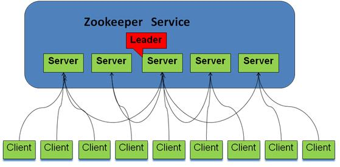
zk集群由多个节点组成，其中有且仅有一个leader，处理所有事务请求；follower及observer统称learner。learner需要同步leader的数据。follower还参与选举及事务决策过程。zk客户端会打散配置文件中的serverAddress 顺序并随机组成新的list，然后循环按序取一个服务器地址进行连接，直到成功。follower及observer会将事务请求转交给leader处理。 

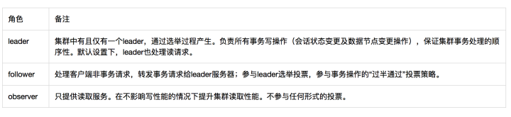

要搭建一个高可用的zk集群，我们首先需要确定好集群规模。一般我们将节点（指leader及follower节点，不包括observer节点）个数设置为 2*n+1 ，n为可容忍宕机的个数。 zk使用“过半”设计原则，很好地解决了单点问题，提升了集群容灾能力。但是zk的集群伸缩不是很灵活，集群中所有机器ip及port都是事先配置在每个服务的zoo.cfg 文件里的。如果要往集群增加一个follower节点，首先需要更改所有机器的zoo.cfg，然后逐个重启。
集群模式下，单个zk服务节点启动时的工作流程大体如下：

- 统一由QuorumPeerMain作为启动类，加载解析zoo.cfg配置文件；
- 初始化核心类：ServerCnxnFactory（IO操作）、FileTxnSnapLog（事务日志及快照文件操作）、QuorumPeer实例（代表zk集群中的一台机器）、ZKDatabase（内存数据库）等；
- 加载本地快照文件及事务日志，恢复内存数据；
- 完成leader选举，节点间通过一系列投票，选举产生最合适的机器成为leader，同时其余机器成为follower或是observer。关于选举算法，就是集群中哪个机器处理的数据越新（通过ZXID来比较，ZXID越大，数据越新），其越有可能被选中；
- 完成leader与learner间的数据同步：集群中节点角色确定后，leader会重新加载本地快照及日志文件，以此作为基准数据，再结合各个learner的本地提交数据，leader再确定需要给具体learner回滚哪些数据及同步哪些数据；
- 当leader收到过半的learner完成数据同步的ACK，集群开始正常工作，可以接收并处理客户端请求，在此之前集群不可用。

# ZooKeeper的读写机制

## 概述

**ZooKeeper**的**核心思想**是，提供一个非锁机制的Wait Free的用于分布式系统同步的核心服务。提供简单的文件创建、读写操作接口，其系统核心本身对**文件读写**并不提供加锁互斥的服务，但是提供基于版本比对的更新操作，客户端可以基于此自己实现加锁逻辑。如下图所示: 

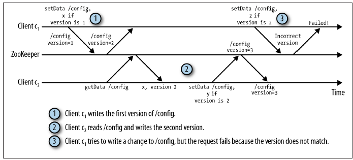

 

## ZK集群服务

 Zookeeper是一个由多个Server组成的集群，该集群有一个Leader，多个Follower。客户端可以连接任意ZooKeeper服务节点来读写数据，如下图所示: 

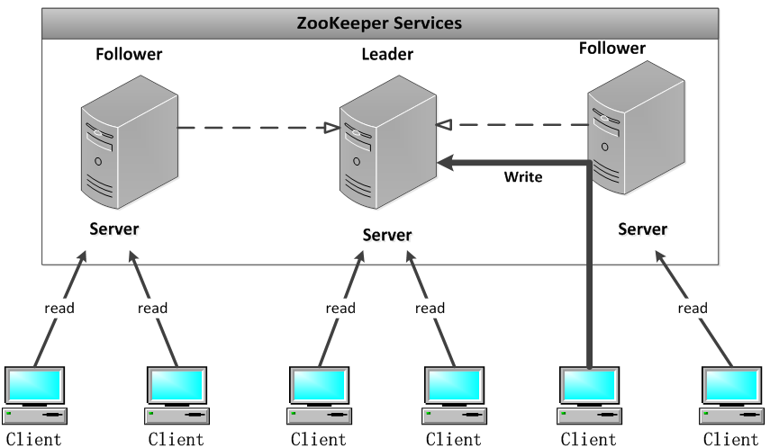

ZK集群中每个Server，都保存一份数据副本。Zookeeper使用简单的同步策略，通过以下两条基本保证来实现数据的一致性：

① 全局**串行化**所有的**写操作**

② 保证**同一客户**端的指令被FIFO执行（以及消息通知的FIFO）

所有的读请求由Zk Server 本地响应，所有的更新请求将转发给Leader，由Leader实施。

## ZK组件

ZK组件如下图所示。ZK组件除了**请求处理器**（Request Processor）以外，组成ZK服务的每一个Server会复制这些组件的副本。 

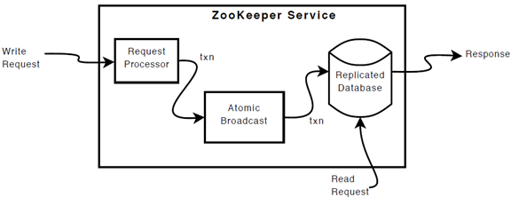

 

**ReplicatedDatabase**是一个内存数据库，它包含了整个Data Tree。为了恢复，更新会被记录到磁盘，并且写在被应用到内存数据库之前，先被序列化到磁盘。

每一个ZK Server，可服务于多个Client。Client可以连接到一台Server，来提交请求。**读请求**，由每台Server数据库的本地副本来进行服务。改变服务器的状态的写请求，需要通过一致性协议来处理。

作为一致性协议的一部分，来自Client的所有写请求，都要被转发到一个单独的Server，称作Leader。ZK集群中其他Server 称作Follower，负责接收Leader发来的提议消息，并且对消息转发达成一致。消息层处理leader失效，同步Followers和Leader。

ZooKeeper使用自定义的原子性消息协议。由于消息传送层是原子性的，ZooKeeper能够保证本地副本不产生分歧。当leader收到一个写请求，它会计算出当写操作完成后系统将会是什么状态，接着将之转变为一个捕获状态的事务。

## ZK性能

ZooKeeper被应用程序广泛使用，并有数以千计的客户端同时的访问它，所以我们需要高吞吐量。我们为ZooKeeper 设计的工作负载的读写比例是 2：1以上。然而我们发现，ZooKeeper的高写入吞吐量，也允许它被用于一些写占主导的工作负载。ZooKeeper通过每台Server上的本地 ZK的状态副本，来提供高读取吞吐量。因此，**容错性**和**读吞吐量**是以添加到该服务的服务器数量为尺度。**写吞吐量**并不以添加到该服务的机器数量为尺度。

例如，在它的诞生地Yahoo公司，对于写占主导的工作负载来说，ZooKeeper的基准吞吐量已经超过每秒10000个操作；对于常规的以读为主导的工作负载来说，吞吐量更是高出了好几倍。

# zookeeper一致性协议

zookeeper实现数据一致性的核心是ZAB协议（Zookeeper原子消息广播协议）。该协议需要做到以下几点：

1. 集群在半数以下节点宕机的情况下，能正常对外提供服务；
2. 客户端的写请求全部转交给leader来处理，leader需确保写变更能实时同步给所有follower及observer；
3. leader宕机或整个集群重启时，需要确保那些已经在leader服务器上提交的事务最终被所有服务器都提交，确保丢弃那些只在leader服务器上被提出的事务，并保证集群能快速恢复到故障前的状态。

**Zab协议有两种模式， 崩溃恢复（选主+数据同步）和消息广播（事务操作）。**任何时候都需要保证只有一个主进程负责进行事务操作，而如果主进程崩溃了，就需要迅速选举出一个新的主进程。主进程的选举机制与事务操作机制是紧密相关的。下面详细讲解这三个场景的协议规则，从细节去探索ZAB协议的数据一致性原理。

## 崩溃恢复(选主)

leader选举是zk中最重要的技术之一，也是保证分布式数据一致性的关键所在。当集群中的一台服务器处于如下两种情况之一时，就会进入leader选举阶段——服务器初始化启动、服务器运行期间无法与leader保持连接。

选举阶段，集群间互传的消息称为投票，投票Vote主要包括二个维度的信息：ID、ZXID
ID 被推举的leader的服务器ID，集群中的每个zk节点启动前就要配置好这个全局唯一的ID。ZXID 被推举的leader的事务ID ，该值是从机器DataTree内存中取的，即事务已经在机器上被commit过了。

1. 节点进入选举阶段后的大体执行逻辑如下：
   设置状态为LOOKING，初始化内部投票Vote (id,zxid) 数据至内存，并将其广播到集群其它节点。节点首次投票都是选举自己作为leader，将自身的服务ID、处理的最近一个事务请求的ZXID（ZXID是从内存数据库里取的，即该节点最近一个完成commit的事务id）及当前状态广播出去。然后进入循环等待及处理其它节点的投票信息的流程中。
2. 循环等待流程中，节点每收到一个外部的Vote信息，都需要将其与自己内存Vote数据进行PK，规则为取ZXID大的，若ZXID相等，则取ID大的那个投票。若外部投票胜选，节点需要将该选票覆盖之前的内存Vote数据，并再次广播出去；同时还要统计是否有过半的赞同者与新的内存投票数据一致，无则继续循环等待新的投票，有则需要判断leader是否在赞同者之中，在则退出循环，选举结束，根据选举结果及各自角色切换状态，leader切换成LEADING、follower切换到FOLLOWING、observer切换到OBSERVING状态。 

算法细节可参照FastLeaderElection.lookForLeader()，主要有三个线程在工作：选举线程（主动调用lookForLeader方法的线程，通过阻塞队列sendqueue及recvqueue与其它两个线程协作）、WorkerReceiver线程（选票接收器，不断获取其它服务器发来的选举消息，筛选后会保存到recvqueue队列中。zk服务器启动时，开始正常工作，不停止）以及WorkerSender线程（选票发送器，会不断地从sendqueue队列中获取待发送的选票，并广播至集群）。WorkerReceiver线程一直在工作，即使当前节点处于LEADING或者FOLLOWING状态，它起到了一个过滤的作用，当前节点为LOOKING时，才会将外部投票信息转交给选举线程处理；如果当前节点处于非LOOKING状态，收到了处于LOOKING状态的节点投票数据（外部节点重启或网络抖动情况下），说明发起投票的节点数据跟集群不一致，这时，当前节点需要向集群广播出最新的内存Vote(id，zxid)，落后节点收到该Vote后，会及时注册到leader上，并完成数据同步，跟上集群节奏，提供正常服务。

## 崩溃恢复(选主后的数据同步)

选主算法中的zxid是从内存数据库中取的最新事务id，事务操作是分两阶段的（提出阶段和提交阶段），leader生成提议并广播给followers，收到半数以上的ACK后，再广播commit消息，同时将事务操作应用到内存中。follower收到提议后先将事务写到本地事务日志，然后反馈ACK，等接到leader的commit消息时，才会将事务操作应用到内存中。可见，选主只是选出了内存数据是最新的节点，仅仅靠这个是无法保证已经在leader服务器上提交的事务最终被所有服务器都提交。比如leader发起提议P1,并收到半数以上follower关于P1的ACK后，在广播commit消息之前宕机了，选举产生的新leader之前是follower，未收到关于P1的commit消息，内存中是没有P1的数据。而ZAB协议的设计是需要保证选主后，P1是需要应用到集群中的。这块的逻辑是通过选主后的数据同步来弥补。 

选主后，节点需要切换状态，leader切换成LEADING状态后的流程如下：

1. 重新加载本地磁盘上的数据快照至内存，并从日志文件中取出快照之后的所有事务操作，逐条应用至内存，并添加到已提交事务缓存commitedProposals。这样能保证日志文件中的事务操作，必定会应用到leader的内存数据库中。
2. 获取learner发送的FOLLOWERINFO/OBSERVERINFO信息，并与自身commitedProposals比对，确定采用哪种同步方式，不同的learner可能采用不同同步方式（DIFF同步、TRUNC+DIFF同步、SNAP同步）。这里是拿learner内存中的zxid与leader内存中的commitedProposals（min、max）比对，如果zxid介于min与max之间，但又不存在于commitedProposals中时，说明该zxid对应的事务需要TRUNC回滚；如果 zxid 介于min与max之间且存在于commitedProposals中，则leader需要将zxid+1~max 间所有事务同步给learner，这些内存缺失数据，很可能是因为leader切换过程中造成commit消息丢失，learner只完成了事务日志写入，未完成提交事务，未应用到内存。
3. leader主动向所有learner发送同步数据消息，每个learner有自己的发送队列，互不干扰。同步结束时，leader会向learner发送NEWLEADER指令，同时learner会反馈一个ACK。当leader接收到来自learner的ACK消息后，就认为当前learner已经完成了数据同步，同时进入“过半策略”等待阶段。当leader统计到收到了一半已上的ACK时，会向所有已经完成数据同步的learner发送一个UPTODATE指令，用来通知learner集群已经完成了数据同步，可以对外服务了。
   细节可参照Leader.lead() 、Follower.followLeader()及LearnerHandler类。

### 恢复阶段的保证

该恢复过程的复杂部分是在一个给定的时间内，提议冲突的绝对数量。最大数量冲突提议是一个可配置的选项，但是默认是1000。为了使该协议能够即使在Leader故障的情况下也能正常运作。我们需要做出两条具体的保证：

**①** 我们绝不能遗忘已经被deliver的消息，**若一条消息在一台机器上被deliver，那么该消息必须将在每台机器上deliver，即使那台机器故障了**。

例如，出现了这样**一种情况**：Leader发送了commit消息，但在该commit消息到达其他任何机器之前，Leader发生了故障。也就是说，只有Leader自己收到了**commit**消息。如图6中的**C2**。

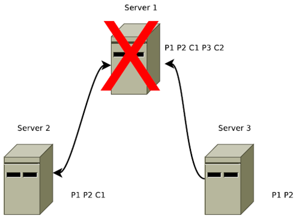

> "第一条保证"（deliver消息不能忘记）的一个示例。在该图中Server1是一个**Leader，**我们用**L1**表示，Server2和Server3为**Follower**。首先Leader发起了两个Proposal，P1和P2，并将P1、P2发送给了Server1和Server2。然后Leader对P1发起了Commit即C1，之后又发起了一个Proposal即P3，再后来又对P2发起了commit即C2，就在此时我们的Leader挂了。那么这时候，P3和C2这两个消息只有**Leader自己**收到了。

因为Leader已经deliver了该C2消息，client能够在消息中看到该事务的结果。所以该事务必须能够在其他所有的Server中deliver，最终使得client看到了一个一致性的服务视图。

**②** 我们必须丢弃已经被skip的消息。**一个被skip的消息，必须仍然需要被skip。**

例如，发生了这样**一种情况：**Leader发送了propose消息，但在该propose消息到达其他任何机器之前，Leader发生了故障。也就是说，只有Leader自己收到了propose消息。如图6的P3所示。

在图6中没有任何一个server能够看到**3号提议**，所以在图7中当server 1恢复时他需要在系统恢复时丢弃三号提议P3。

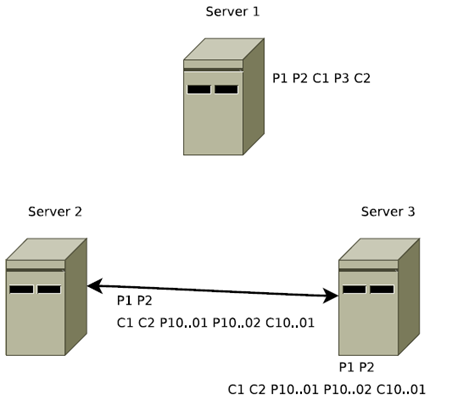

> "第二条保证"（skip消息必须被丢弃）的一个示例。Server1挂掉以后，Server3被选举为Leader，我们用L2表示。L2中还有未被deliver的消息P1、P2，所以，L2在发出新提议P10000001、P10000002之前，L2先将P1、P2两个消息**deliver**。因此，L2先发出了两个**commit**消息C1、C2，之后L2才发出了新的提议P10000001和P10000002。

如果Server1 恢复之后**再次成为了Leader**，此时再次将**P3**在P10000001和P10000002之后**deliver**，那么将违背顺序性的保障。

### 保证的实现

如果Leader选举协议保证了**新Leader**在**Quorum Server**中具有最高的提议编号，即Zxid最高。那么新选举出来的leader将具有所有已deliver的消息。新选举出来的Leader，在提出一个新消息之前，首先要保证**事务日志**中的所有消息都由**Quorum Follower**已Propose并deliver。需要注意的是，我们可以让新Leader成为一个用最高zxid来处理事务的server，来作为一个优化。这样，作为新被选举出来的Leader，就不必去从一组Followers中找出包含最高zxid的Followers和获取丢失的事务。

**① 第一条**

所有的正确启动的Servers，将会成为Leader或者**跟随**一个**Leader**。Leader能够确保它的Followers看到所有的提议，并deliver所有已经deliver的消息。通过将新连接上的Follower所没有见过的所有PROPOSAL进行**排队，**并之后对该Proposals的COMMIT消息进行**排队**，直到最后一个COMMIT消息。在所有这样的消息已经排好队之后，Leader将会把Follower加入到广播列表，以便今后的提议和确认。**这一条是为了保证一致性**，因为如果一条**消息P**已经在**旧Leader**-Server1中deliver了，即使它刚刚将**消息P** deliver之后就挂了，但是当旧**Leader**-**Server1**重启恢复之后，我们的Client就可以从该Server中看到该**消息P** deliver的事务，所以为了保证每一个client都能看到一个一致性的视图，我们需要将该消息在每个Server上deliver。

**② 第二条**

skip已经Propose，但不能deliver的消息，处理起来也比较简单。在我们的实现中，**Zxid**是由**64位**数字组成的，**低32**位用作简单**计数器**。**高32位**是一个**epoch**。每当**新Leader接管它时**，将获取日志中Zxid最大的epoch，新Leader **Zxid**的**epoch位**设置为epoch+1，**counter位**设置0。用epoch来标记领导关系的改变,并要求**Quorum Servers** 通过epoch来识别该leader，避免了多个Leader用同一个**Zxid**发布不同的提议。

这个方案的一个优点就是，我们可以skip一个失败的领导者的实例，从而加速并简化了恢复过程。如果一台宕机的Server重启，并带有未发布的 Proposal，那么先前的未发布的所有提议将永不会被deliver。并且它不能够成为一个新leader，因为任何一种可能的 Quorum Servers ，都会有一个Server其Proposal 来自与一个新epoch因此它具有一个较高的zxid。当Server以Follower的身份连接，领导者检查自身最后提交的提议，该提议的epoch 为Follower的最新提议的epoch（也就是图7中新Leader-Server2中deliver的C2提议），并告诉Follower截断事务日志**直到**该epoch在新Leader中deliver的最后的Proposal即C2。在图7中，当**旧Leader**-Server1连接到了**新leader**-Server2，leader将告诉他从事务日志中清除3号提议P3，具体点就是清除P2之后的所有提议，因为P2之后的所有提议只有**旧Leader**-Server1知道，其他Server不知道。

### Paxos与Zab

**① Paxos一致性**

Paxos的一致性不能达到ZooKeeper的要求，我们可以下面一个例子。我们假设ZK集群由三台机器组成，Server1、Server2、Server3。Server1为Leader，他生成了三条Proposal，P1、P2、P3。但是在发送完P1之后，Server1就挂了。如下图8所示。

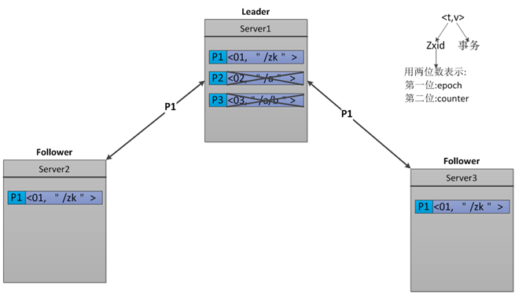

Server1挂掉之后，Server3被选举成为Leader，因为在Server3里只有一条Proposal—P1。所以，Server3在P1的基础之上又发出了一条新Proposal—P2＇，P2＇的Zxid为02。如下图9所示。

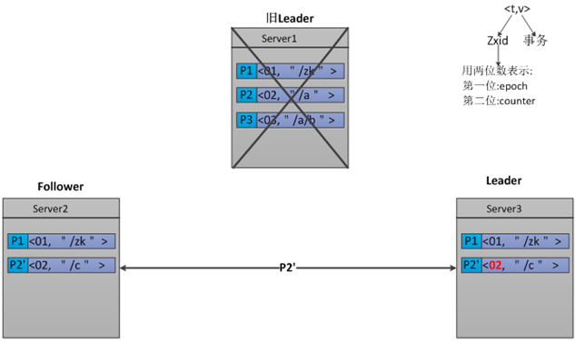

Server2发送完P2＇之后，它也挂了。此时Server1已经重启恢复，并再次成为了Leader。那么，Server1将发送还没有被deliver的Proposal—P2和P3。由于Follower-Server2中**P2＇**的Zxid为02和Leader-Server1中**P2**的Zxid相等，所以P2会被拒绝。而**P3**，将会被Server2接受。如图10所示。

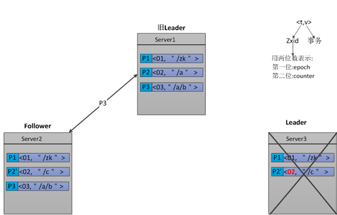

我们分析一下Follower-Server2中的Proposal，由于P2'将P2的内容覆盖了。所以导致，Server2中的Proposal-P3无法生效，因为他的父节点并不存在。

**② Zab一致性**

首先来分析一下，上面的示例中为什么不满足ZooKeeper需求。ZooKeeper是一个树形结构，很多操作都要先检查才能确定能不能执行，比如，在图10中Server2有三条Proposal。**P1**的事务是创建节点"/zk"，**P2'**是创建节点"/c"，而**P3**是创建节点 "/a/b",由于"/a"还没建，创建"a/b"就搞不定了。那么，我们就能从此看出Paxos的一致性达不到ZooKeeper一致性的要求。

为了达到ZooKeeper所需要的一致性，ZooKeeper采用了Zab协议。Zab做了如下几条保证，来达到ZooKeeper要求的一致性。

(a) Zab要保证同一个leader的发起的事务要按顺序被apply，同时还要保证只有先前的leader的所有事务都被apply之后，新选的leader才能在发起事务。

(b) 一些已经Skip的消息，需要仍然被Skip。

我想对于第一条保证大家都能理解，它主要是为了保证每 个Server的数据视图的一致性。我重点解释一下第二条，它是如何实现。为了能够实现，Skip已经被skip的消息。我们在Zxid中引入了 epoch，如下图所示。每当Leader发生变换时，epoch位就加1，counter位置0。

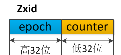

我们继续使用上面的例子，看一下他是如何实现Zab的第二条保证的。我们假设ZK集群由三台机器组成，Server1、Server2、Server3。Server1为Leader，他生成了三条 Proposal，P1、P2、P3。但是在发送完P1之后，Server1就挂了。如下图12所示。


Server1挂掉之后，Server3被选举成为 Leader，因为在Server3里只有一条Proposal—P1。所以，Server3在P1的基础之上又发出了一条新Proposal—P2＇， 由于Leader发生了变换，epoch要加1，所以epoch由原来的0变成了1，而counter要置0。那么，P2＇的Zxid为**1**0。如下图13所示。

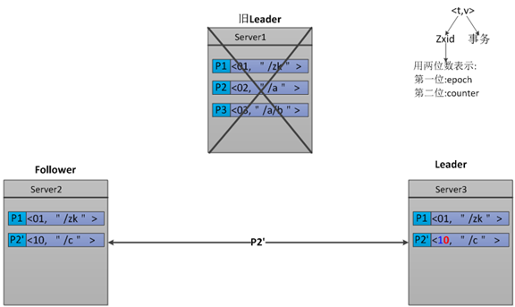

Server3发送完P2＇之后，它也挂了。此时Server1已经重启恢复，并再次成为了Leader。那么，Server1将发送还没有被deliver的Proposal—P2和P3。由于Server2中**P2＇**的Zxid为**10，**而Leader-Server1中**P2**和**P3**的Zxid分别为**02**和**03**，**P2＇**的epoch位高于P2和P3。所以此时Leader-Server1的P2和P3都会被拒绝,那么我们Zab的第二条保证也就实现了。如图14所示。

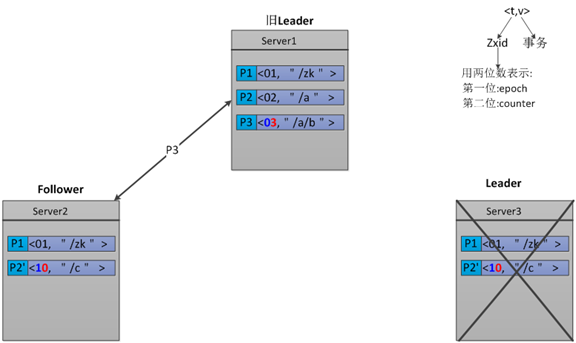


## 消息广播(事务操作)

一旦Leader已经和多数的Follower进行了状态同步后，他就可以开始广播消息了，即进入广播状态。ZooKeeper服务一直维持在Broadcast状态，直到Leader崩溃了或者Leader失去了大部分的Followers支持。

ZAB协议对于事务操作的处理是一个类似于二阶段提交过程。针对客户端的事务请求，leader服务器会为其生成对应的事务proposal，并将其发送给集群中所有follower机器，然后收集各自的选票，最后进行事务提交。流程如下图。

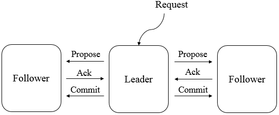

ZAB协议的二阶段提交过程中，移除了中断(aborts)逻辑（事务回滚），所有follower服务器要么正常反馈leader提出的事务proposal，要么丢弃该Leader的Propose。没有"aborts"意味着，只要有指定数量的机器确认了该Propose，而不是等待所有机器的回应。

广播协议在所有的通讯过程中使用TCP的FIFO信道，通过使用该信道，使保持有序性变得非常的容易。通过FIFO信道，消息被有序的deliver。只要收到的消息一被处理，其顺序就会被保存下来。

Leader会广播已经被deliver的Proposal消息。在发出一个Proposal消息前，Leader会分配给Proposal一个单调递增的唯一id，称之为zxid。因为Zab保证了因果有序， 所以递交的消息也会按照zxid进行排序。广播是把Proposal封装到消息当中，并添加到指向Follower的输出队列中，通过FIFO信道发送到 Follower。当Follower收到一个Proposal时，会将该proposal写入到事务日志，然后立马反馈ACK给leader，也就是说如果不是网络、内存或磁盘等问题，follower肯定会写入成功，并正常反馈ACK。leader收到过半follower的ACK后，会广播commit消息给所有learner，并将事务应用到内存；learner收到commit消息后会将事务应用到内存。这个用来达成共识的协议被设计成具有原子性，因此每个修改要么成功要么失败。

**ZAB协议中多次用到“过半”设计策略 ，该策略是zk在A（可用性）与C（一致性）间做的取舍，也是zk具有高容错特性的本质。相较分布式事务中的2PC（二阶段提交协议）的“全量通过”，ZAB协议可用性更高（牺牲了部分一致性），能在集群半数以下服务宕机时正常对外提供服务。**

# ZooKeeper的数据一致性保障

**顺序一致性**: **来自任意特定客户端的更新都会按其发送顺序被提交保持一致**。也就是说，针对同一个Follower A提交的写请求request1、request2，某些Follower虽然可能不能在请求提交成功后立即看到（也就是强一致性），但经过自身与Leader之间的同步后，这些Follower在看到这两个请求时，一定是先看到request1，然后再看到request2，两个请求之间不会乱序，即顺序一致性。如下图: 

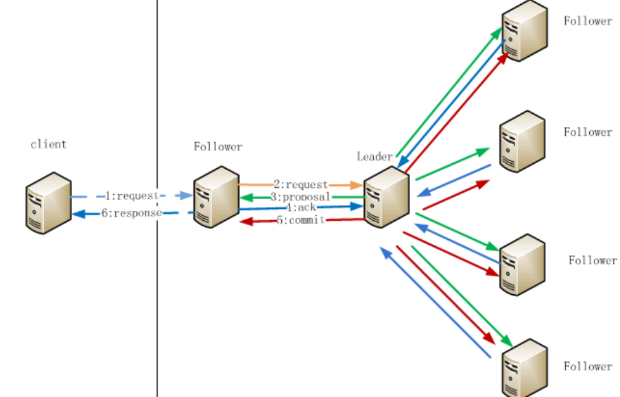

> Leader在处理第4步Follower的ack回复时，采用过半数响应即成功原则，也就是这时候有的Follower是还没有处理或者处理成功这个请求的

**原子性**：**每个更新要么成功，要么失败**。这意味着如果一个更新失败，则不会有客户端会看到这个更新的结果。

**单一系统映像**：**一个客户端无论连接到哪一台服务器，它看到的都是同样的系统视图**。这意味着，如果一个客户端在同一个会话中连接到一台新的服务器，它所看到的系统状态不会比在之前服务器上所看到的更老。当一台服务器出现故障，导致它的一个客户端需要尝试连接集合体中其他的服务器时，所有滞后于故障服务器的服务器都不会接受该连接请求，除非这些服务器赶上故障服务器。

**持久性**：**一个更新一旦成功，其结果就会持久存在并且不会被撤销**。这表明更新不会受到服务器故障的影响。

**实时性**：在特定的一段时间内，客户端看到的系统需要被保证是实时的（在十几秒的时间里）。在此时间段内，任何系统的改变将被客户端看到，或者被客户端侦测到。


## 如何保证顺序一致性

- FollowerRequestProcessor为Follower的首个处理器，如果是写请求，先将请求写入commitprocessor的queuedRequests（方便后续commit时判断是否本Follower提交的写请求），然后转Leader
- Leader为每个请求生成zxid，下发proposal给Follower，Follower会将请求写入到`pendingTxns阻塞队列及txnLog`中，然后发送ack给Leader

```java
public void logRequest(TxnHeader hdr, Record txn) {
    Request request = new Request(hdr.getClientId(), hdr.getCxid(), hdr.getType(), hdr, txn, hdr.getZxid());
    if ((request.zxid & 0xffffffffL) != 0) {
        pendingTxns.add(request);
    }
    syncProcessor.processRequest(request);
}
```

> proposal这步是会发给所有的follower的（放到LearnerHandler的请求处理队列中，一个Follower一个LearnerHandler），之后Follower的ack就不一定全返回了。

- ack过半，Leader发送commit请求给所有Follower，Follower对比commit request的zxid和前面提到的pendingTxns的zxid，不一致的话Follower退出，重新跟Leader同步

```java
long firstElementZxid = pendingTxns.element().zxid;
if (firstElementZxid != zxid) {
    LOG.error("Committing zxid 0x" + Long.toHexString(zxid)
        + " but next pending txn 0x"
        + Long.toHexString(firstElementZxid));
    System.exit(12);
}
```

- Follower处理commit请求，如果不是本Follower提交的写请求，直接调用FinalRequestProcessor做持久化，触发watches；如果是本Follower提交，则做一些特殊处理（主要针对客户端连接断开的场景），然后调用FinalRequestProcessor等后续处理流程
- FinalRequestProcessor做持久化，返回客户端

> 总之：Follower通过队列和zxid等顺序标识保证请求的顺序处理，一言不合就会退出或者重新同步Leader

# 用CAP理论来分析ZooKeeper

在此ZooKeeper保证的是CP，参见[CAP定理](https://sainpo.top/2019/08/23/distributed-systems-cap)。

**分析：可用性（A:Available）**

**不能保证每次服务请求的可用性**。任何时刻对ZooKeeper的访问请求能得到一致的数据结果，同时系统对网络分割具备容错性；但是它不能保证每次服务请求的可用性（注：也就是在极端环境下，ZooKeeper可能会丢弃一些请求，消费者程序需要重新请求才能获得结果）。所以说，ZooKeeper不能保证服务可用性。

**进行leader选举时集群都是不可用**。在使用ZooKeeper获取服务列表时，当master节点因为网络故障与其他节点失去联系时，剩余节点会重新进行leader选举。问题在于，选举leader的时间太长，30 ~ 120s, 且选举期间整个zk集群都是不可用的，这就导致在选举期间注册服务瘫痪，虽然服务能够最终恢复，但是漫长的选举时间导致的注册长期不可用是不能容忍的。所以说，ZooKeeper不能保证服务可用性。


# 参考资料

- 详细投票的过程参见https://dbaplus.cn/news-141-1875-1.html?spm=ata.13261165.0.0.3e572d4cQLT4Cu ，建议阅读这篇论文: [ZooKeeper’s atomic broadcast protocol:Theory and practice](http://www.tcs.hut.fi/Studies/T-79.5001/reports/2012-deSouzaMedeiros.pdf?spm=ata.13261165.0.0.3e572d4cQLT4Cu&file=2012-deSouzaMedeiros.pdf)

- 浅析Zookeeper的一致性原理: https://zhuanlan.zhihu.com/p/25594630
- 深入解读zookeeper一致性原理: https://www.cnblogs.com/wuxl360/p/5817646.html
- 分布式系统CAP定理: https://sainpo.top/2019/08/23/distributed-systems-cap